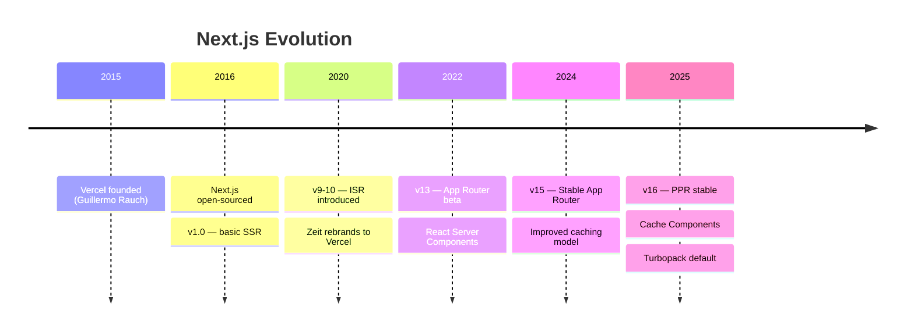
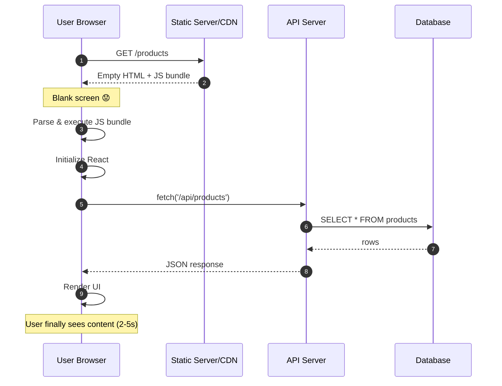
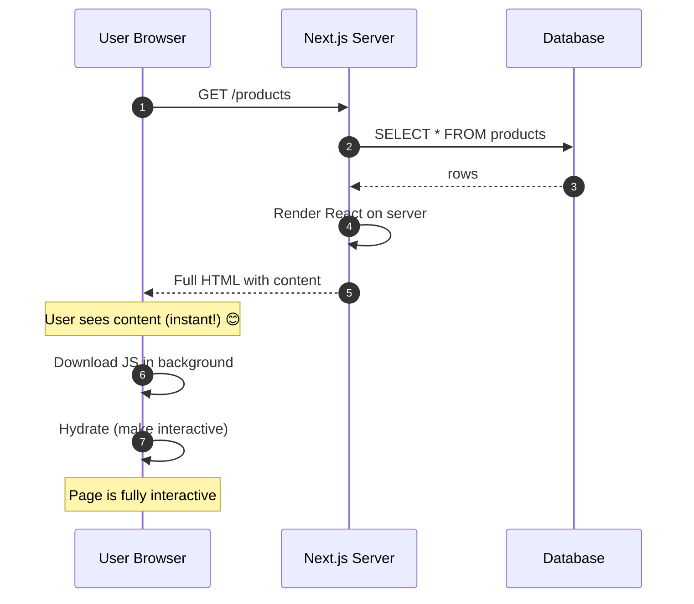
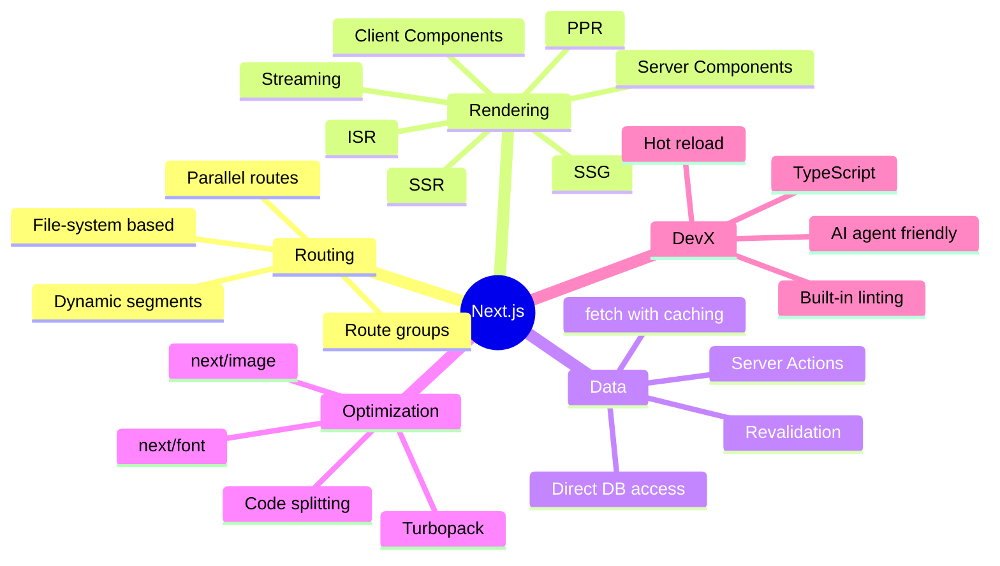
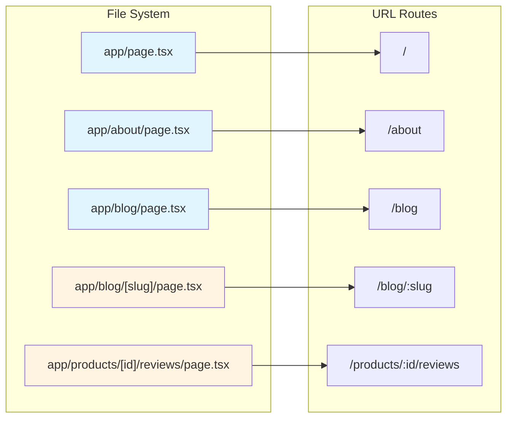
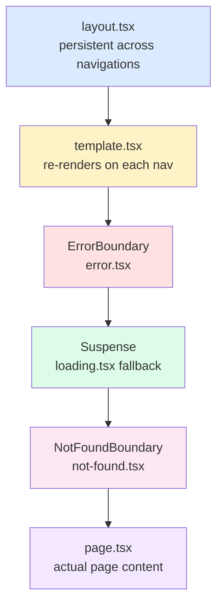
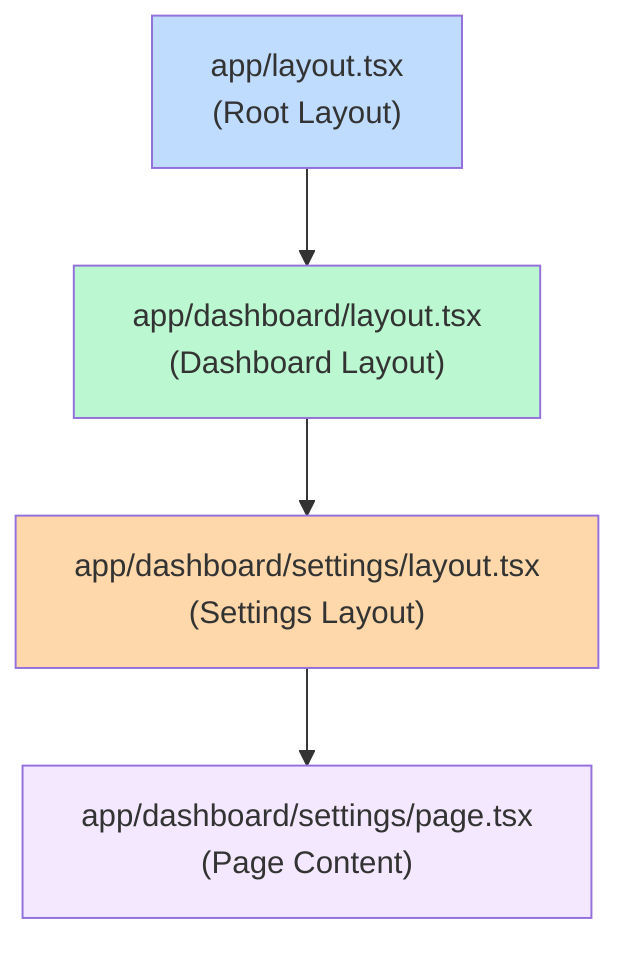
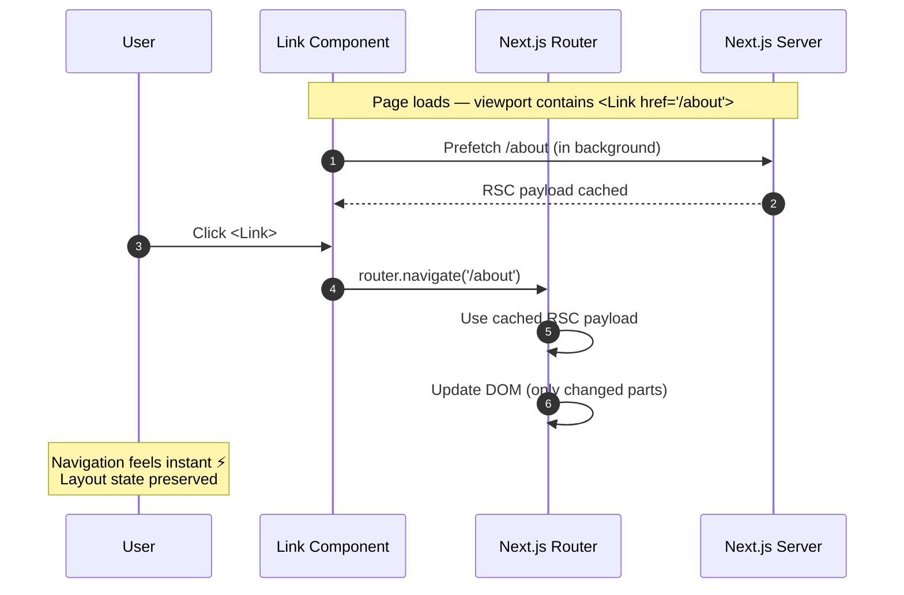

# Session 1: Introduction to Next.js

**Duration:** 45 minutes | **Time:** 9:30 AM – 10:15 AM

---

## Table of Contents

1. [What is Next.js?](#1-what-is-nextjs)
2. [Why Next.js? The Problem with Plain React](#2-why-nextjs-the-problem-with-plain-react)
3. [Key Features at a Glance](#3-key-features-at-a-glance)
4. [Creating Your First Next.js App](#4-creating-your-first-nextjs-app)
5. [Project Structure](#5-project-structure)
6. [File-System Routing](#6-file-system-routing)
7. [Special Files in the App Router](#7-special-files-in-the-app-router)
8. [The `<Link>` Component & Navigation](#8-the-link-component--navigation)
9. [Quick Quiz](#9-quick-quiz)

---

## 1. What is Next.js?

Next.js is a **React framework** built and maintained by [Vercel](https://vercel.com). It adds production-grade capabilities on top of React — things like server-side rendering, file-based routing, and built-in optimizations — that React itself doesn't provide out of the box.

> **Official definition:** "Next.js is the React framework for building full-stack web applications."

### A Brief History



| Year | Event |
|------|-------|
| 2015 | Vercel founded by Guillermo Rauch |
| **Oct 2016** | Next.js open-sourced on GitHub |
| 2020 | Became the de facto React framework for production apps; Zeit rebrands to Vercel |
| 2022 | App Router introduced (Next.js 13) with React Server Components |
| 2024 | Next.js 15 released with stable App Router, improved caching |
| 2025+ | Next.js 16.x — Partial Prerendering (PPR) stable, Cache Components, Turbopack default |

### Who Uses It?

Walmart, Nike, TikTok, Spotify, Uber, Lyft, Starbucks, Netflix, Apple — all run Next.js in production.

---

## 2. Why Next.js? The Problem with Plain React

### The Classic React (CSR) Flow



**Problems with pure Client-Side Rendering (CSR):**

1. **Poor SEO** — Search engines receive an empty HTML shell. Content is rendered after JavaScript runs, which many crawlers miss or delay indexing.
2. **Slow initial paint** — Users see a blank screen until the JavaScript bundle downloads, parses, and executes.
3. **No secrets safety** — API keys, database credentials cannot live in client-side code.
4. **Waterfall data fetching** — Data can only be fetched after JS loads, adding latency.

### How Next.js Solves This



Next.js renders HTML on the server so users and crawlers see fully-formed content immediately.

### Visual Comparison

```mermaid
gantt
    title Time-to-Content: CSR vs SSR
    dateFormat X
    axisFormat %s s

    section CSR (Plain React)
    Empty HTML received     :a1, 0, 0.2s
    Download JS bundle      :a2, after a1, 1.5s
    Parse & execute JS      :a3, after a2, 0.5s
    Fetch API data          :a4, after a3, 0.8s
    Render UI               :a5, after a4, 0.3s

    section SSR (Next.js)
    HTML with content       :b1, 0, 0.5s
    Download JS bundle      :b2, after b1, 1.5s
    Hydrate (interactive)   :b3, after b2, 0.4s
```



---

## 3. Key Features at a Glance



| Feature | What It Does |
|---------|-------------|
| **File-System Routing** | Folders and files in `app/` define your URL routes automatically |
| **Server Components** | Components that render on the server — no JS sent to browser |
| **Client Components** | Components that run in the browser for interactivity |
| **Server Actions** | Run server-side code (e.g., DB mutations) directly from forms |
| **SSR** | HTML generated on each request — always fresh data |
| **SSG** | HTML generated at build time — ultra-fast static pages |
| **ISR** | Static pages that auto-update in the background |
| **Streaming** | Progressive rendering with `<Suspense>` — no full-page blocking |
| **Image Optimization** | `next/image` — automatic WebP conversion, lazy loading, sizing |
| **Font Optimization** | `next/font` — zero layout shift, self-hosted fonts |
| **Turbopack** | Rust-based bundler (default in Next.js 16) — 10x faster HMR |

---

## 4. Creating Your First Next.js App

### Quick Start (Recommended)

```bash
npx create-next-app@latest my-app --yes
cd my-app
npm run dev
```

The `--yes` flag uses recommended defaults:
- TypeScript ✅
- Tailwind CSS ✅
- ESLint ✅
- App Router ✅
- Turbopack (dev bundler) ✅

Visit **http://localhost:3000** to see your app.

### Available Scripts

```json
{
  "scripts": {
    "dev":   "next dev",      // Start dev server (Turbopack)
    "build": "next build",    // Production build
    "start": "next start",    // Start production server
    "lint":  "eslint"         // Run linter
  }
}
```

### System Requirements

- **Node.js:** 20.9 or later
- **OS:** macOS, Windows (WSL), Linux

---

## 5. Project Structure

```
my-app/
├── app/                    ← App Router lives here
│   ├── layout.tsx          ← Root layout (required)
│   ├── page.tsx            ← Home page "/"
│   ├── globals.css         ← Global styles
│   └── favicon.ico
├── public/                 ← Static assets (images, fonts)
├── next.config.ts          ← Next.js configuration
├── tailwind.config.ts      ← Tailwind config (if used)
├── tsconfig.json           ← TypeScript config
└── package.json
```

### Top-Level Folders

| Folder | Purpose |
|--------|---------|
| `app/` | App Router — routes, layouts, pages |
| `public/` | Static files served at `/` (e.g., `/logo.png`) |
| `src/` | Optional — keeps app code separate from config files |

---

## 6. File-System Routing

Next.js derives your URL routes directly from the folder structure inside `app/`.

### How Folders Map to URLs



### Basic Routing

```
app/
├── page.tsx              →  /
├── about/
│   └── page.tsx          →  /about
└── blog/
    ├── page.tsx          →  /blog
    └── [slug]/
        └── page.tsx      →  /blog/:slug   (dynamic route)
```

### Creating a Page

```tsx
// app/about/page.tsx
export default function AboutPage() {
  return <h1>About Us</h1>
}
```

That's it — the file becomes the `/about` route automatically.

### Dynamic Routes

Wrap a folder name in `[square brackets]` to create a dynamic segment:

```tsx
// app/blog/[slug]/page.tsx
export default async function BlogPost({
  params,
}: {
  params: Promise<{ slug: string }>
}) {
  const { slug } = await params
  return <h1>Post: {slug}</h1>
}
```

| Pattern | Matches |
|---------|---------|
| `[slug]` | `/blog/hello-world` |
| `[...slug]` | `/shop/clothes/shirts` (catch-all) |
| `[[...slug]]` | `/docs`, `/docs/intro/setup` (optional catch-all) |

---

## 7. Special Files in the App Router

Next.js uses **reserved filenames** to create specific UI behaviors without any configuration.

### Component Hierarchy

When a user visits `/dashboard/settings`, Next.js renders this tree:



### Nested Routes — Layouts Compose

For `/dashboard/settings`, layouts at every level wrap their children:



```
layout.tsx        ← wraps everything (persistent across navigations)
  template.tsx    ← re-renders on each nav (optional)
    error.tsx     ← React error boundary
      loading.tsx ← Suspense boundary (shows skeleton)
        not-found.tsx
          page.tsx ← the actual page content
```

### File Reference

| File | Purpose | Key Behavior |
|------|---------|-------------|
| `layout.tsx` | Shared UI wrapping child routes | **Does not re-render** on navigation; preserves state |
| `page.tsx` | The actual page content | Makes the route publicly accessible |
| `loading.tsx` | Skeleton/spinner shown while page loads | Automatically wraps `page.tsx` in `<Suspense>` |
| `error.tsx` | Error fallback UI | Catches errors thrown by child components |
| `not-found.tsx` | 404 UI for the segment | Triggered by `notFound()` function |
| `route.ts` | API endpoint (no UI) | Handles HTTP methods: GET, POST, PUT, DELETE |
| `template.tsx` | Like layout but re-renders on each nav | Useful for animations or reset of state |

### Example: Root Layout (Required)

```tsx
// app/layout.tsx
export default function RootLayout({
  children,
}: {
  children: React.ReactNode
}) {
  return (
    <html lang="en">
      <body>{children}</body>
    </html>
  )
}
```

The root layout **must** include `<html>` and `<body>` tags. It's the one layout that wraps your entire application.

### Example: Loading UI

```tsx
// app/blog/loading.tsx
export default function Loading() {
  return (
    <div className="skeleton">
      <div className="skeleton-line" />
      <div className="skeleton-line" />
    </div>
  )
}
```

When `app/blog/page.tsx` is fetching data, this skeleton shows instantly — no extra code needed.

### Example: Error Boundary

```tsx
// app/blog/error.tsx
'use client' // Error components must be Client Components

export default function Error({
  error,
  reset,
}: {
  error: Error
  reset: () => void
}) {
  return (
    <div>
      <h2>Something went wrong!</h2>
      <p>{error.message}</p>
      <button onClick={reset}>Try again</button>
    </div>
  )
}
```

### Route Groups `(group)`

Wrap a folder in parentheses to **organize routes without affecting the URL**:

```
app/
├── (marketing)/
│   ├── layout.tsx    ← marketing-specific layout
│   ├── page.tsx      →  /         (NOT /(marketing))
│   └── about/
│       └── page.tsx  →  /about
└── (dashboard)/
    ├── layout.tsx    ← dashboard-specific layout
    └── settings/
        └── page.tsx  →  /settings
```

This lets different sections of your app have different layouts while sharing the same domain.

---

## 8. The `<Link>` Component & Navigation

### How `<Link>` Navigation Works



Use `next/link` instead of `<a>` tags for client-side navigation (no full page reload):

```tsx
import Link from 'next/link'

export default function Nav() {
  return (
    <nav>
      <Link href="/">Home</Link>
      <Link href="/about">About</Link>
      <Link href="/blog">Blog</Link>
    </nav>
  )
}
```

**What `<Link>` does automatically:**
- **Prefetches** linked pages in the viewport (in production)
- **Client-side navigation** — only fetches what changed, not the whole page
- **Preserves layout state** — the shared layout doesn't re-mount

### Programmatic Navigation

```tsx
'use client'
import { useRouter } from 'next/navigation'

export default function LoginButton() {
  const router = useRouter()
  return (
    <button onClick={() => router.push('/dashboard')}>
      Log In
    </button>
  )
}
```

---

## 9. Quick Quiz

1. What problem does Next.js solve that plain React (CSR) can't handle well?
2. What file makes a folder into a publicly accessible route?
3. How do you create a dynamic route for `/products/[id]`?
4. What does `loading.tsx` do behind the scenes?
5. What's the difference between `layout.tsx` and `template.tsx`?

---

## Key Takeaways

- Next.js is a **full-stack React framework** — it handles routing, rendering, data fetching, and optimizations.
- Use the **App Router** (`app/` directory) — it's the current recommended approach.
- Routing is **file-system based** — no separate router config needed.
- Special files (`layout`, `page`, `loading`, `error`) give you powerful UI behaviors with minimal code.
- `<Link>` is always preferred over `<a>` for in-app navigation.

---

**Next Session →** SSR in Next.js (10:30 AM)

*References: [Next.js Docs 16.2.4](https://nextjs.org/docs) · [Next.js Wikipedia](https://en.wikipedia.org/wiki/Next.js)*
