# Session 2: Server-Side Rendering (SSR) in Next.js

**Duration:** 45 minutes | **Time:** 10:30 AM – 11:15 AM

---

## Table of Contents

1. [Rendering Strategies Overview](#1-rendering-strategies-overview)
2. [Client-Side Rendering (CSR) — Recap](#2-client-side-rendering-csr--recap)
3. [Server-Side Rendering (SSR) — Deep Dive](#3-server-side-rendering-ssr--deep-dive)
4. [React Server Components (RSC)](#4-react-server-components-rsc)
5. [Client Components](#5-client-components)
6. [How Next.js Renders a Page (Step by Step)](#6-how-nextjs-renders-a-page-step-by-step)
7. [Data Fetching in Server Components](#7-data-fetching-in-server-components)
8. [Streaming with Suspense](#8-streaming-with-suspense)
9. [Static vs Dynamic Rendering](#9-static-vs-dynamic-rendering)
10. [Quick Quiz](#10-quick-quiz)

---

## 1. Rendering Strategies Overview

Next.js doesn't force you into a single rendering model. It gives you a **spectrum** of strategies — and the right choice depends on how often your data changes and whether the content is user-specific.

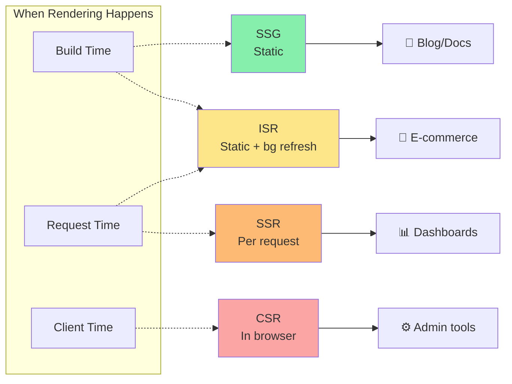

| Strategy | Rendered When | Best For |
|----------|--------------|----------|
| **CSR** (Client-Side) | In the browser, after JS loads | Highly interactive, user-specific dashboards |
| **SSR** (Server-Side) | On the server, per request | Real-time data, personalised pages, SEO |
| **SSG** (Static Generation) | At build time, once | Blogs, docs, marketing pages |
| **ISR** (Incremental Static Regen) | At build time + background refresh | Frequently-updated static content |

In the App Router, Next.js determines which strategy to use at the **component level** — different parts of the same page can use different strategies simultaneously.

---

## 2. Client-Side Rendering (CSR) — Recap

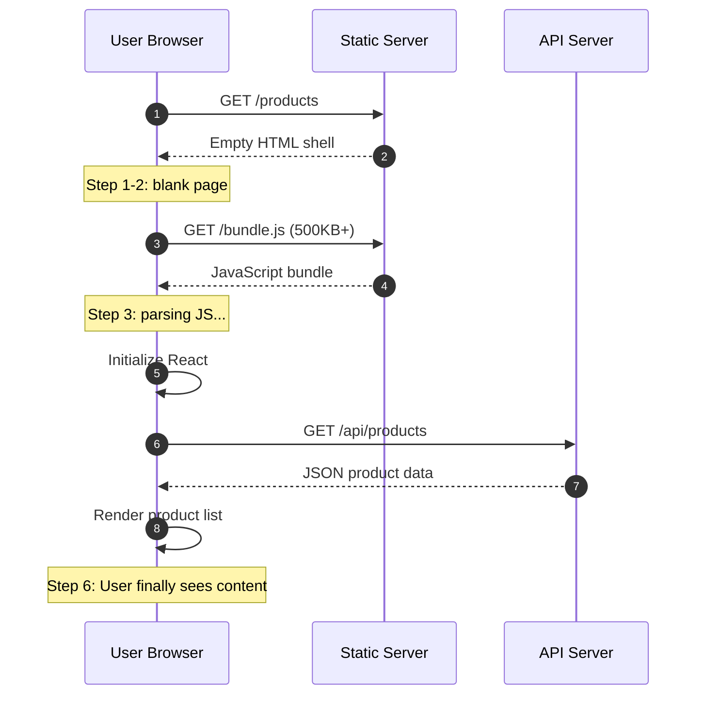

**Timeline:** User sees content only at step 6 — often 2–5 seconds on slow connections.

**When CSR still makes sense:**
- Pages that don't need SEO (e.g., internal admin dashboards)
- Highly interactive UIs that update constantly (e.g., collaborative editors)
- Real-time data that must always be fresh from the client

---

## 3. Server-Side Rendering (SSR) — Deep Dive

With SSR, the HTML is fully generated on the server **for every request**, then sent to the browser.

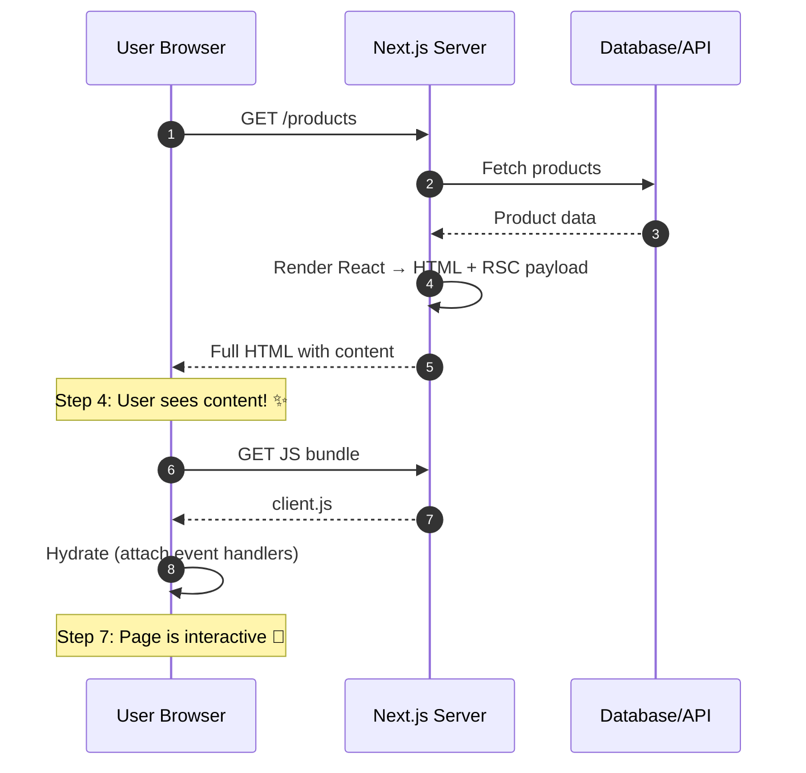

**Advantages of SSR:**
- Users see content on step 4 — fast First Contentful Paint (FCP)
- Search engines crawl fully-rendered HTML → **excellent SEO**
- Sensitive data (API keys, DB queries) never leaves the server
- Content is always up-to-date (re-rendered per request)

**The role of Hydration (step 7):**
After the browser receives HTML, React "hydrates" it — attaching event listeners and making interactive elements work. The page *looks* ready at step 4, but is fully interactive at step 7.

---

## 4. React Server Components (RSC)

React Server Components are the foundation of Next.js App Router rendering. They are **React components that run exclusively on the server**.

### Key Properties

| Property | Server Component | Client Component |
|----------|-----------------|-----------------|
| Runs on | Server only | Browser (+ server for initial HTML) |
| Can use `async/await` | ✅ Yes | ❌ No (use `useEffect`) |
| Can access DB/filesystem | ✅ Yes | ❌ No |
| Can use `useState` / `useEffect` | ❌ No | ✅ Yes |
| Can handle browser events | ❌ No | ✅ Yes |
| Included in JS bundle | ❌ No | ✅ Yes |
| Can import Server Components | ✅ Yes | ❌ No |

**Default behaviour:** Every component in the `app/` directory is a Server Component unless you opt out with `'use client'`.

### RSC Payload (What the Server Actually Sends)

When Next.js renders a Server Component, it doesn't just send HTML. It creates a compact binary format called the **React Server Component Payload (RSC Payload)**. This contains:

- The rendered output of Server Components
- Placeholders for where Client Components should render
- Props passed from Server → Client Components

The browser uses the RSC Payload for subsequent (client-side) navigations — instead of re-requesting full HTML, it gets a lightweight update for only what changed.

### Example: A Server Component

```tsx
// app/products/page.tsx
// No 'use client' → this is a Server Component

import { db } from '@/lib/db'

export default async function ProductsPage() {
  // This query runs on the server — no API route needed!
  const products = await db.select().from(productsTable)

  return (
    <ul>
      {products.map((product) => (
        <li key={product.id}>
          {product.name} — ${product.price}
        </li>
      ))}
    </ul>
  )
}
```

**What happens:**
1. Next.js runs this component on the server
2. The database query runs server-side (never exposed to browser)
3. HTML is generated with the product list embedded
4. Browser receives fully-rendered HTML instantly

---

## 5. Client Components

Client Components are the React components you're already familiar with — they run in the browser and support hooks, events, and browser APIs.

### Marking a Component as Client

Add `'use client'` as the **very first line** of the file:

```tsx
// app/ui/counter.tsx
'use client'

import { useState } from 'react'

export default function Counter() {
  const [count, setCount] = useState(0)

  return (
    <div>
      <p>Count: {count}</p>
      <button onClick={() => setCount(count + 1)}>Increment</button>
    </div>
  )
}
```

### `'use client'` Creates a Boundary

The directive doesn't just mark one file — it marks the **boundary** between server and client module graphs. Once a file has `'use client'`, all its imports are also treated as Client Components.

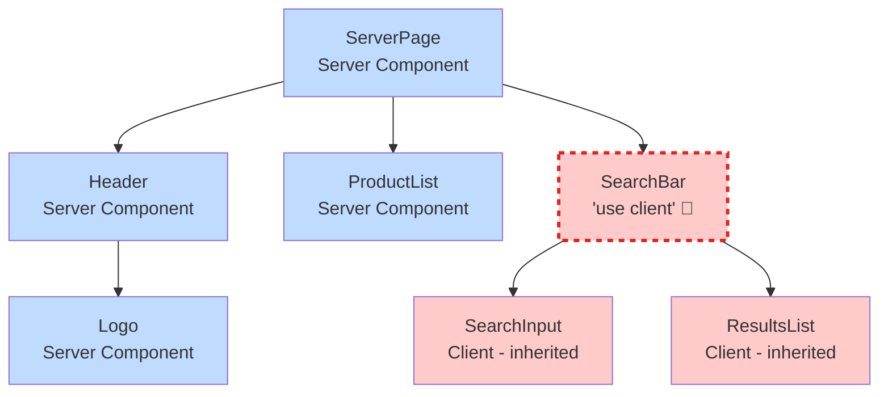

**Key insight:** Everything below the `'use client'` boundary becomes part of the client bundle — even if you don't add the directive to those child files.

### When to Use Client Components

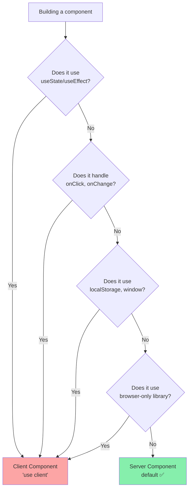

Use `'use client'` only when you need:

- **State management** — `useState`, `useReducer`
- **Lifecycle effects** — `useEffect`, `useLayoutEffect`
- **Event handlers** — `onClick`, `onChange`, `onSubmit`
- **Browser APIs** — `localStorage`, `window`, `navigator.geolocation`
- **Custom hooks** that use any of the above
- **Third-party libraries** that rely on browser APIs

### Minimising Client JavaScript

Keep `'use client'` boundaries as **small and deep** as possible:

```tsx
// ❌ Bad: Entire layout is Client Component
'use client'
export default function Layout({ children }) {
  const [menuOpen, setMenuOpen] = useState(false)
  return (
    <div>
      <nav>...</nav>
      <main>{children}</main>  {/* All children become client */}
    </div>
  )
}

// ✅ Good: Only the interactive part is a Client Component
// layout.tsx (Server Component)
import MobileMenu from './mobile-menu' // 'use client' inside
export default function Layout({ children }) {
  return (
    <div>
      <nav>
        <MobileMenu /> {/* Only this is client */}
      </nav>
      <main>{children}</main>
    </div>
  )
}
```

### Passing Server Components into Client Components

A powerful pattern — you can pass a Server Component as `children` to a Client Component:

```tsx
// app/ui/modal.tsx
'use client'
export default function Modal({ children }: { children: React.ReactNode }) {
  const [open, setOpen] = useState(true)
  return open ? <div className="modal">{children}</div> : null
}

// app/page.tsx (Server Component)
import Modal from './ui/modal'
import Cart from './ui/cart' // Server Component that fetches cart

export default function Page() {
  return (
    <Modal>
      <Cart /> {/* Cart renders on server, passed as RSC payload */}
    </Modal>
  )
}
```

---

## 6. How Next.js Renders a Page (Step by Step)

### First Request — Full Lifecycle

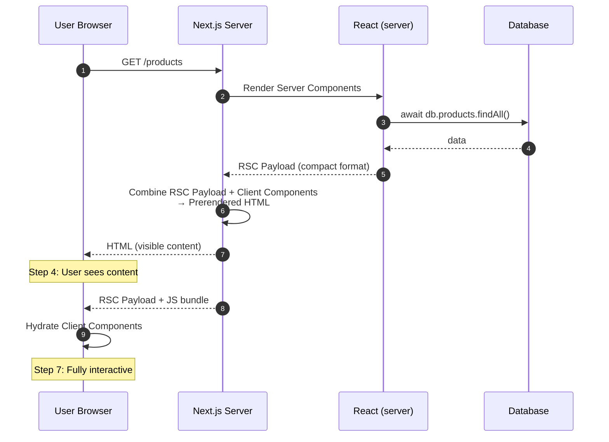

### Subsequent Navigations (Client-Side)

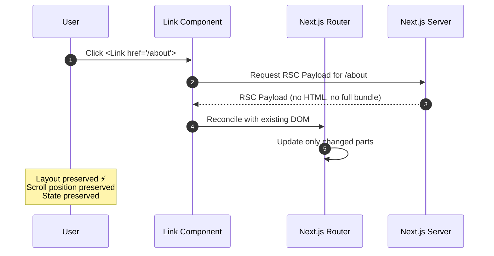

This is why layouts don't re-render on navigation — Next.js only fetches and updates the parts of the tree that actually changed.

### What Goes Where — Server vs Client

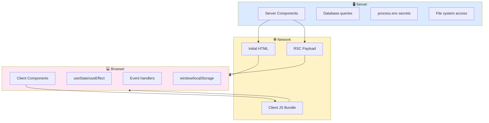

---

## 7. Data Fetching in Server Components

### With `fetch` API

```tsx
// app/blog/page.tsx
export default async function BlogPage() {
  const res = await fetch('https://api.example.com/posts')
  const posts = await res.json()

  return (
    <ul>
      {posts.map((post) => (
        <li key={post.id}>{post.title}</li>
      ))}
    </ul>
  )
}
```

**Key notes:**
- No `useEffect` — just `async/await` in the component
- Identical `fetch` calls in the same render tree are **automatically memoized** (deduplicated)
- By default, `fetch` results are **not cached** — they run fresh on every request (pure SSR behaviour)

### Directly with ORM / Database

```tsx
// app/dashboard/page.tsx
import { db } from '@/lib/db'

export default async function DashboardPage() {
  // Direct DB query — credentials stay on server, never in browser bundle
  const stats = await db.query('SELECT COUNT(*) FROM orders WHERE status = $1', ['pending'])

  return <div>Pending orders: {stats.rows[0].count}</div>
}
```

### Parallel Data Fetching

Avoid sequential waterfalls — start multiple requests simultaneously:

```tsx
// ❌ Sequential (slow) — getAlbums waits for getArtist
const artist = await getArtist(username)
const albums = await getAlbums(username)

// ✅ Parallel — both start at the same time
const artistPromise = getArtist(username)
const albumsPromise = getAlbums(username)
const [artist, albums] = await Promise.all([artistPromise, albumsPromise])
```

### Protecting Server-Only Code

Use the `server-only` package to prevent accidental imports in Client Components:

```ts
// lib/data.ts
import 'server-only'  // Build-time error if imported in 'use client' file

export async function getSecretData() {
  return db.query('SELECT * FROM sensitive_table')
}
```

---

## 8. Streaming with Suspense

Traditional SSR blocks the entire page until all data is ready. **Streaming** lets you send HTML in chunks as data becomes available.

### The Problem Without Streaming

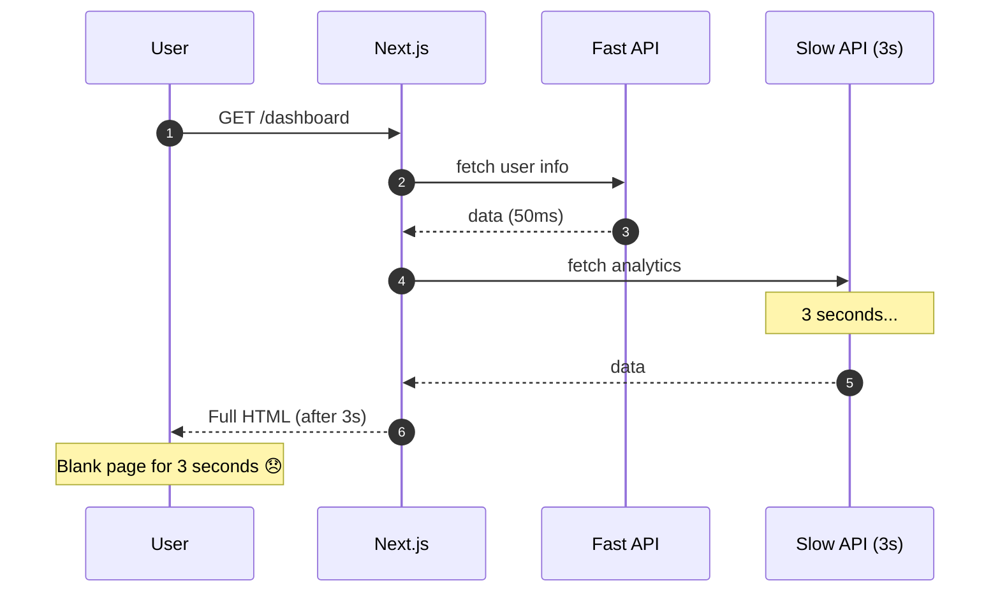

### With Streaming

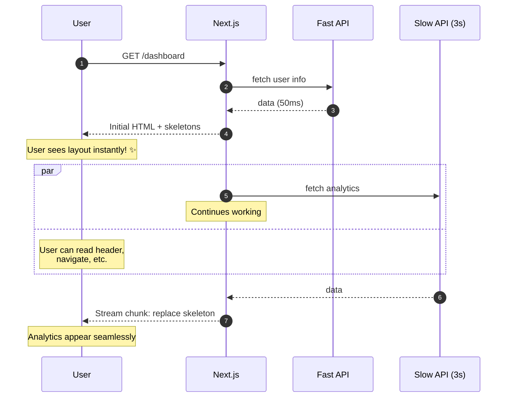

### Streaming with `loading.tsx`

Create a `loading.tsx` file next to your `page.tsx` to stream the entire page:

```tsx
// app/dashboard/loading.tsx
export default function DashboardLoading() {
  return (
    <div>
      <div className="skeleton h-8 w-1/4 mb-4" />
      <div className="skeleton h-64 w-full" />
    </div>
  )
}
```

```
Request page
  ↓
Immediately send: layout + loading skeleton     ← user sees this NOW
  ↓ (background: fetching data)
Stream in: actual page content                  ← replaces skeleton
```

Behind the scenes, `loading.tsx` wraps your `page.tsx` in a `<Suspense>` boundary.

### Granular Streaming with `<Suspense>`

For more control, wrap individual slow components in `<Suspense>`:

```tsx
// app/dashboard/page.tsx
import { Suspense } from 'react'
import RevenueChart from './revenue-chart'      // slow (queries DB)
import LatestInvoices from './latest-invoices'  // fast

export default function DashboardPage() {
  return (
    <main>
      {/* Renders immediately */}
      <h1>Dashboard</h1>
      <LatestInvoices />

      {/* Streams in after data is ready */}
      <Suspense fallback={<ChartSkeleton />}>
        <RevenueChart />
      </Suspense>
    </main>
  )
}
```

**The user sees:**
1. Instant: heading + latest invoices + chart skeleton
2. After data loads: chart appears, replacing the skeleton

---

## 9. Static vs Dynamic Rendering

### How Next.js Decides

At build time, Next.js analyses each route to determine whether it can be **statically prerendered** or must be **dynamically rendered** per request.

```mermaid
flowchart TD
    Page[Page being analyzed] --> Q1{Uses cookies&#40;&#41; or<br/>headers&#40;&#41;?}
    Q1 -->|Yes| Dynamic[🔄 Dynamic Rendering<br/>Per request]
    Q1 -->|No| Q2{Uses searchParams?}
    Q2 -->|Yes| Dynamic
    Q2 -->|No| Q3{Has uncached<br/>fetch&#40;&#41;?}
    Q3 -->|Yes| Dynamic
    Q3 -->|No| Q4{Uses 'use cache'<br/>directive?}
    Q4 -->|Yes| Cached[💾 Cached<br/>Static + Revalidate]
    Q4 -->|No| Static[⚡ Static<br/>Prerendered at build]

    style Static fill:#86efac
    style Cached fill:#fde68a
    style Dynamic fill:#fdba74
```

| Trigger | Result |
|---------|--------|
| No dynamic data | **Static** — prerendered at build, served instantly from CDN |
| Uses `cookies()`, `headers()` | **Dynamic** — rendered per request |
| Uses `searchParams` | **Dynamic** — rendered per request |
| Has uncached `fetch()` | **Dynamic** — rendered per request |
| Uses `use cache` directive | **Static** — cached until revalidated |

### Static Rendering Example

```tsx
// app/about/page.tsx
// No dynamic APIs used → Next.js pre-renders this at build time
export default function AboutPage() {
  return <h1>About Our Company</h1>
}
```

This page is generated once during `next build` and served as a static file — blazing fast.

### Dynamic Rendering Example

```tsx
// app/profile/page.tsx
import { cookies } from 'next/headers'

export default async function ProfilePage() {
  // cookies() is a dynamic API → forces dynamic rendering
  const cookieStore = await cookies()
  const userId = cookieStore.get('user_id')?.value

  const user = await getUser(userId)
  return <h1>Welcome, {user.name}!</h1>
}
```

This page is re-rendered on every request because it needs user-specific cookie data.

---

## 10. Quick Quiz

1. What is the RSC Payload and why does Next.js use it?
2. In what scenario would you choose SSR over SSG?
3. Why should `'use client'` boundaries be placed as deep in the component tree as possible?
4. What is "hydration" and why does it happen after SSR?
5. How does `loading.tsx` relate to `<Suspense>` internally?
6. What's the difference between sequential and parallel data fetching — write the parallel version of this:
   ```ts
   const user = await getUser(id)
   const posts = await getPosts(id)
   ```

---

## Key Takeaways

- **Server Components** run on the server — no JS sent to browser, can access DB directly.
- **Client Components** run in the browser — use `'use client'`, support hooks and events.
- **Default is server** — opt into client only when you need interactivity.
- **SSR** = per-request rendering — always fresh, great for SEO.
- **Streaming** + `<Suspense>` = no more full-page loading states.
- Keep client boundaries **small and deep** to minimise JavaScript bundle size.

---

**← Previous Session:** Intro to Next.js
**Next Session →** SSR Features in Next.js (11:15 AM)

*References: [Next.js Docs 16.2.4 — Server and Client Components](https://nextjs.org/docs/app/getting-started/server-and-client-components) · [Fetching Data](https://nextjs.org/docs/app/getting-started/fetching-data)*
