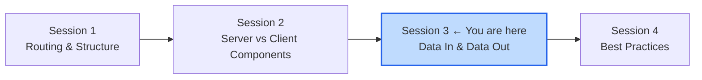
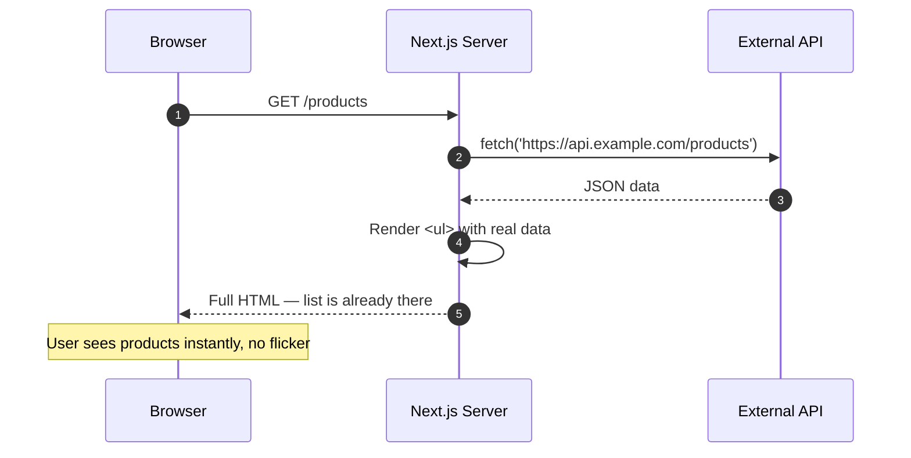
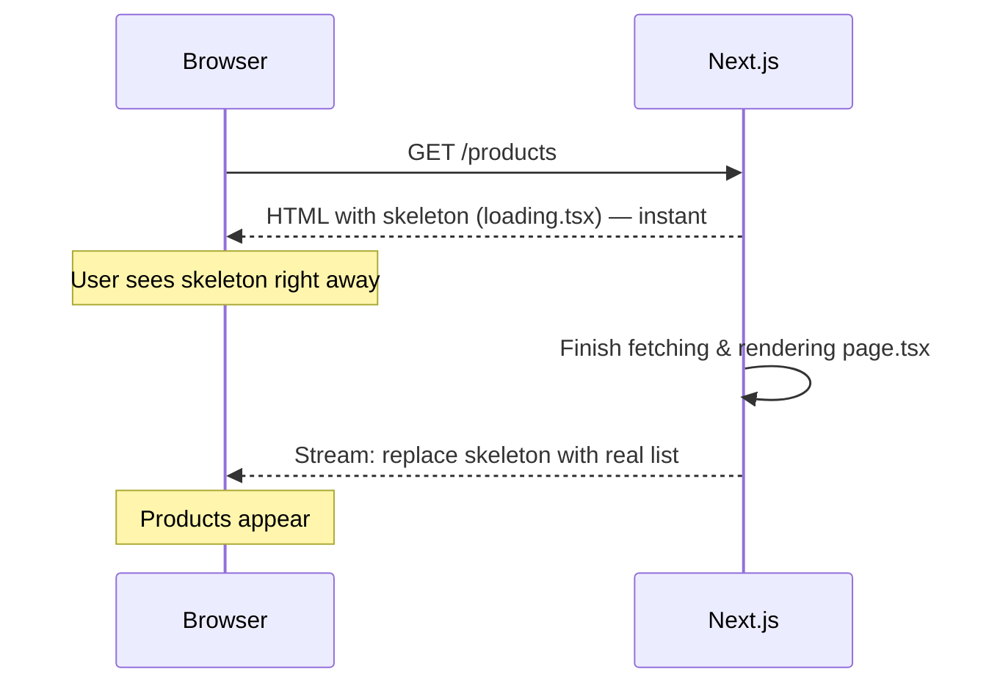
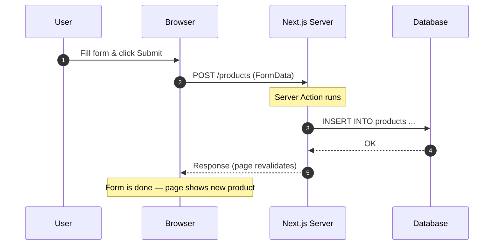

# Session 3: Data Fetching & Server Actions

**Duration:** 30 minutes | **Time:** 11:15 AM – 11:45 AM

---

## Table of Contents

1. [Where We Are](#1-where-we-are)
2. [The "Aha" Moment — Async Server Components](#2-the-aha-moment--async-server-components)
3. [Handling Loading & Error States](#3-handling-loading--error-states)
4. [Server Actions — Mutating Data from a Form](#4-server-actions--mutating-data-from-a-form)
5. [Putting It Together — A Mini Feature](#5-putting-it-together--a-mini-feature)
6. [Quick Quiz](#6-quick-quiz)

---

## 1. Where We Are

After Sessions 1 and 2 you can:

- Create routes with `app/` folder structure
- Know when to reach for Server vs Client Components
- Understand that the server renders HTML before it reaches the browser

**Session 3 answers: how does data get in and out?**



---

## 2. The "Aha" Moment — Async Server Components

In plain React, getting data into a page looks like this:

```tsx
// React (CSR) — the old way
'use client'
import { useEffect, useState } from 'react'

export default function ProductsPage() {
  const [products, setProducts] = useState([])

  useEffect(() => {
    fetch('/api/products')
      .then(r => r.json())
      .then(setProducts)
  }, [])

  return <ul>{products.map(p => <li key={p.id}>{p.name}</li>)}</ul>
}
```

Problems: an extra API route, a loading flash, no SEO, secrets can't go here.

**In Next.js App Router, a Server Component can just be `async`:**

```tsx
// app/products/page.tsx — Server Component (no 'use client')
export default async function ProductsPage() {
  const res = await fetch('https://api.example.com/products')
  const products = await res.json()

  return (
    <ul>
      {products.map((p) => (
        <li key={p.id}>{p.name}</li>
      ))}
    </ul>
  )
}
```

That's the entire page. No `useEffect`. No state. No API route.

### What's happening under the hood



### You can also query a database directly

```tsx
// app/products/page.tsx
import { db } from '@/lib/db'

export default async function ProductsPage() {
  // This runs on the server — DB credentials never reach the browser
  const products = await db.query('SELECT id, name, price FROM products')

  return (
    <ul>
      {products.rows.map((p) => (
        <li key={p.id}>{p.name} — ${p.price}</li>
      ))}
    </ul>
  )
}
```

No API route needed. The DB query runs on the server and disappears before the response reaches the browser.

---

## 3. Handling Loading & Error States

### `loading.tsx` — instant skeleton while data fetches

Create a file called `loading.tsx` next to your `page.tsx`:

```
app/
└── products/
    ├── page.tsx        ← your real page (async, fetches data)
    └── loading.tsx     ← shown immediately while page.tsx is working
```

```tsx
// app/products/loading.tsx
export default function Loading() {
  return (
    <ul>
      {[1, 2, 3].map((i) => (
        <li key={i} className="h-6 bg-gray-200 rounded animate-pulse mb-2" />
      ))}
    </ul>
  )
}
```

Next.js automatically wraps `page.tsx` in a `<Suspense>` boundary. The user sees the skeleton immediately — the real list streams in when data is ready.



### `error.tsx` — graceful error fallback

```tsx
// app/products/error.tsx
'use client' // error boundaries must be Client Components

export default function Error({
  error,
  reset,
}: {
  error: Error
  reset: () => void
}) {
  return (
    <div>
      <p>Could not load products: {error.message}</p>
      <button onClick={reset}>Try again</button>
    </div>
  )
}
```

If `page.tsx` throws (network error, DB down, etc.), Next.js shows this instead of crashing the whole app. The user gets a "Try again" button — no white screen of death.

---

## 4. Server Actions — Mutating Data from a Form

So far we've covered **reading** data. But how do you **write** data (create, update, delete) without building a separate API?

**Server Actions** are async functions that run on the server, called directly from a form.

### Defining a Server Action

```tsx
// app/products/actions.ts
'use server' // marks every export in this file as a Server Action

export async function addProduct(formData: FormData) {
  const name = formData.get('name') as string
  const price = Number(formData.get('price'))

  await db.query(
    'INSERT INTO products (name, price) VALUES ($1, $2)',
    [name, price]
  )
}
```

### Using it in a form

```tsx
// app/products/add-product-form.tsx
import { addProduct } from './actions'

export default function AddProductForm() {
  return (
    <form action={addProduct}>
      <input name="name" placeholder="Product name" required />
      <input name="price" type="number" placeholder="Price" required />
      <button type="submit">Add Product</button>
    </form>
  )
}
```

That's it. When the user submits the form, Next.js calls `addProduct` on the server. No `fetch`. No `useState`. No API route.

### What's happening



The browser never touches the database. The action runs server-side. The database stays safe.

---

## 5. Putting It Together — A Mini Feature

Here's a complete working feature: a product list with an add form.

```
app/
└── products/
    ├── page.tsx              ← shows the list, includes the form
    ├── loading.tsx           ← skeleton while list loads
    ├── error.tsx             ← error fallback
    └── actions.ts            ← addProduct server action
```

```tsx
// app/products/page.tsx
import { db } from '@/lib/db'
import { addProduct } from './actions'

export default async function ProductsPage() {
  const products = await db.query('SELECT id, name, price FROM products')

  return (
    <main>
      <h1>Products</h1>

      <form action={addProduct}>
        <input name="name" placeholder="Name" required />
        <input name="price" type="number" placeholder="Price" required />
        <button type="submit">Add</button>
      </form>

      <ul>
        {products.rows.map((p) => (
          <li key={p.id}>{p.name} — ${p.price}</li>
        ))}
      </ul>
    </main>
  )
}
```

Notice what's missing: no `useState`, no `useEffect`, no `fetch`, no API routes, no event handlers. Just `async/await` and a `form action`.

---

## 6. Quick Quiz

1. Why don't we need `useEffect` to fetch data in a Server Component?
2. What does `loading.tsx` do automatically behind the scenes?
3. Why must `error.tsx` be a Client Component?
4. What does `'use server'` do at the top of a file?
5. In the form example, where does `addProduct` actually run — browser or server?

---

## Key Takeaways

- **Async Server Components** fetch data with plain `await` — no API routes, no `useEffect`.
- **`loading.tsx`** shows a skeleton instantly while data loads — free streaming UI.
- **`error.tsx`** catches failures gracefully — always a Client Component.
- **Server Actions** (`'use server'`) let forms write data server-side — no separate API needed.
- The result: full read/write features with almost no boilerplate.

---

**← Previous Session:** Server vs Client Components
**Next Session →** Best Practices (11:45 AM)

*References: [Next.js Docs — Fetching Data](https://nextjs.org/docs/app/getting-started/fetching-data) · [Server Actions](https://nextjs.org/docs/app/building-your-application/data-fetching/server-actions-and-mutations)*
