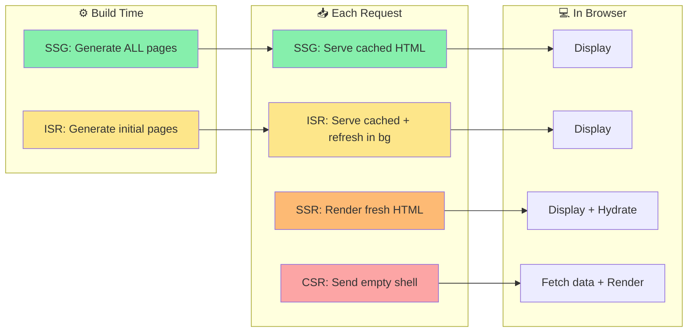
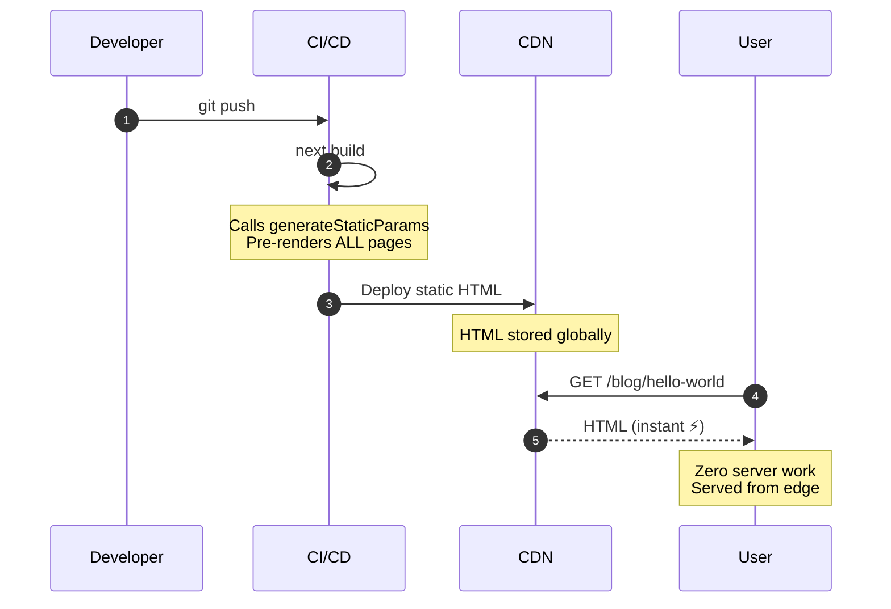
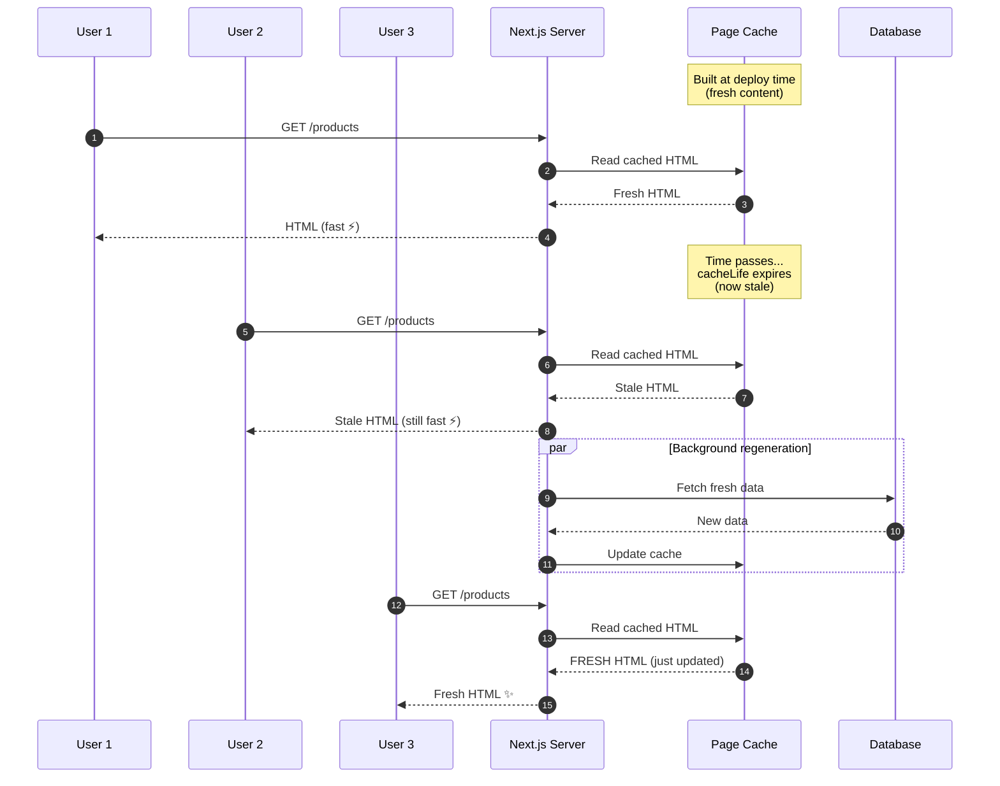
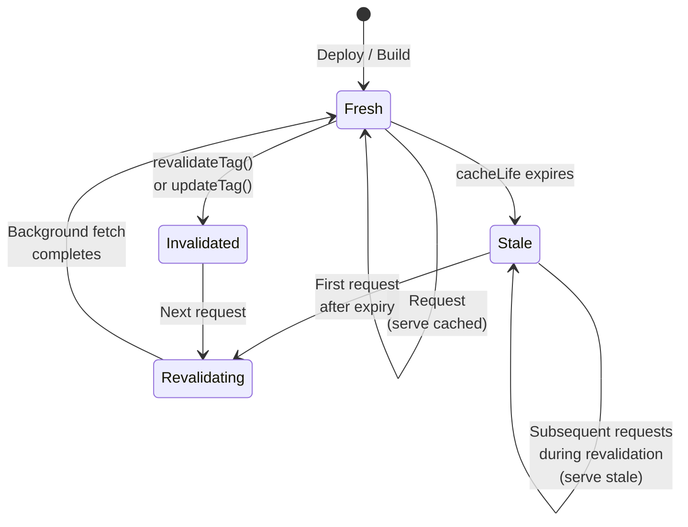
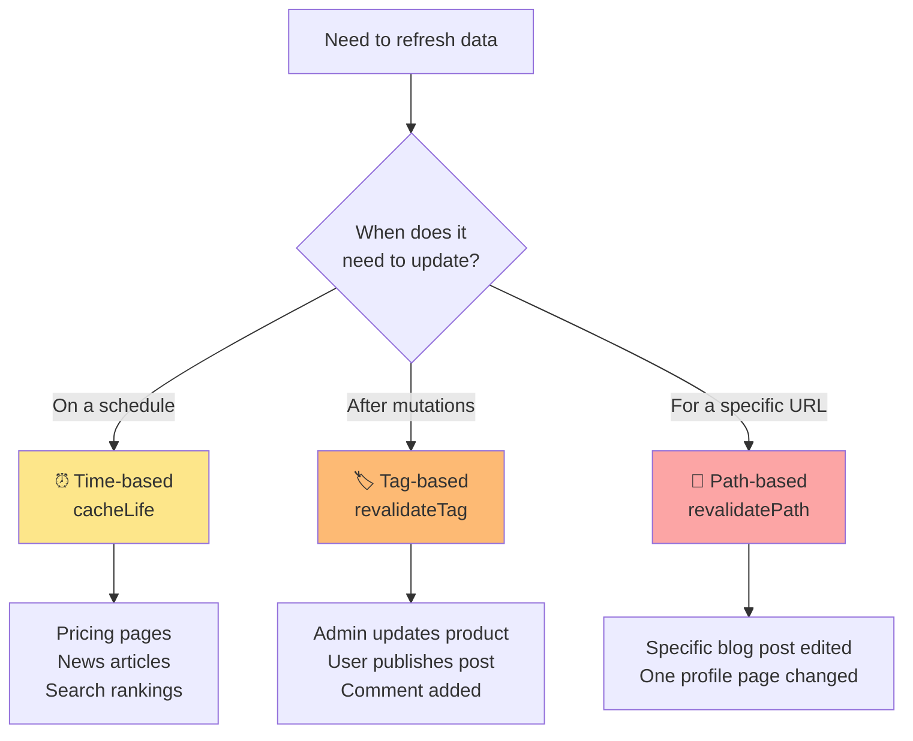
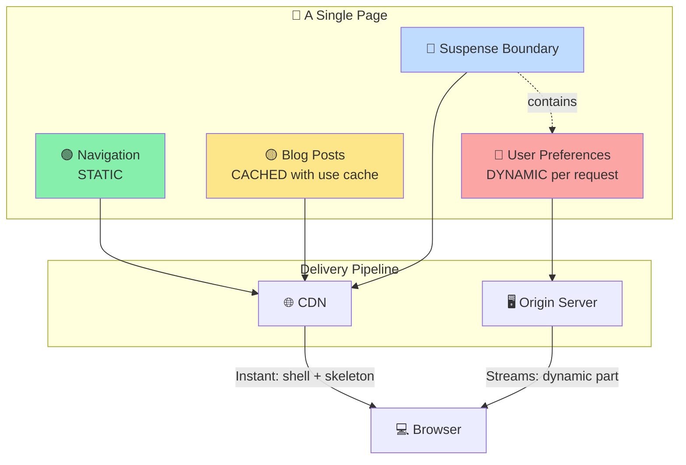
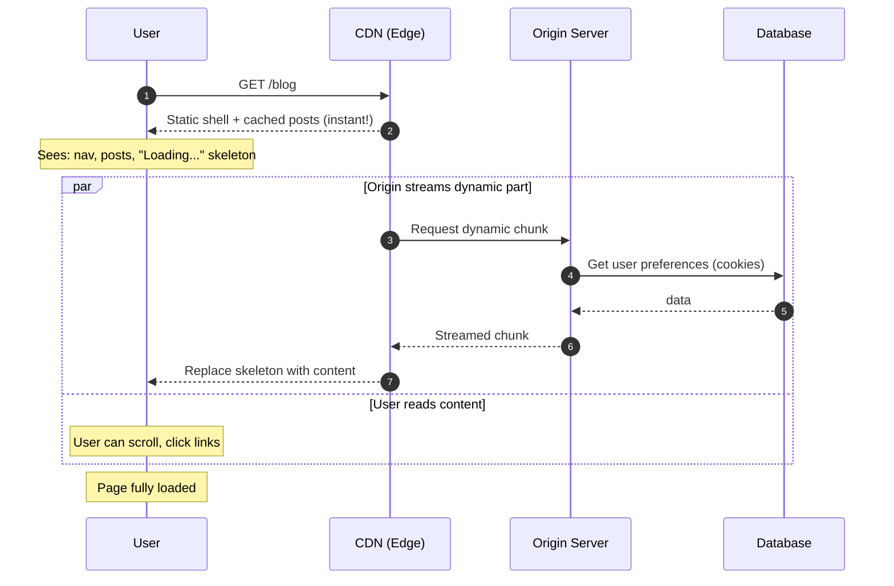
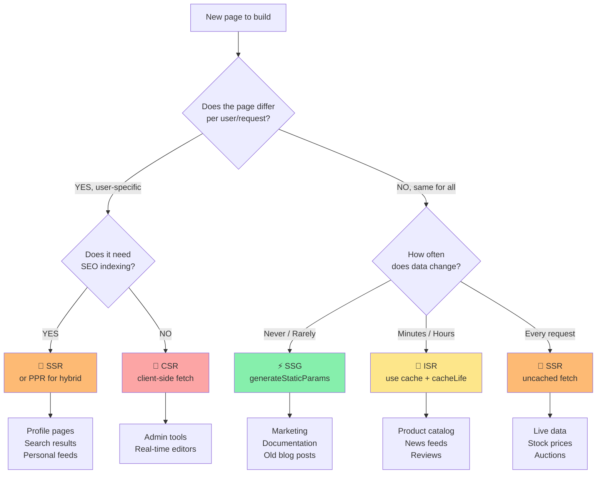

# Session 3: SSR Features in Next.js

**Duration:** 30 minutes | **Time:** 11:15 AM – 11:45 AM

---

## Table of Contents

1. [The Four Rendering Modes — Compared](#1-the-four-rendering-modes--compared)
2. [Static Site Generation (SSG)](#2-static-site-generation-ssg)
3. [Incremental Static Regeneration (ISR)](#3-incremental-static-regeneration-isr)
4. [Caching with `use cache`](#4-caching-with-use-cache)
5. [Revalidation Strategies](#5-revalidation-strategies)
6. [Partial Prerendering (PPR)](#6-partial-prerendering-ppr)
7. [Choosing the Right Strategy](#7-choosing-the-right-strategy)
8. [Quick Quiz](#8-quick-quiz)

---

## 1. The Four Rendering Modes — Compared



### Performance Spectrum


| | CSR | SSR | SSG | ISR |
|---|---|---|---|---|
| **Rendered** | Browser | Server (per request) | Server (build time) | Server (build + background) |
| **HTML on first load** | Empty shell | Full HTML | Full HTML | Full HTML |
| **SEO** | Poor | Excellent | Excellent | Excellent |
| **Always fresh data** | Yes | Yes | No (rebuild needed) | Configurable |
| **Server load** | None | High | None | Low |
| **Time to First Byte** | Fast (empty) | Depends on data | Fastest | Fastest |
| **Best for** | Dashboards | User-specific, live data | Docs, blogs, marketing | E-commerce, news, catalogs |

---

## 2. Static Site Generation (SSG)

SSG pre-renders pages at **build time** — the HTML is created once and served from a CDN. It's the fastest possible delivery method.



### How Next.js Decides to SSG a Page

Next.js **automatically** statically generates a page when:
- No dynamic APIs are used (`cookies()`, `headers()`, `searchParams`)
- All data is fetched with `use cache` or from deterministic operations
- The route has no dynamic segments, **or** you provide `generateStaticParams`

### `generateStaticParams` — Pre-generating Dynamic Routes

For dynamic routes like `/blog/[slug]`, you can tell Next.js which slugs to pre-build:

```tsx
// app/blog/[slug]/page.tsx

// Tell Next.js: "Generate HTML for these slugs at build time"
export async function generateStaticParams() {
  const posts = await fetch('https://api.example.com/posts').then(r => r.json())

  return posts.map((post) => ({
    slug: post.slug,          // e.g. "hello-world", "nextjs-intro"
  }))
}

export default async function BlogPost({
  params,
}: {
  params: Promise<{ slug: string }>
}) {
  const { slug } = await params
  const post = await getPost(slug)

  return (
    <article>
      <h1>{post.title}</h1>
      <p>{post.content}</p>
    </article>
  )
}
```

**At build time**, Next.js calls `generateStaticParams`, gets the list of slugs, and pre-renders HTML for every single one. When a user visits `/blog/hello-world`, they get a pre-built static file — zero server work.

### Static Rendering is the Default

```tsx
// app/about/page.tsx
// ✅ This is automatically static — no dynamic APIs, no uncached fetches
export default function About() {
  return <div>About page — rendered at build time</div>
}
```

---

## 3. Incremental Static Regeneration (ISR)

ISR is the "best of both worlds" — you get the speed of static pages, but they can be **automatically updated** after deployment without a full rebuild.

### The Stale-While-Revalidate Pattern



### State Machine



This is called the **stale-while-revalidate** pattern.

### ISR with `use cache` (Next.js 15+)

In the App Router with Cache Components, ISR behaviour is achieved using the `use cache` directive with `cacheLife`:

```tsx
// app/products/page.tsx
import { cacheLife } from 'next/cache'

export default async function ProductsPage() {
  'use cache'
  cacheLife('hours')  // Cache for hours, revalidate in background

  const products = await fetch('https://api.example.com/products').then(r => r.json())

  return (
    <ul>
      {products.map((p) => (
        <li key={p.id}>{p.name} — ${p.price}</li>
      ))}
    </ul>
  )
}
```

### `cacheLife` Built-In Profiles

| Profile | Stale | Revalidate | Expire |
|---------|-------|------------|--------|
| `'seconds'` | 0s | 15s | 60s |
| `'minutes'` | 0s | 60s | 3600s |
| `'hours'` | 0s | 3600s | 86400s |
| `'days'` | 0s | 86400s | 604800s |
| `'weeks'` | 0s | 604800s | 2592000s |
| `'max'` | 0s | 2592000s | 31536000s |

### Custom `cacheLife`

```tsx
import { cacheLife } from 'next/cache'

async function getInventory() {
  'use cache'
  cacheLife({
    stale: 30,          // Serve stale for up to 30 seconds
    revalidate: 300,    // Revalidate after 5 minutes
    expire: 86400,      // Expire after 24 hours
  })

  return db.inventory.findAll()
}
```

### ISR with `fetch` revalidate (Previous API — still works)

In projects not using Cache Components, ISR is configured via `next: { revalidate }`:

```tsx
export default async function Page() {
  // Revalidate this data every 60 seconds
  const data = await fetch('https://api.example.com/data', {
    next: { revalidate: 60 }
  })
  const items = await data.json()

  return <ul>{items.map(item => <li key={item.id}>{item.name}</li>)}</ul>
}
```

---

## 4. Caching with `use cache`

The `use cache` directive is Next.js's unified caching primitive. It can cache both **data** and **UI**.

### Data-Level Caching

Cache a function that fetches data — useful when the same data is used in multiple components:

```tsx
// lib/data.ts
import { cacheLife, cacheTag } from 'next/cache'

export async function getProducts() {
  'use cache'
  cacheLife('hours')
  cacheTag('products')    // Tag for on-demand invalidation

  return db.select().from(products)
}
```

### UI-Level Caching

Cache an entire component or page — the rendered HTML output is cached:

```tsx
// app/blog/page.tsx
import { cacheLife } from 'next/cache'

export default async function BlogPage() {
  'use cache'
  cacheLife('days')

  const posts = await getPosts()
  return <PostList posts={posts} />
}
```

### The Cache Key

The cache key is automatically derived from:
- The function/component identity
- All arguments passed to it
- All values closed over from parent scope

```tsx
// Each user gets their own cache entry
async function getUserProfile(userId: string) {
  'use cache'
  cacheLife('minutes')
  // userId is automatically part of the cache key
  return db.user.findById(userId)
}
```

### Enabling Cache Components

```ts
// next.config.ts
import type { NextConfig } from 'next'

const nextConfig: NextConfig = {
  cacheComponents: true,
}

export default nextConfig
```

---

## 5. Revalidation Strategies

Revalidation = telling Next.js to discard cached data and fetch fresh content.



### Time-Based Revalidation

Automatically revalidates after a duration — controlled by `cacheLife`:

```tsx
'use cache'
cacheLife('hours')  // Fresh for ~1 hour, then revalidated in background
```

### On-Demand Revalidation with `revalidateTag`

Trigger revalidation immediately after a mutation (e.g., admin publishes new content):

```tsx
// lib/actions.ts
'use server'

import { revalidateTag } from 'next/cache'

export async function publishProduct(formData: FormData) {
  const name = formData.get('name') as string
  const price = formData.get('price') as string

  // Save to database
  await db.products.create({ name, price: Number(price) })

  // Invalidate all caches tagged 'products'
  revalidateTag('products')  // Any 'use cache' with cacheTag('products') is now stale
}
```

The cached data:
```tsx
export async function getProducts() {
  'use cache'
  cacheTag('products')   // Tagged — will be invalidated by revalidateTag('products')
  return db.products.findAll()
}
```

### On-Demand Revalidation with `revalidatePath`

Revalidate by URL path instead of tag:

```tsx
'use server'
import { revalidatePath } from 'next/cache'

export async function updateBlogPost(id: string, content: string) {
  await db.posts.update({ id, content })
  revalidatePath(`/blog/${id}`)  // Revalidate the specific blog post page
  revalidatePath('/blog')        // Also revalidate the blog listing page
}
```

### `updateTag` — Immediate Invalidation

`updateTag` works like `revalidateTag` but is used inside Server Actions with Cache Components:

```tsx
async function createPost(formData: FormData) {
  'use server'
  await db.post.create({ data: { title: formData.get('title') } })
  updateTag('posts')  // Immediately marks all 'posts' cached entries as expired
}
```

---

## 6. Partial Prerendering (PPR)

PPR is the **default rendering model when Cache Components is enabled**. It combines the best of static and dynamic rendering on a single page.

### The PPR Architecture



### PPR Request Timeline



### PPR in Practice

```tsx
// app/blog/page.tsx
import { Suspense } from 'react'
import { cookies } from 'next/headers'
import { cacheLife, cacheTag } from 'next/cache'

export default function BlogPage() {
  return (
    <>
      {/* Static — included in pre-built HTML */}
      <header>
        <h1>Our Blog</h1>
      </header>

      {/* Cached — fetched at build/revalidation, served statically */}
      <BlogPosts />

      {/* Dynamic — streams in per request (personalized) */}
      <Suspense fallback={<p>Loading your bookmarks...</p>}>
        <UserBookmarks />
      </Suspense>
    </>
  )
}

// Cached component — everyone gets the same content
async function BlogPosts() {
  'use cache'
  cacheLife('hours')
  cacheTag('posts')

  const posts = await fetch('https://api.example.com/posts').then(r => r.json())
  return (
    <ul>
      {posts.map((post) => (
        <li key={post.id}>{post.title}</li>
      ))}
    </ul>
  )
}

// Dynamic component — personalized per user
async function UserBookmarks() {
  const userId = (await cookies()).get('user_id')?.value
  const bookmarks = await getUserBookmarks(userId)
  return <ul>{bookmarks.map(b => <li key={b.id}>{b.title}</li>)}</ul>
}
```

**What the user experiences:**
1. **Instantly:** Header + blog posts (from CDN)
2. **Streaming:** Bookmarks appear after user-specific data loads

---

## 7. Choosing the Right Strategy

### Decision Tree



### Real-World Mapping

| Page Type | Strategy | Why |
|-----------|----------|-----|
| Marketing homepage | SSG | Never changes, maximum speed |
| Blog post | ISR (hours/days) | Rarely updated, still fast |
| Product listing | ISR (minutes) | Inventory changes, but not per-user |
| Product detail | ISR + PPR | Product cached; stock level dynamic |
| Search results | SSR | Results depend on query param |
| User dashboard | SSR or CSR | Fully user-specific |
| News feed | ISR (seconds/minutes) | Frequent updates, many users |
| Admin panel | CSR | No SEO needed, always user-specific |

### Cost vs Freshness Trade-off

```mermaid
quadrantChart
    title Strategy Trade-offs
    x-axis Low Server Cost --> High Server Cost
    y-axis Stale Data --> Fresh Data
    quadrant-1 Best for fresh + cheap (rare!)
    quadrant-2 Static content
    quadrant-3 Rarely useful
    quadrant-4 High cost, fresh data
    SSG: [0.1, 0.2]
    ISR: [0.25, 0.65]
    PPR: [0.4, 0.85]
    SSR: [0.85, 0.95]
    CSR: [0.15, 0.7]
```

---

## 8. Quick Quiz

1. What is the "stale-while-revalidate" pattern in ISR?
2. You have a product page. The product name/description rarely changes but the stock count updates every minute. How would you structure the caching?
3. What's the difference between `revalidateTag` and `revalidatePath`?
4. A marketing site builds 10,000 blog pages at build time using `generateStaticParams`. A new post is published. How does the user see it without a full rebuild?
5. When would you use PPR vs pure SSR?

---

## Key Takeaways

- **SSG** = build-time rendering, fastest, no server costs — but data is frozen until rebuild.
- **ISR** = SSG + automatic background refresh — use `cacheLife` to control freshness.
- **`use cache`** is the unified directive for caching data and UI at any granularity.
- **`cacheTag` + `revalidateTag`** = powerful on-demand cache invalidation.
- **PPR** = static shell + dynamic streaming — get CDN speed for most of the page while personalised parts stream in.
- Choose rendering strategy based on **how often data changes** and **whether it's user-specific**.

---

**← Previous Session:** SSR in Next.js
**Next Session →** Real-Life Use Cases, Best Practices & Disadvantages (11:45 AM)

*References: [Next.js Docs 16.2.4 — Caching](https://nextjs.org/docs/app/getting-started/caching) · [Revalidating](https://nextjs.org/docs/app/getting-started/revalidating) · [ISR Guide](https://nextjs.org/docs/app/guides/incremental-static-regeneration)*
