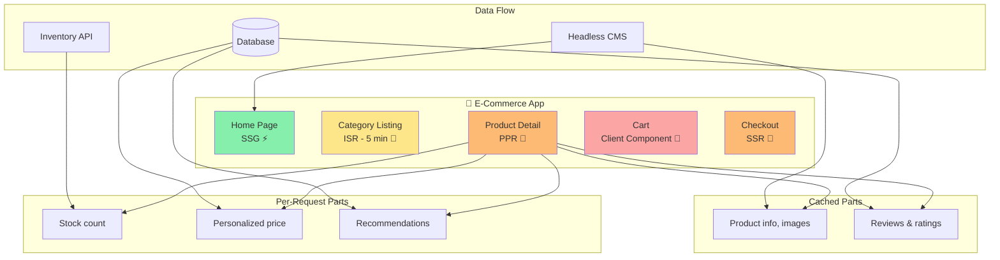
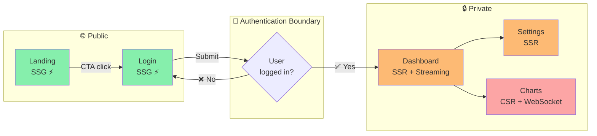
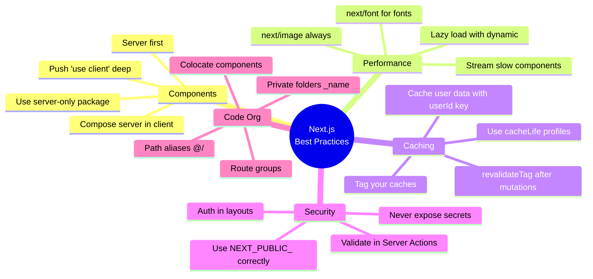
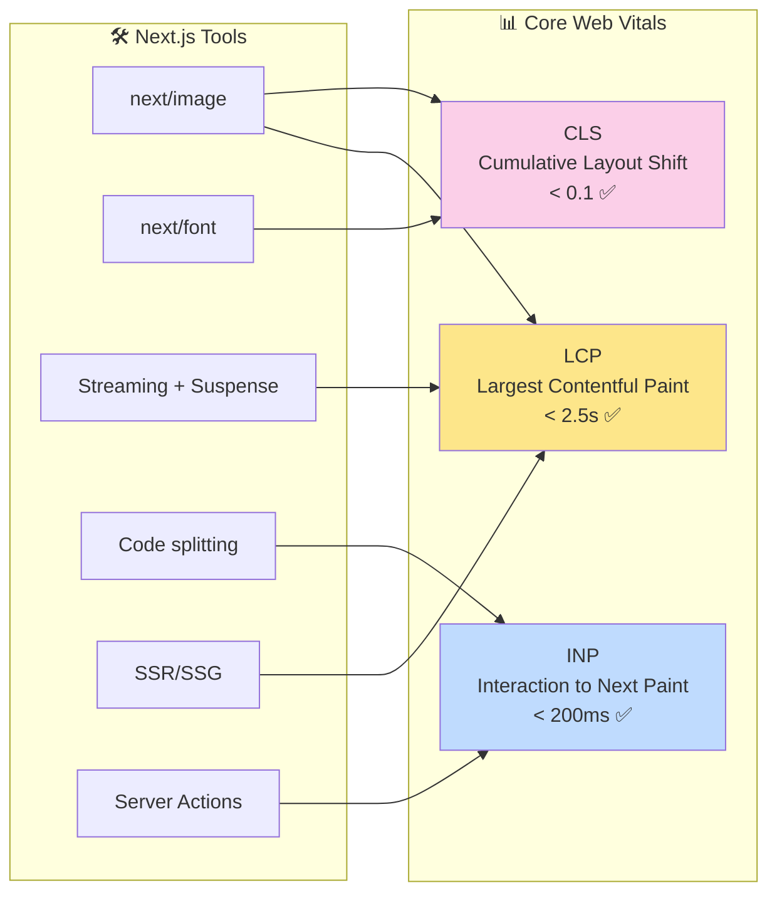
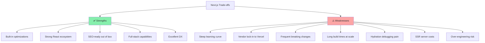
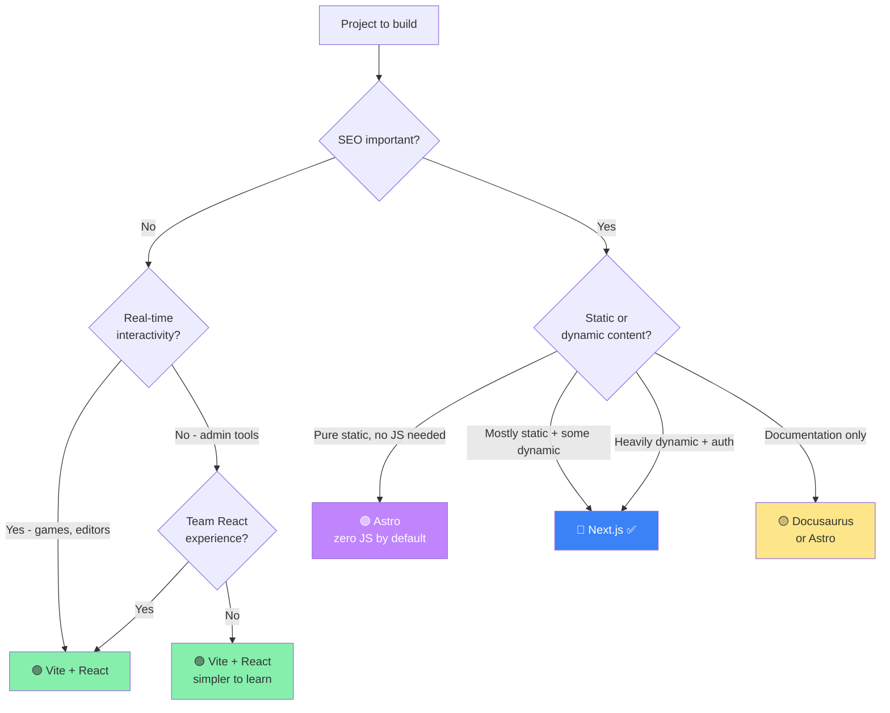
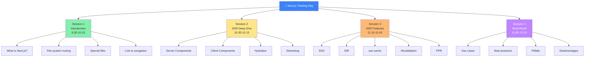

# Session 4: Real-Life Use Cases, Best Practices & Disadvantages

**Duration:** 30 minutes | **Time:** 11:45 AM – 12:15 PM

---

## Table of Contents

1. [Who Uses Next.js in Production?](#1-who-uses-nextjs-in-production)
2. [Real-Life Use Cases by Industry](#2-real-life-use-cases-by-industry)
3. [Best Practices](#3-best-practices)
4. [Performance Optimizations](#4-performance-optimizations)
5. [Common Pitfalls to Avoid](#5-common-pitfalls-to-avoid)
6. [Disadvantages of Next.js](#6-disadvantages-of-nextjs)
7. [When NOT to Use Next.js](#7-when-not-to-use-nextjs)
8. [Next.js vs Alternatives](#8-nextjs-vs-alternatives)
9. [Quick Quiz](#9-quick-quiz)

---

## 1. Who Uses Next.js in Production?

Next.js has become one of the most widely adopted React frameworks globally. Some notable adopters:

| Company | Use Case | Result |
|---------|----------|--------|
| **Nike** | Global e-commerce, product pages | Sub-second page loads worldwide |
| **TikTok** | Creator platform & web app | SSR for initial feed, CSR for interactivity |
| **Walmart** | E-commerce catalog | ISR for product pages at massive scale |
| **Spotify** | Web player, content pages | SSG for marketing, SSR for personalised pages |
| **Twitch** | Dashboard & discovery | Hybrid rendering per page type |
| **Hulu** | Streaming platform | SEO-critical landing pages via SSR |
| **Starbucks** | Online ordering | SSR for menu + ordering flow |

> As of 2024, Next.js powers **~11% of all websites** built with React frameworks globally.

---

## 2. Real-Life Use Cases by Industry

### E-Commerce

**Challenge:** Thousands of product pages, real-time inventory, personalised recommendations, critical SEO.

**Architecture:**



**Solution with Next.js:**

```
Product Listing Page → ISR (cacheLife: 'minutes')
  - Static HTML pre-built for all categories
  - Revalidates in background every 5 minutes
  - User-specific cart/wishlist → dynamic (Suspense)

Product Detail Page → PPR
  - Product info, images, description → cached (use cache)
  - Stock count, personalised price → dynamic (streams per request)
  - Add-to-cart button → Client Component
```

**Real outcome (Nanobébé case study):**
- 25% reduction in bounce rate
- 18% increase in mobile conversions
- Pages load 3x faster than their previous CSR app

---

### Content Platforms & Blogs

**Challenge:** Thousands of articles, SEO is everything, authors publish frequently.

**Solution:**

```tsx
// app/articles/[slug]/page.tsx
export async function generateStaticParams() {
  // Pre-build top 1000 articles at deploy time
  const topArticles = await db.articles.findMany({
    orderBy: { views: 'desc' },
    take: 1000,
  })
  return topArticles.map(a => ({ slug: a.slug }))
}

export default async function ArticlePage({ params }) {
  'use cache'
  cacheLife('days')
  cacheTag(`article-${params.slug}`)

  const article = await getArticle(params.slug)
  return <ArticleRenderer article={article} />
}
```

**Benefits:**
- Top articles served instantly from CDN
- Newly published articles still accessible (dynamic render on first visit, then cached)
- Author publishes → `revalidateTag('article-slug')` → instantly fresh

---

### SaaS Dashboards

**Challenge:** User-specific data, must be fast, secure, no public SEO needed for dashboard internals.

**Architecture:**



```
Landing page     → SSG    (public, SEO critical)
Auth pages       → SSG    (login/signup, minimal data)
Dashboard        → SSR    (user-specific, per-request rendering)
Settings         → SSR    (user-specific config)
Analytics charts → CSR    (real-time, updates continuously)
```

```tsx
// app/(dashboard)/layout.tsx
import { redirect } from 'next/navigation'
import { auth } from '@/lib/auth'

export default async function DashboardLayout({
  children,
}: {
  children: React.ReactNode
}) {
  const session = await auth()
  if (!session?.user) {
    redirect('/login')  // Server-side redirect — no flash of unauthorised content
  }
  return <div className="dashboard">{children}</div>
}
```

**Benefits:**
- Auth check happens on server — users never see a flash of unauthorised content
- Database queries server-side — no need for separate REST/GraphQL API
- Secrets (API keys, DB strings) never touch the browser

---

### Marketing & Landing Pages

**Challenge:** Must load in under 1 second, convert visitors, rank on Google.

**Solution:** Pure SSG with `next/image` and `next/font`:

```tsx
// app/page.tsx — Home page
import Image from 'next/image'
import { Inter } from 'next/font/google'

const inter = Inter({ subsets: ['latin'] })

export default function HomePage() {
  return (
    <main className={inter.className}>
      <Image
        src="/hero.jpg"
        alt="Product hero"
        width={1200}
        height={600}
        priority  // Preload LCP image
      />
      <h1>The Best Product</h1>
      <p>Convert more customers with amazing performance.</p>
    </main>
  )
}
```

**Automatic optimisations Next.js applies:**
- Converts images to WebP/AVIF
- Prevents Cumulative Layout Shift (CLS) with placeholder
- Self-hosts Google Fonts — no external network request
- Code splits per route — only loads what's needed

---

### Financial & Healthcare Portals

**Challenge:** Security, compliance, fast data, no sensitive info on client.

```tsx
// lib/secure-data.ts
import 'server-only'  // Prevents any accidental client import

export async function getPatientRecords(patientId: string) {
  const records = await db.records.findMany({
    where: { patientId },
    // Sensitive query — never leaves server
  })
  return records
}
```

**Real outcome (Capitalise.ai case study):**
- Response times dropped by 40% vs their previous SPA
- All sensitive computation on server — passes compliance audits
- SSR means data is always fresh — no stale cache issues for financial data

---

## 3. Best Practices

### Best Practices Decision Map



### 1. Server Components by Default — Opt Into Client

```tsx
// ✅ Correct mental model
// Start with Server Component
// Add 'use client' ONLY when you need interactivity

// ❌ Wrong: marking everything as client "just to be safe"
'use client'
export default function StaticCard({ title, description }) {
  // No hooks, no events — this doesn't need to be client!
  return <div><h2>{title}</h2><p>{description}</p></div>
}

// ✅ Right: Server Component — smaller JS bundle
export default function StaticCard({ title, description }) {
  return <div><h2>{title}</h2><p>{description}</p></div>
}
```

### 2. Push Client Boundaries as Deep as Possible

```tsx
// ❌ Wrong: entire product card is client because of one button
'use client'
export function ProductCard({ product }) {
  const [added, setAdded] = useState(false)
  return (
    <div>
      
      <h2>{product.name}</h2>
      <button onClick={() => setAdded(true)}>
        {added ? 'Added!' : 'Add to cart'}
      </button>
    </div>
  )
}

// ✅ Right: only the button is client
export function ProductCard({ product }) {  // Server Component
  return (
    <div>
      
      <h2>{product.name}</h2>
      <AddToCartButton productId={product.id} />  // ← only this is 'use client'
    </div>
  )
}
```

### 3. Use `server-only` for Sensitive Code

```ts
// lib/db.ts
import 'server-only'  // Hard error if imported in a Client Component

export const db = createDbClient(process.env.DATABASE_URL)
```

### 4. Use Route Groups to Organise Without Breaking URLs

```
app/
├── (auth)/               ← grouped, not in URL
│   ├── login/page.tsx    →  /login
│   └── register/page.tsx →  /register
├── (marketing)/          ← different layout from auth
│   ├── layout.tsx        ←  marketing-specific nav/footer
│   └── page.tsx          →  /
└── (dashboard)/
    ├── layout.tsx         ←  authenticated layout
    └── overview/page.tsx  →  /overview
```

### 5. Use `next/image` Always for Images

```tsx
// ❌ Never use raw  for user/content images


// ✅ Always use next/image
import Image from 'next/image'
<Image
  src="/hero.jpg"
  alt="Hero"
  width={1200}
  height={600}
  priority  // for above-the-fold images
/>
```

Benefits: auto WebP, lazy loading, prevents CLS, responsive sizes.

### 6. Environment Variable Safety

```bash
# .env.local
DATABASE_URL=postgres://...        # Server-only (no NEXT_PUBLIC_ prefix)
API_SECRET=sk-secret-key           # Server-only
NEXT_PUBLIC_APP_URL=https://...    # Safe for client (public data only)
```

Never put secrets in `NEXT_PUBLIC_` variables — they are embedded in the JavaScript bundle sent to the browser.

### 7. Tag Your Caches for Precise Invalidation

```tsx
// Instead of revalidating entire paths, tag granularly
async function getUser(id: string) {
  'use cache'
  cacheTag(`user-${id}`)   // Tag is specific to this user
  return db.users.findById(id)
}

// When user updates their profile:
export async function updateProfile(userId: string, data: Partial<User>) {
  'use server'
  await db.users.update({ where: { id: userId }, data })
  revalidateTag(`user-${userId}`)  // Only this user's cache is cleared
}
```

---

## 4. Performance Optimizations

### Core Web Vitals Targets



| Metric | Target | What it measures |
|--------|--------|-----------------|
| **LCP** (Largest Contentful Paint) | < 2.5s | How fast main content loads |
| **INP** (Interaction to Next Paint) | < 200ms | How fast the page responds to input |
| **CLS** (Cumulative Layout Shift) | < 0.1 | Visual stability (no jumping layout) |

### How Next.js Helps Hit These Targets

| Optimisation | CWV Metric | How |
|-------------|-----------|-----|
| `next/image` with `priority` | LCP ↓ | Preloads hero image |
| `next/image` with dimensions | CLS ↓ | Reserves space before image loads |
| `next/font` | CLS ↓ | Zero layout shift, no FOUT |
| SSR/SSG | LCP ↓ | HTML ready before JS loads |
| Code splitting | INP ↓ | Smaller JS bundles load faster |
| Streaming | LCP ↓ | Above-the-fold content comes first |
| Server Actions | INP ↓ | No round-trip to separate API server |

### Bundle Size Tips

```tsx
// ✅ Lazy load heavy Client Components
import dynamic from 'next/dynamic'

const HeavyChart = dynamic(() => import('./heavy-chart'), {
  loading: () => <ChartSkeleton />,
  ssr: false,  // Don't render on server if not needed for SEO
})
```

---

## 5. Common Pitfalls to Avoid

### Pitfall 1: Fetching in Client Components When Server Would Work

```tsx
// ❌ Unnecessary client-side fetch
'use client'
export function ProductList() {
  const [products, setProducts] = useState([])
  useEffect(() => {
    fetch('/api/products').then(r => r.json()).then(setProducts)
  }, [])
  return <ul>{products.map(p => <li>{p.name}</li>)}</ul>
}

// ✅ Just use a Server Component
export default async function ProductList() {
  const products = await db.products.findAll()
  return <ul>{products.map(p => <li key={p.id}>{p.name}</li>)}</ul>
}
```

### Pitfall 2: Caching User-Specific Data Without a Cache Key

```tsx
// ❌ Dangerous: all users share the same cache entry!
async function getUserDashboard() {
  'use cache'
  const userId = (await cookies()).get('user_id')?.value
  return db.dashboard.findByUser(userId)
}

// ✅ Pass userId as parameter so it becomes part of the cache key
async function getUserDashboard(userId: string) {
  'use cache'
  return db.dashboard.findByUser(userId)
}
// Then call: getUserDashboard(userId) from outside the cache
```

### Pitfall 3: Not Using `<Suspense>` Around Slow Components

```tsx
// ❌ One slow component blocks the entire page
export default async function Page() {
  const slow = await verySlowQuery()  // 3 seconds
  const fast = await fastQuery()       // 50ms
  return <><FastContent data={fast} /><SlowContent data={slow} /></>
}

// ✅ Slow component streams in independently
export default async function Page() {
  const fast = await fastQuery()
  return (
    <>
      <FastContent data={fast} />
      <Suspense fallback={<Skeleton />}>
        <SlowComponent />  {/* fetches internally and streams */}
      </Suspense>
    </>
  )
}
```

### Pitfall 4: `'use client'` in a Layout File

Marking your root layout as `'use client'` forces every page in your entire app to be a Client Component — you lose all Server Component benefits.

---

## 6. Disadvantages of Next.js

Being honest about the trade-offs is important. Next.js is not a perfect fit for every project.



### 1. Steeper Learning Curve

Next.js introduces **significant cognitive complexity** over plain React:
- Understanding the difference between Server and Client Components
- Knowing when to use SSR vs SSG vs ISR
- The `use cache` directive and caching model (changed significantly between versions 13→14→15→16)
- File-system routing conventions
- Hydration errors and debugging RSC

> For developers new to React, the recommendation is to learn React fundamentals first before jumping into Next.js.

### 2. Vendor Lock-in (Vercel)

- While Next.js is open source, many advanced features are optimised for **Vercel's infrastructure**
- ISR, Edge Functions, Image Optimisation — all work "magically" on Vercel
- Self-hosting requires significantly more configuration
- Some features (like Vercel's CDN caching, Edge Middleware) need custom setup on other providers
- Vercel is the primary driver of the framework's roadmap

### 3. Build Times at Scale

- With SSG, building 100,000+ static pages takes a long time
- Cold builds can take 10–30+ minutes for large sites
- Solution: ISR (don't pre-build everything) + CI caching — but adds complexity

### 4. Complexity in Debugging

- Errors can originate on the server, in the RSC layer, or on the client
- Stack traces are sometimes cryptic
- Hydration errors (server HTML doesn't match client render) are notoriously difficult to debug
- The boundary between server and client code is not always obvious

### 5. Frequent Breaking Changes

- Next.js releases major versions with breaking changes relatively often (v13 → v14 → v15 → v16 all had significant changes to caching APIs)
- The caching model changed substantially between versions
- Teams spending time on upgrades instead of features
- Documentation sometimes lags behind actual framework behaviour

### 6. Server Costs for SSR

- Unlike pure SSG, SSR pages require a running server process
- Each request consumes CPU and memory
- Under heavy traffic, server costs can be significantly higher than a pure CDN-served static site
- Requires proper auto-scaling to handle traffic spikes

### 7. Over-Engineering Risk

- Next.js offers so many features that teams sometimes implement complex rendering strategies where simple solutions would suffice
- A simple blog doesn't need ISR with `cacheTag` and on-demand revalidation — just SSG suffices
- Feature proliferation can lead to inconsistent patterns within a single codebase

---

## 7. When NOT to Use Next.js



| Scenario | Better Alternative | Why |
|----------|------------------|-----|
| Simple SPA with no SEO requirements | Vite + React | Simpler build tooling, no server needed |
| Documentation site | Astro, Docusaurus | Purpose-built for static docs |
| Highly interactive real-time app (collaborative editor, game) | Plain React + WebSockets | Next.js adds overhead for pure client apps |
| Simple CRUD app (internal tool) | Remix, plain React | Less complexity for simple forms/data |
| Purely static marketing site (no dynamic content) | Astro | Zero JS by default, simpler mental model |
| Team has no React experience | Learn React first | Next.js adds too many concepts at once |
| Need a traditional MVC backend | NestJS, Express | Next.js is frontend-focused |

---

## 8. Next.js vs Alternatives

| | Next.js | Remix | Astro | SvelteKit |
|---|---|---|---|---|
| **Language** | React/TSX | React/TSX | Any UI framework | Svelte |
| **Routing** | File-system (app/) | File-system | File-system | File-system |
| **SSR** | ✅ | ✅ | ✅ | ✅ |
| **SSG** | ✅ | Limited | ✅ (primary) | ✅ |
| **ISR** | ✅ (native) | Partial | Limited | Limited |
| **Server Components** | ✅ (RSC) | Limited | ✅ | N/A |
| **Bundle size** | Moderate | Small | Tiny (0 JS default) | Small |
| **Learning curve** | High | Medium | Low-Medium | Medium |
| **Ecosystem** | Largest | Good | Growing | Good |
| **Best for** | Full-stack React apps | Data-heavy apps | Content sites | Svelte apps |

---

## 9. Quick Quiz

1. A news site has 50,000 articles. New articles are published hourly. Which rendering strategy would you use? How would breaking news be handled?
2. Name three advantages of doing data fetching in Server Components vs Client Components.
3. Your e-commerce site is seeing high server costs. The product catalog rarely changes. What can you do to reduce server load while keeping content fresh?
4. What are two scenarios where you would **not** recommend using Next.js?
5. Why is it dangerous to use `'use cache'` without proper cache keys for user-specific data?

---

## Key Takeaways

**Use Next.js when you need:**
- SEO-critical pages with dynamic data
- A full-stack React application
- A mix of static and dynamic content
- Strong ecosystem and developer tooling
- Performance out of the box (images, fonts, code splitting)

**Be cautious of:**
- Vendor lock-in with Vercel
- Complexity growth as the app scales
- Frequent version upgrades
- SSR costs for high-traffic sites

**The golden rule:** Match your rendering strategy to your data characteristics — don't default to SSR everything, and don't default to CSR everything. Use the decision tree.

---

## Full Day Summary



| Session | Core Concept |
|---------|-------------|
| 1 — Intro | File-system routing, special files, the `<Link>` component |
| 2 — SSR | RSC vs Client Components, hydration, data fetching, streaming |
| 3 — SSR Features | SSG, ISR, `use cache`, revalidation, PPR |
| 4 — Real World | Use cases by industry, best practices, pitfalls, when to avoid |

---

## Resources for Further Learning

- [Next.js Official Docs](https://nextjs.org/docs) — Always the source of truth
- [Next.js Learn Course](https://nextjs.org/learn) — Interactive tutorial (build a dashboard)
- [Vercel Blog](https://vercel.com/blog) — Architecture deep-dives
- [Next.js GitHub](https://github.com/vercel/next.js) — Examples, issues, RFCs

---

**← Previous Session:** SSR Features in Next.js

*References: [Next.js Docs 16.2.4](https://nextjs.org/docs) · [pagepro.co — Pros and Cons](https://pagepro.co/blog/pros-and-cons-of-nextjs/) · [Raft Labs — Best Practices](https://www.raftlabs.com/blog/building-with-next-js-best-practices-and-benefits-for-performance-first-teams) · [Strapi — React & Next.js 2025](https://strapi.io/blog/react-and-nextjs-in-2025-modern-best-practices)*
