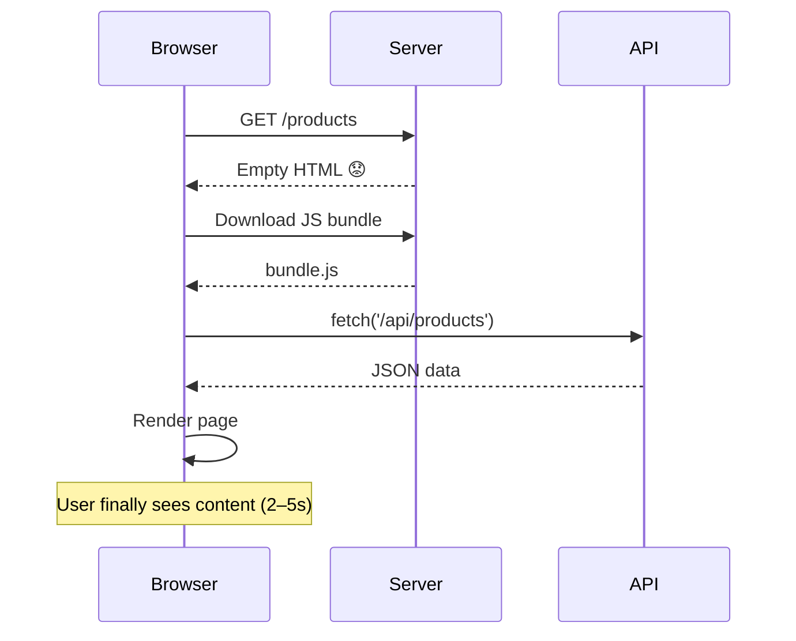
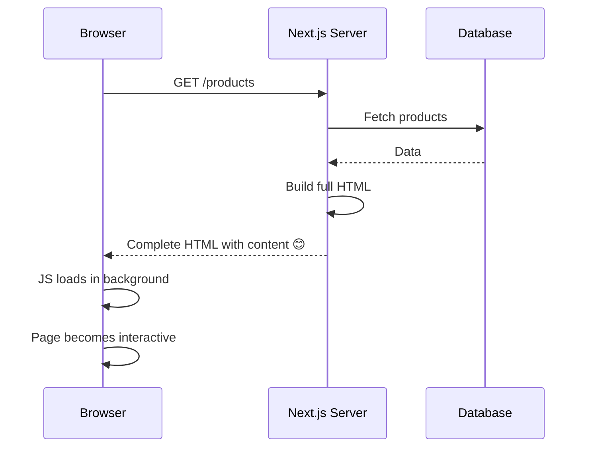
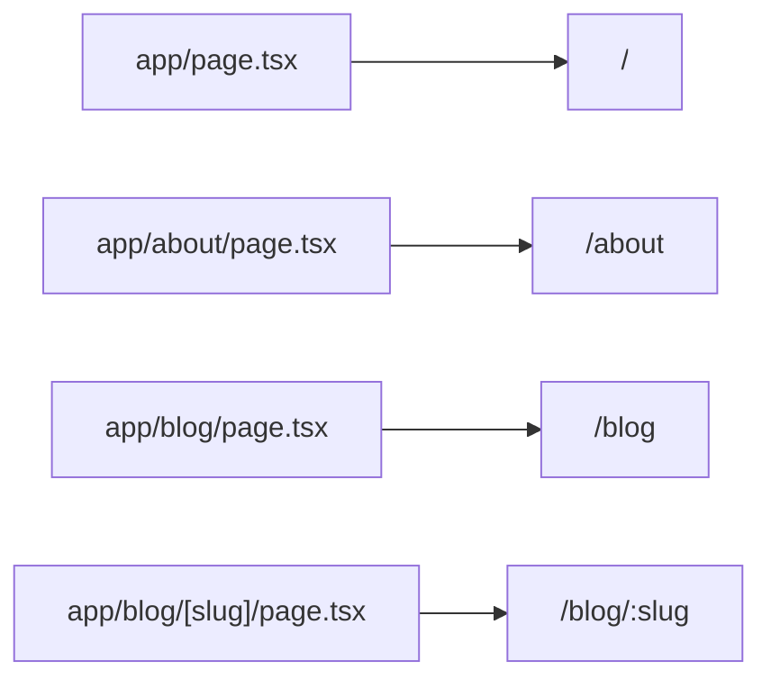
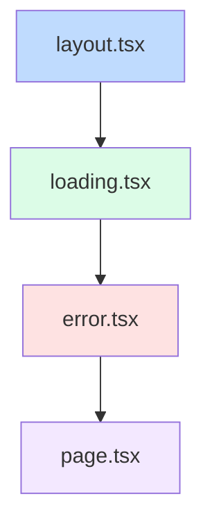

# Session 1: Introduction to Next.js (Simplified)

**Duration:** 45 minutes | **Time:** 9:30 AM – 10:15 AM

---

## Table of Contents

1. [What is Next.js?](#1-what-is-nextjs)
2. [Why Next.js? The Problem with Plain React](#2-why-nextjs-the-problem-with-plain-react)
3. [Key Features at a Glance](#3-key-features-at-a-glance)
4. [Creating Your First Next.js App](#4-creating-your-first-nextjs-app)
5. [Project Structure](#5-project-structure)
6. [File-System Routing](#6-file-system-routing)
7. [Special Files in the App Router](#7-special-files-in-the-app-router)
8. [The `<Link>` Component & Navigation](#8-the-link-component--navigation)
9. [Quick Quiz](#9-quick-quiz)

---

## 1. What is Next.js?

**In one sentence:** Next.js is a tool built on top of React that makes it easier to build real, production-ready websites.

Think of it like this:
- **React** = the engine (handles UI)
- **Next.js** = the full car (adds routing, server rendering, optimization, and more)

> **Official definition:** "Next.js is the React framework for building full-stack web applications."

It was created by a company called **Vercel** and first released in 2016. Today, many large companies use it in production.

### Key Milestones

| Year | What Happened |
|------|---------------|
| 2016 | Next.js open-sourced |
| 2022 | App Router introduced (what we use today) |
| 2024 | Next.js 15 — stable and improved |
| 2025 | Next.js 16 — even faster with Turbopack |

---

## 2. Why Next.js? The Problem with Plain React

### The Problem: React Apps Are Slow to Show Content

When you build a regular React app (no Next.js), here's what happens when a user visits your site:



**This takes 2–5 seconds.** The user stares at a blank screen the whole time.

**Three big problems with this:**

| Problem | Why it hurts |
|---------|-------------|
| **Blank screen** | Users leave if they see nothing for 2+ seconds |
| **Bad SEO** | Google's crawler also sees a blank page — your site won't rank |
| **Secrets exposed** | API keys in client-side JS can be seen by anyone |

### How Next.js Fixes This

Next.js runs React **on the server** before sending anything to the browser:



The user sees real content almost immediately. Google's crawler does too.

---

## 3. Key Features at a Glance

You don't need to understand all of these right now. Just know they exist.

| Feature | What It Does | Think of it as... |
|---------|-------------|-------------------|
| **File-System Routing** | Folders = URL routes | No router config needed |
| **Server Components** | Components that run on the server | Invisible to the browser |
| **Client Components** | Components that run in the browser | Regular React components |
| **Server Actions** | Run server code from a form or button | No API routes needed |
| **SSR** | HTML built per request | Always fresh data |
| **SSG** | HTML built at deploy time | Super fast static pages |
| **ISR** | Static pages that update themselves | Best of both worlds |
| **Streaming** | Send parts of the page as they're ready | No waiting for slow data |
| **next/image** | Optimized images automatically | WebP, lazy loading, sizing |
| **next/font** | Optimized fonts | Zero layout shift |

---

## 4. Creating Your First Next.js App

### One Command to Get Started

```bash
npx create-next-app@latest my-app --yes
cd my-app
npm run dev
```

Open **http://localhost:3000** in your browser. You should see the Next.js welcome page.

The `--yes` flag picks the recommended defaults (TypeScript, Tailwind CSS, ESLint, App Router).

### Useful Commands

```bash
npm run dev    # Start the dev server (use this while coding)
npm run build  # Build for production
npm run start  # Run the production build
```

### Requirements

- Node.js version 20.9 or higher (`node -v` to check)

---

## 5. Project Structure

When you create a new Next.js app, here's what you get:

```
my-app/
├── app/                 ← Your pages and routes go here
│   ├── layout.tsx       ← The shell that wraps all pages
│   ├── page.tsx         ← The home page (/)
│   └── globals.css      ← Global styles
├── public/              ← Images and static files
├── next.config.ts       ← Next.js settings
└── package.json
```

**The most important folder is `app/`.** Everything you build lives here.

---

## 6. File-System Routing

### The Golden Rule: Folders = URLs

You don't configure routes anywhere. Next.js looks at your folder names and creates routes automatically.



### Creating a Page — It's Just a File

```tsx
// app/about/page.tsx
export default function AboutPage() {
  return <h1>About Us</h1>
}
```

That's all you need. Create the file, get the route.

### Dynamic Routes

What if the URL has a variable part, like `/products/123` or `/blog/my-post`?

Wrap the folder name in square brackets:

```
app/blog/[slug]/page.tsx  →  matches /blog/anything
```

```tsx
// app/blog/[slug]/page.tsx
export default async function BlogPost({
  params,
}: {
  params: Promise<{ slug: string }>
}) {
  const { slug } = await params
  return <h1>Post: {slug}</h1>
}
```

### Route Patterns Cheat Sheet

| Folder Pattern | Matches |
|---------------|---------|
| `[slug]` | `/blog/hello-world` |
| `[...slug]` | `/shop/a/b/c` (catches everything) |
| `[[...slug]]` | `/docs` and `/docs/a/b` (optional) |

---

## 7. Special Files in the App Router

Next.js gives special meaning to certain filenames inside `app/`. Learning these 5 files gets you very far:

| File | What it does |
|------|-------------|
| `page.tsx` | The actual page content — makes the route visible |
| `layout.tsx` | Wraps pages — stays mounted as you navigate |
| `loading.tsx` | Shows a skeleton while the page loads |
| `error.tsx` | Shows a friendly message when something breaks |
| `not-found.tsx` | Custom 404 page |

### How They Nest

When you visit `/dashboard/settings`, Next.js builds this structure:



### layout.tsx — The Persistent Shell

```tsx
// app/layout.tsx
export default function RootLayout({
  children,
}: {
  children: React.ReactNode
}) {
  return (
    <html lang="en">
      <body>{children}</body>
    </html>
  )
}
```

- The root layout **must** have `<html>` and `<body>` tags
- It **does not re-render** when you navigate between pages — great for navbars and sidebars

### loading.tsx — Instant Skeleton

```tsx
// app/blog/loading.tsx
export default function Loading() {
  return <div className="skeleton">Loading posts...</div>
}
```

While `app/blog/page.tsx` fetches data, this shows automatically. No extra code needed.

### error.tsx — Friendly Error UI

```tsx
// app/blog/error.tsx
'use client'  // must be a client component

export default function Error({
  error,
  reset,
}: {
  error: Error
  reset: () => void
}) {
  return (
    <div>
      <h2>Something went wrong!</h2>
      <button onClick={reset}>Try again</button>
    </div>
  )
}
```

### Route Groups — Organize Without Changing URLs

Wrap a folder in `(parentheses)` to group routes without affecting the URL:

```
app/
├── (marketing)/
│   ├── layout.tsx    ← layout only for marketing pages
│   ├── page.tsx      →  /
│   └── about/
│       └── page.tsx  →  /about
└── (dashboard)/
    ├── layout.tsx    ← different layout for dashboard
    └── settings/
        └── page.tsx  →  /settings
```

The `(marketing)` part is invisible in the URL.

---

## 8. The `<Link>` Component & Navigation

### Never Use `<a>` Tags for Internal Links

In plain HTML you'd use `<a href="/about">`. In Next.js, always use `<Link>`:

```tsx
import Link from 'next/link'

export default function Nav() {
  return (
    <nav>
      <Link href="/">Home</Link>
      <Link href="/about">About</Link>
      <Link href="/blog">Blog</Link>
    </nav>
  )
}
```

**Why `<Link>` is better than `<a>`:**
- No full page reload — only what changed is updated
- Links in the viewport are **prefetched** in the background (instant navigation)
- The layout stays mounted — your navbar doesn't flash

### Navigating Programmatically

If you need to navigate after a button click or form submit:

```tsx
'use client'
import { useRouter } from 'next/navigation'

export default function LoginButton() {
  const router = useRouter()
  return (
    <button onClick={() => router.push('/dashboard')}>
      Log In
    </button>
  )
}
```

Note: `useRouter` requires `'use client'` because it uses browser APIs.

---

## 9. Quick Quiz

1. What problem does Next.js solve that plain React (CSR) can't handle well?
2. What file makes a folder into a publicly accessible route?
3. How do you create a dynamic route for `/products/[id]`?
4. What does `loading.tsx` do behind the scenes?
5. What's the difference between `layout.tsx` and `template.tsx`?

---

## Key Takeaways

- Next.js is React with **superpowers** — routing, server rendering, and optimizations included.
- Use the **App Router** (`app/` directory) — it's the modern way to build with Next.js.
- **Folders = routes.** Create a `page.tsx` file in a folder to make it a route.
- Learn 5 special files: `page`, `layout`, `loading`, `error`, `not-found`.
- Always use `<Link>` instead of `<a>` for navigation inside your app.

---

**Next Session →** SSR in Next.js (10:30 AM)
