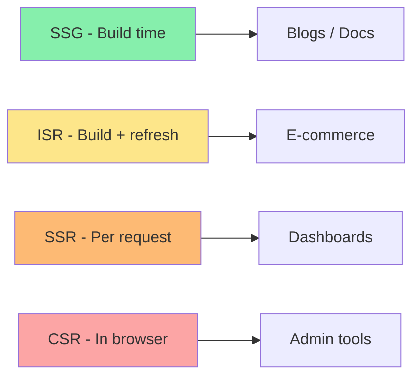
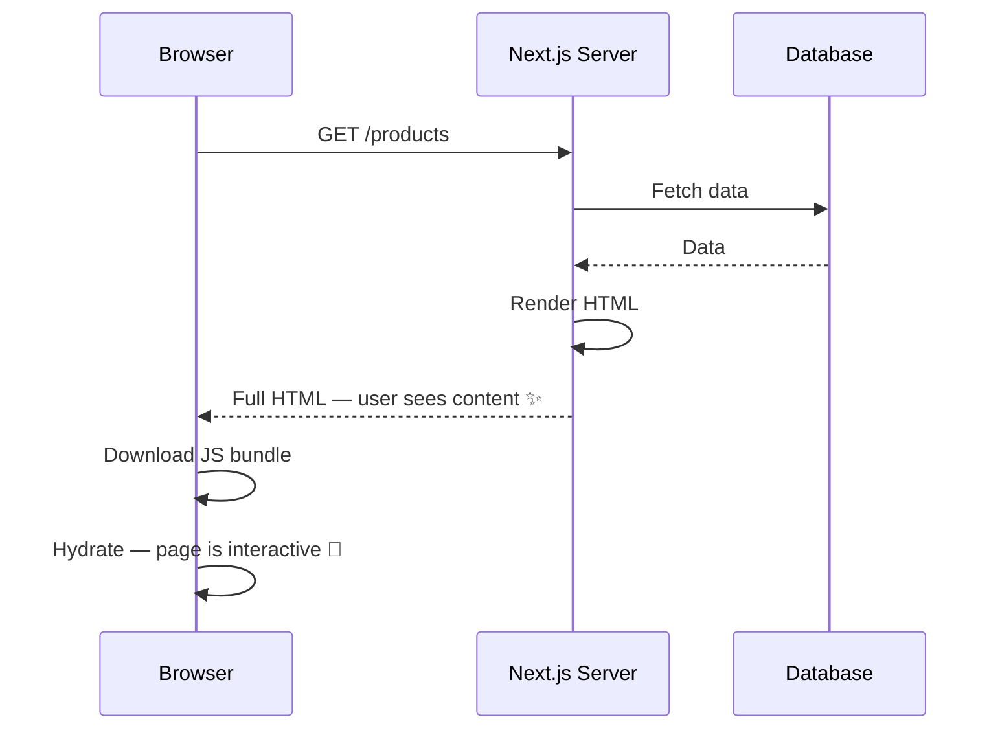
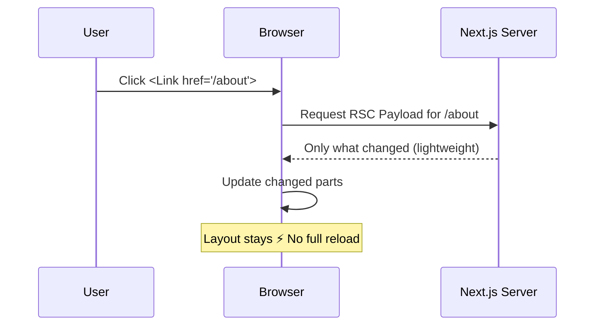
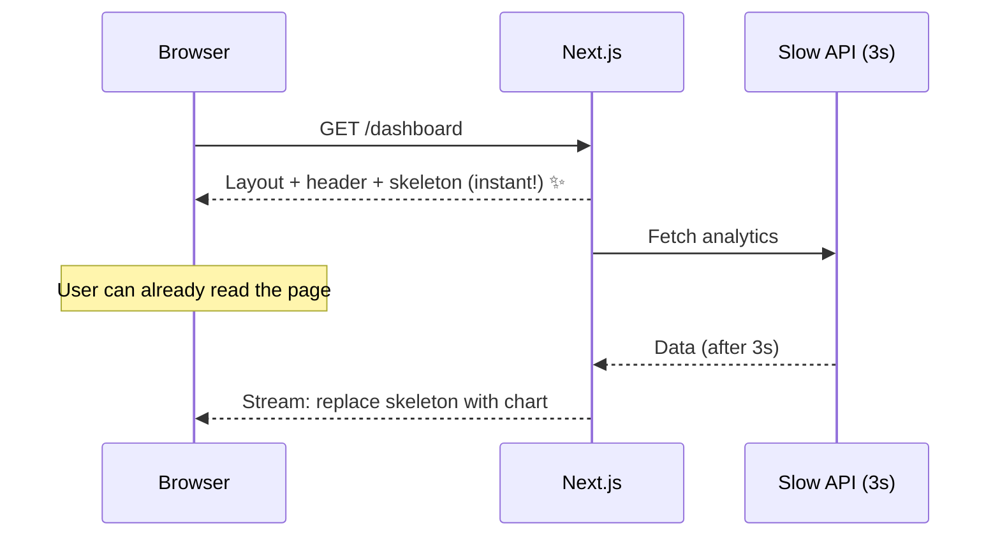

# Session 2: Server-Side Rendering (SSR) in Next.js (Simplified)

**Duration:** 45 minutes | **Time:** 10:30 AM – 11:15 AM

---

## Table of Contents

1. [Rendering Strategies Overview](#1-rendering-strategies-overview)
2. [Client-Side Rendering (CSR) — Recap](#2-client-side-rendering-csr--recap)
3. [Server-Side Rendering (SSR) — Deep Dive](#3-server-side-rendering-ssr--deep-dive)
4. [React Server Components (RSC)](#4-react-server-components-rsc)
5. [Client Components](#5-client-components)
6. [How Next.js Renders a Page (Step by Step)](#6-how-nextjs-renders-a-page-step-by-step)
7. [Data Fetching in Server Components](#7-data-fetching-in-server-components)
8. [Streaming with Suspense](#8-streaming-with-suspense)
9. [Static vs Dynamic Rendering](#9-static-vs-dynamic-rendering)
10. [Quick Quiz](#10-quick-quiz)

---

## 1. Rendering Strategies Overview

Next.js doesn't lock you into one way of building pages. It gives you four strategies — pick based on how often your data changes.

| Strategy | When HTML is built | Best For |
|----------|--------------------|----------|
| **SSG** (Static) | Once at build time | Blogs, docs, marketing pages |
| **ISR** (Incremental Static) | Build time + refreshes in background | E-commerce product pages |
| **SSR** (Server-Side) | Every time someone visits | Dashboards, personalised pages |
| **CSR** (Client-Side) | In the browser | Internal admin tools |

**Simple rule of thumb:**
- Content never changes → **SSG**
- Content changes sometimes → **ISR**
- Content is user-specific or real-time → **SSR**
- SEO doesn't matter and it's very interactive → **CSR**



---

## 2. Client-Side Rendering (CSR) — Recap

This is how a plain React app (without Next.js) works:

```
User visits /products
  → Server sends: empty HTML + big JS file
  → Browser downloads and runs the JS
  → React starts up
  → React calls the API to get products
  → Page finally shows content
```

**The user sees a blank screen for 2–5 seconds.**

**When CSR is still fine to use:**
- Internal tools where SEO doesn't matter
- Pages that update in real-time (e.g. live chat, collaborative editors)

---

## 3. Server-Side Rendering (SSR) — Deep Dive

With SSR, Next.js builds the full HTML **on the server** before sending it to the browser:

```
User visits /products
  → Next.js server fetches products from DB
  → Next.js builds complete HTML with the products already in it
  → Browser receives full HTML — user sees content immediately!
  → JS loads in background
  → Page becomes interactive (buttons, clicks, etc. start working)
```

**Why SSR is better for most pages:**

| Benefit | Why it matters |
|---------|---------------|
| Fast first paint | User sees content right away, not a blank screen |
| Great SEO | Google gets full HTML, not an empty shell |
| Secure | DB credentials and API keys stay on the server |
| Always fresh | Data is fetched on every request |

### What is Hydration?

After the browser receives the HTML, it looks interactive — but it isn't yet. React then "hydrates" the page: it attaches event listeners and makes buttons and forms work. This happens in the background after the HTML arrives.

```
Step 1: HTML arrives → user sees content (but can't click yet)
Step 2: JS loads + React hydrates → page is fully interactive
```

---

## 4. React Server Components (RSC)

This is a newer concept in React that Next.js uses heavily. The idea is simple:

**Some components run only on the server. They never send JavaScript to the browser.**

### Server vs Client Components at a Glance

| | Server Component | Client Component |
|-|-----------------|-----------------|
| Where it runs | Server only | Browser |
| Can fetch from DB directly | ✅ Yes | ❌ No |
| Can use `useState` / `useEffect` | ❌ No | ✅ Yes |
| Can handle `onClick`, `onChange` | ❌ No | ✅ Yes |
| Adds JS to the browser bundle | ❌ No | ✅ Yes |

**Default:** Every component in `app/` is a Server Component. You opt into Client Components only when you need interactivity.

### Example — Server Component fetching data

```tsx
// app/products/page.tsx
// No 'use client' = Server Component

import { db } from '@/lib/db'

export default async function ProductsPage() {
  const products = await db.select().from(productsTable)

  return (
    <ul>
      {products.map((product) => (
        <li key={product.id}>
          {product.name} — ${product.price}
        </li>
      ))}
    </ul>
  )
}
```

Notice: no `useEffect`, no API call from the browser — just `async/await` directly in the component. The database query runs on the server; the browser never sees it.

---

## 5. Client Components

When you need interactivity (state, event handlers, browser APIs), add `'use client'` at the top of the file:

```tsx
// app/ui/counter.tsx
'use client'

import { useState } from 'react'

export default function Counter() {
  const [count, setCount] = useState(0)

  return (
    <div>
      <p>Count: {count}</p>
      <button onClick={() => setCount(count + 1)}>Increment</button>
    </div>
  )
}
```

### When Do You Need `'use client'`?

Use it when your component needs any of these:
- `useState` or `useReducer`
- `useEffect` or `useLayoutEffect`
- Event handlers (`onClick`, `onChange`, `onSubmit`)
- Browser APIs (`localStorage`, `window`, `navigator`)
- Third-party libraries that only work in the browser

If none of the above apply, leave it as a Server Component.

### Keep Client Components Small

The more code you mark as `'use client'`, the more JavaScript ships to the browser. Push the `'use client'` boundary as deep (as small) as possible.

```tsx
// ❌ Bad: The whole layout becomes a client component
'use client'
export default function Layout({ children }) {
  const [menuOpen, setMenuOpen] = useState(false)
  return (
    <div>
      <nav>...</nav>
      <main>{children}</main>  {/* children are now client too */}
    </div>
  )
}

// ✅ Good: Only the menu toggle is a client component
// layout.tsx — Server Component
import MobileMenu from './mobile-menu'  // 'use client' is inside here

export default function Layout({ children }) {
  return (
    <div>
      <nav>
        <MobileMenu />  {/* only this tiny piece is client */}
      </nav>
      <main>{children}</main>
    </div>
  )
}
```

---

## 6. How Next.js Renders a Page (Step by Step)

### First Visit (Full Page Load)



### Clicking a `<Link>` (Subsequent Navigation)



This is why Next.js navigation feels instant — it's not reloading the whole page, just swapping the content.

---

## 7. Data Fetching in Server Components

### Using `fetch`

```tsx
// app/blog/page.tsx
export default async function BlogPage() {
  const res = await fetch('https://api.example.com/posts')
  const posts = await res.json()

  return (
    <ul>
      {posts.map((post) => (
        <li key={post.id}>{post.title}</li>
      ))}
    </ul>
  )
}
```

No `useEffect`, no loading state to manage — just `async/await`.

### Using a Database Directly

```tsx
// app/dashboard/page.tsx
import { db } from '@/lib/db'

export default async function DashboardPage() {
  const stats = await db.query('SELECT COUNT(*) FROM orders WHERE status = $1', ['pending'])
  return <div>Pending orders: {stats.rows[0].count}</div>
}
```

Your DB credentials never leave the server.

### Fetch Data in Parallel (Don't Make Waterfalls)

```tsx
// ❌ Slow — each line waits for the previous one
const user = await getUser(id)
const posts = await getPosts(id)

// ✅ Fast — both start at the same time
const [user, posts] = await Promise.all([getUser(id), getPosts(id)])
```

---

## 8. Streaming with Suspense

### The Problem

Normal SSR waits for **all** data before sending any HTML. If one slow query takes 3 seconds, the user waits 3 seconds before seeing anything.

### The Solution: Streaming

With streaming, Next.js sends the parts of the page it has ready immediately, then fills in the slow parts as they finish.



### How to Use It

**Option 1 — `loading.tsx` for the whole page:**

```tsx
// app/dashboard/loading.tsx
export default function DashboardLoading() {
  return <div className="skeleton">Loading dashboard...</div>
}
```

This shows instantly while `page.tsx` is still loading data.

**Option 2 — `<Suspense>` for individual slow parts:**

```tsx
// app/dashboard/page.tsx
import { Suspense } from 'react'
import RevenueChart from './revenue-chart'  // slow
import LatestInvoices from './latest-invoices'  // fast

export default function DashboardPage() {
  return (
    <main>
      <h1>Dashboard</h1>
      <LatestInvoices />  {/* renders immediately */}

      <Suspense fallback={<div>Loading chart...</div>}>
        <RevenueChart />  {/* streams in when ready */}
      </Suspense>
    </main>
  )
}
```

The user sees the heading and invoices right away. The chart appears a moment later without blocking anything.

---

## 9. Static vs Dynamic Rendering

### Next.js Decides Automatically

When you run `next build`, Next.js looks at each page and decides:

- **Static** — can be pre-built and served from a CDN (fastest)
- **Dynamic** — must be rendered fresh on every request

### What Makes a Page Dynamic?

| If your page uses... | Next.js renders it... |
|----------------------|-----------------------|
| Nothing special | **Static** (pre-built at deploy) |
| `cookies()` or `headers()` | **Dynamic** (per request) |
| `searchParams` from the URL | **Dynamic** (per request) |
| An uncached `fetch()` | **Dynamic** (per request) |

### Static Example

```tsx
// app/about/page.tsx
// No dynamic APIs → pre-built at deploy time
export default function AboutPage() {
  return <h1>About Our Company</h1>
}
```

Built once, served from CDN on every visit. Blazing fast.

### Dynamic Example

```tsx
// app/profile/page.tsx
import { cookies } from 'next/headers'

export default async function ProfilePage() {
  const cookieStore = await cookies()  // ← makes this dynamic
  const userId = cookieStore.get('user_id')?.value
  const user = await getUser(userId)
  return <h1>Welcome, {user.name}!</h1>
}
```

Re-rendered on every request because the content depends on who is logged in.

---

## 10. Quick Quiz

1. What is the RSC Payload and why does Next.js use it?
2. In what scenario would you choose SSR over SSG?
3. Why should `'use client'` boundaries be placed as deep in the component tree as possible?
4. What is "hydration" and why does it happen after SSR?
5. How does `loading.tsx` relate to `<Suspense>` internally?
6. What's the difference between sequential and parallel data fetching — write the parallel version of this:
   ```ts
   const user = await getUser(id)
   const posts = await getPosts(id)
   ```

---

## Key Takeaways

- **Server Components** run on the server — no JS sent to the browser, can query the DB directly.
- **Client Components** run in the browser — add `'use client'` only when you need hooks or events.
- **Default is server** — opt into client only when necessary.
- **SSR** = rendered per request — always fresh, great for SEO.
- **Streaming** + `<Suspense>` = users see content fast even when some data is slow.
- Keep `'use client'` boundaries **small** to minimise JavaScript bundle size.

---

**← Previous Session:** Intro to Next.js
**Next Session →** SSR Features in Next.js (11:15 AM)
