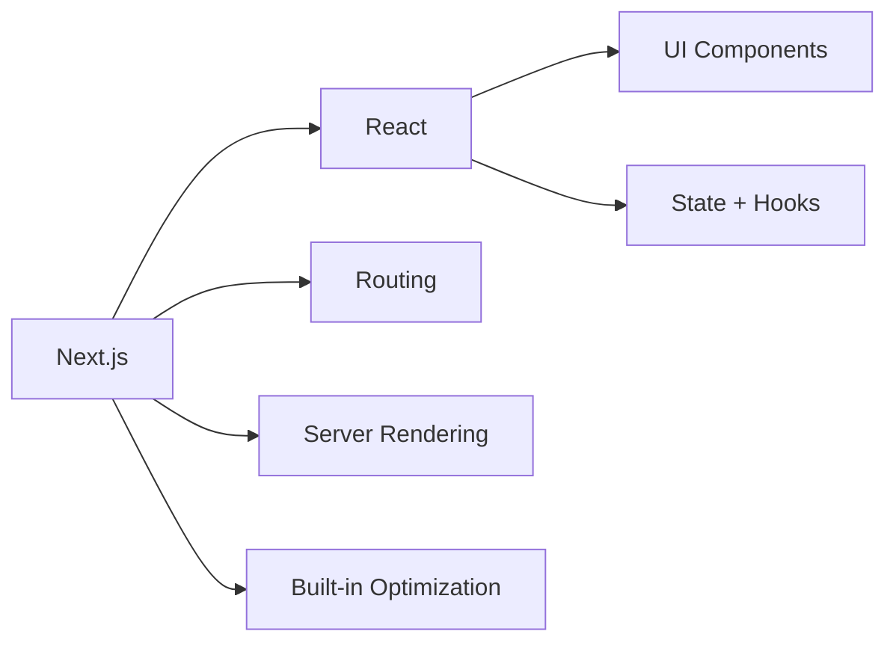
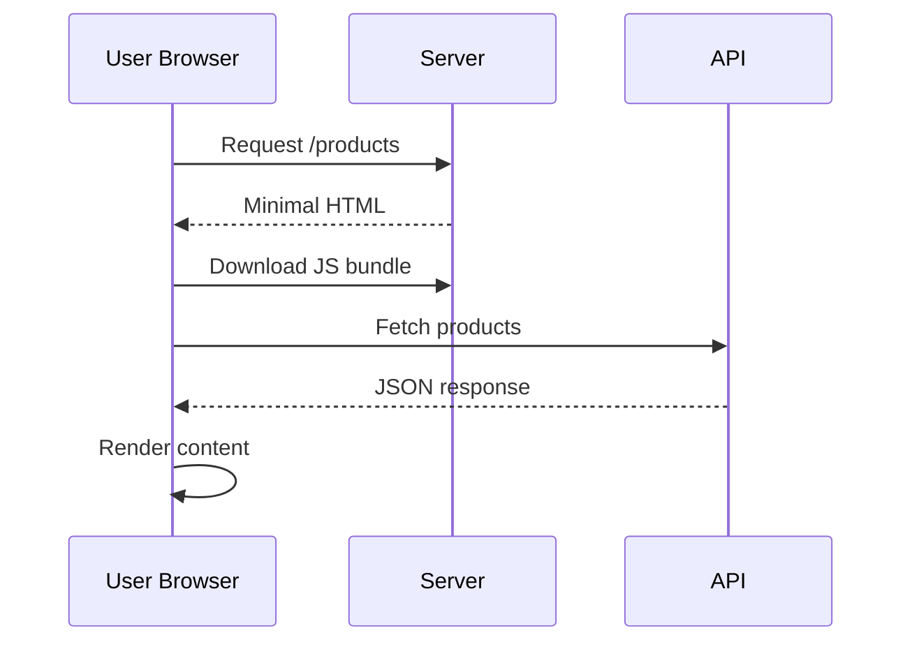
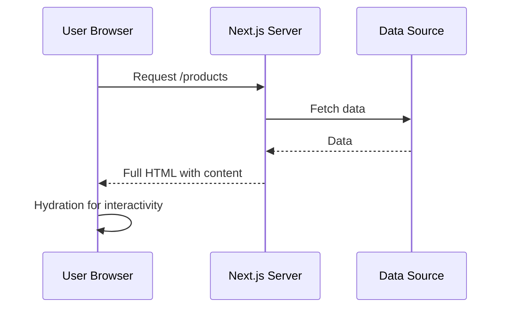
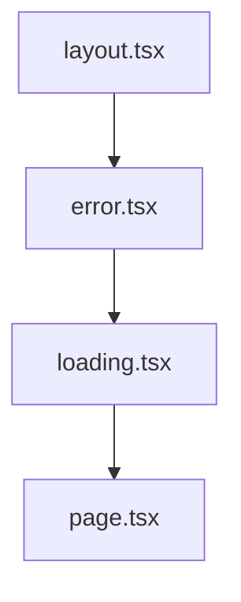

# Session 1: Introduction to Next.js

- Duration: 45 minutes
- Goal: learn what Next.js is and why teams use it
- Focus: App Router basics, routing, and navigation

---

## What is Next.js?

- Next.js is a React framework for full-stack web apps
- It adds routing, rendering, and optimization out of the box
- Created by Vercel, used by many production teams
- Think of it as: React engine + full app toolkit



---

## Why Not Plain React for Everything?

- Client-side rendering can start with nearly empty HTML
- Users wait for JavaScript and API calls before seeing content
- First load feels slower
- SEO can suffer when crawlers see little initial content



---

## How Next.js Helps

- Renders useful HTML on the server first
- Sends content to users faster on initial load
- Loads JavaScript in the background for interactivity
- Improves both user experience and discoverability



---

## Core Features at a Glance

- File-system routing
- Server and Client Components
- SSR, SSG, and ISR rendering strategies
- Built-in performance tools (`next/image`, `next/font`)

---

## Create Your First Next.js App

```bash
npx create-next-app@latest my-app --yes
cd my-app
npm run dev
```

- Open `http://localhost:3000`
- Recommended Node.js version: 20.9+

---

## Basic Project Structure

```text
app/            routes and UI
public/         static assets
next.config.ts  Next.js config
package.json    scripts and dependencies
```

- `app/` is the main working folder in App Router projects

---

## File-System Routing

- `app/page.tsx` -> `/`
- `app/about/page.tsx` -> `/about`
- `app/blog/[slug]/page.tsx` -> `/blog/:slug`
- Folder names map directly to URLs

```mermaid
graph LR
  A[app/page.tsx] --> A1[/]
  B[app/about/page.tsx] --> B1[/about]
  C[app/blog/page.tsx] --> C1[/blog]
  D[app/blog/[slug]/page.tsx] --> D1[/blog/:slug]
```

---

## App Router Special Files + Navigation

- `layout.tsx`: shared UI shell
- `loading.tsx`: loading state UI
- `error.tsx`: route-level error UI
- Use `<Link>` for internal navigation instead of plain `<a>`



---

## Quick Quiz + Key Takeaways

- What makes a route publicly accessible in `app/`?
- How do you define a dynamic route?
- Why is `<Link>` preferred for internal pages?
- Next.js gives React apps routing, server rendering, and performance defaults
