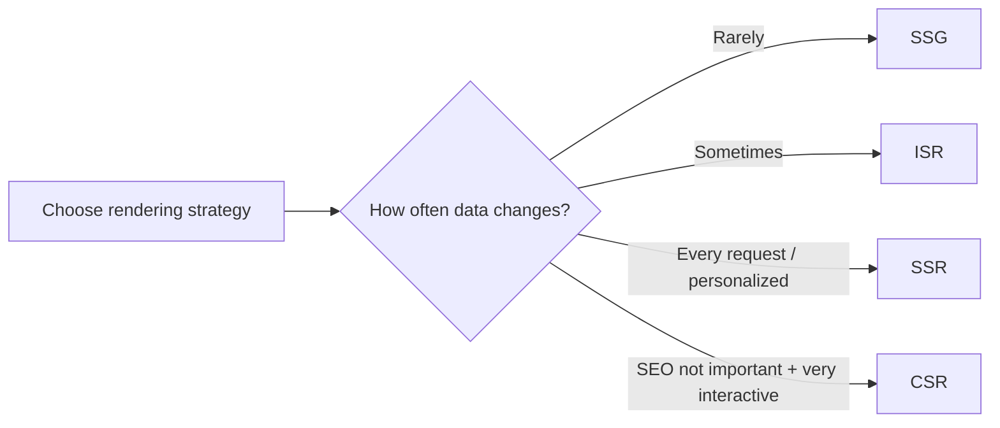
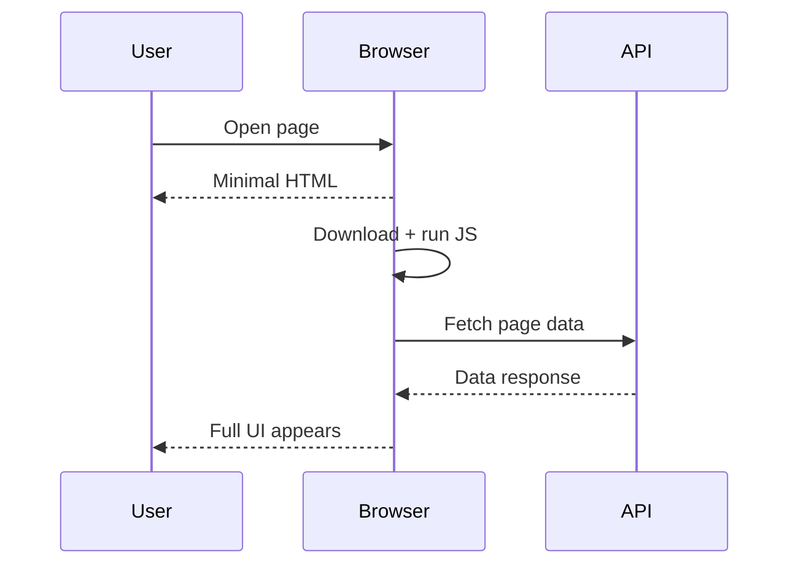
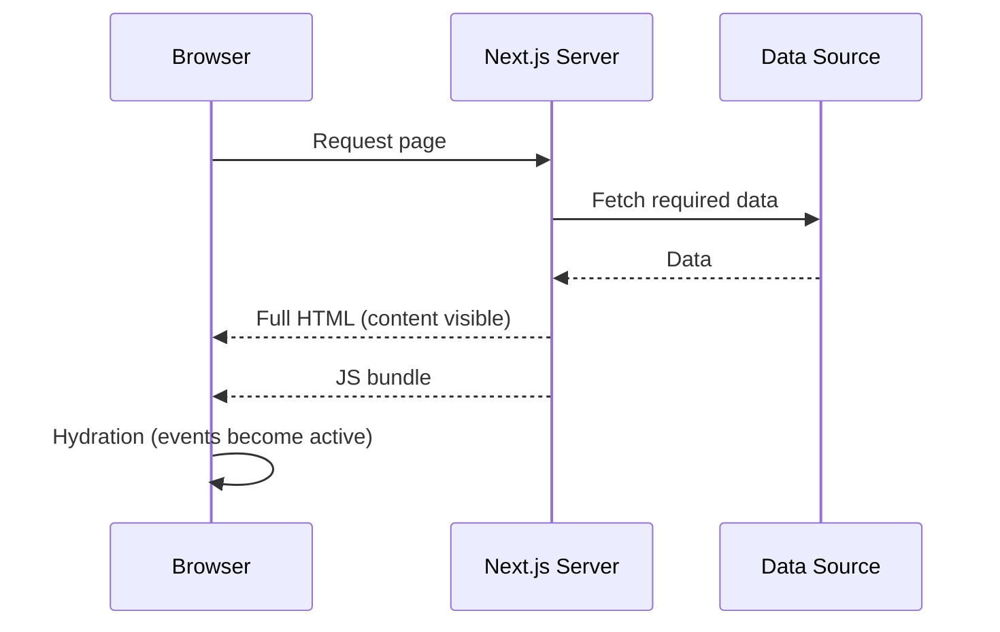
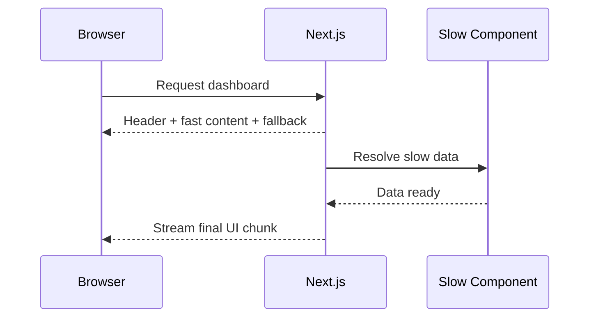
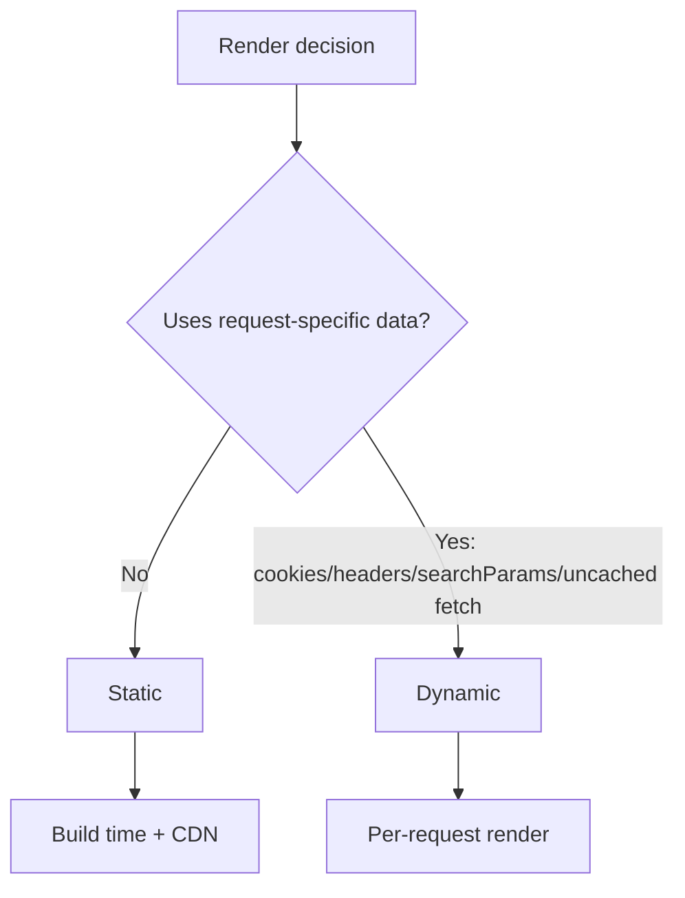

# Session 2: Server-Side Rendering (SSR) in Next.js

- Duration: 45 minutes
- Goal: understand SSR and modern Next.js rendering
- Focus: Server Components, hydration, streaming, and dynamic pages

---

## Rendering Strategies (Quick View)

- `SSG`: build once, serve many times
- `ISR`: static pages refreshed in background
- `SSR`: render fresh HTML on each request
- `CSR`: render in browser after JavaScript loads



---

## CSR Recap (Why It Can Feel Slow)

- Browser often receives minimal HTML first
- JavaScript must download before UI fully appears
- Data is fetched after app boots
- Result: slower first meaningful paint



---

## SSR Basics + Hydration

- Server fetches data and sends full HTML first
- Users see content earlier than CSR
- Then React hydrates to attach events
- Hydration = page becomes interactive



---

## React Server Components (RSC)

- Default in `app/` routes
- Run only on server, not in browser
- Can fetch from database/services directly
- Reduce client JavaScript bundle size

---

## Client Components (`'use client'`)

- Use only when interactivity is needed
- Needed for `useState`, `useEffect`, and event handlers
- Needed for browser APIs (`window`, `localStorage`)
- Keep client boundaries small for better performance

---

## Data Fetching in Server Components

- Prefer direct `async/await` in server components
- Avoid client-side waterfalls for core page data
- Fetch independent data in parallel with `Promise.all`
- Keep secrets and DB credentials on server

```mermaid
flowchart LR
    A[Start render] --> B[getUser()]
    A --> C[getPosts()]
    B --> D[Promise.all]
    C --> D
    D --> E[Render with both results]
```

---

## Streaming with Suspense

- Don’t block whole page on one slow section
- Send ready UI first, stream slow parts later
- Use `loading.tsx` for route-level fallback
- Use `<Suspense>` for component-level fallback



---

## Static vs Dynamic Rendering

- Static: pre-rendered at build time (fast + CDN friendly)
- Dynamic: rendered per request (personalized/fresh)
- Dynamic triggers include request-based inputs
- Choose based on freshness and personalization needs



---

## Quick Quiz + Key Takeaways

- When would you pick SSR over SSG?
- Why should `'use client'` be used sparingly?
- How does hydration differ from initial HTML render?
- SSR improves first load + SEO; streaming improves perceived speed
