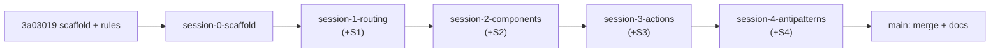

# Prepare nextjs-16-training-2026 training repo

Build the four-session Next.js 16 demo repo on a **chain of dedicated per-session branches**. Each session branch is cut from the previous session's tip, built, and — crucially — gets **its own teaching script committed on the same branch** before the next session is branched off. So every session branch is a self-contained checkpoint: that session's code **and** its instructor script. The final session branch is merged into `main`, then the cross-session docs (`INSTRUCTOR.md` index, `CHEATSHEET.md`, `README.md`) are committed on `main`. This gives instructors a finished course on `main` (watch-demo) and gives attendees a clean baseline per session (build-along: start from the previous session's branch).

## Current state (already in place)

- Scaffold committed (`69d6cc1`): `next@16.2.7`, `react`/`react-dom@19.2.4`, Tailwind 4, **Biome**, **pnpm**.
- `next.config.ts` is default → **Cache Components OFF** (correct).
- Remote wired + pushed: `origin` → `git@github.com:adheepgeorge/nextjs-16-training-2026.git`.
- Agent rules committed (`3a03019`): `AGENTS.md`, `CLAUDE.md`; `.cursor/plan.md` + training docs tracked.
- **`session-0-scaffold`** at `3a03019` — scaffold + docs + agent rules; pushed to origin.
- **`session-1-routing`** at `3a03019` — checked out; S1 work present **uncommitted** in the working tree (nav hub, `src/lib/data.ts`, `(s1-routing)/` routes + special files). Next step: commit + push.
- **Abandoned:** the earlier S1 commit `f17fae9` is now dangling (only ref was the deleted `session-2-components-start`); it will be garbage-collected. No data loss — S1 content lives in the working tree and will be re-committed on `session-1-routing`.
- **Deleted:** old `session-1-routing-start`, `session-2-components-start` snapshot branches.

## Branch model (locked)

Dedicated per-session branches, chained. Each is branched from the previous session's tip, so it contains **all prior sessions plus its own**. Build along by checking out the **previous** session's branch.

| Branch                   | Branched from                     | Contents                                                                                                           |
| ------------------------ | --------------------------------- | ------------------------------------------------------------------------------------------------------------------ |
| `session-0-scaffold`     | `main` @ `3a03019`                | Clean scaffold + docs + agent rules                                                                                |
| `session-1-routing`      | `session-0-scaffold`              | + nav hub, `(s1-routing)/` routes, `src/lib/data.ts`, `teaching-scripts/session-1-routing.md`                      |
| `session-2-components`   | `session-1-routing`               | + `(s2-components)/` routes, `/api/users`, `teaching-scripts/session-2-components.md`                              |
| `session-3-actions`      | `session-2-components`            | + `(s3-actions)/` routes, `teaching-scripts/session-3-actions.md`                                                  |
| `session-4-antipatterns` | `session-3-actions`               | + `/anti-patterns`, `teaching-scripts/session-4-best-practices.md`                                                 |
| `main`                   | merge of `session-4-antipatterns` | Full course + all 4 `teaching-scripts/` (via merge) **plus** `INSTRUCTOR.md`, `CHEATSHEET.md`, updated `README.md` |

Each session branch carries **its own teaching script** alongside its code — committed before branching to the next session. The 4 scripts accumulate down the chain and arrive on `main` through the final merge; only the cross-session docs are authored directly on `main`.

### Two ways to use the repo

| Mode                     | Who                                             | Checkout                          | What you get                                                                                                           |
| ------------------------ | ----------------------------------------------- | --------------------------------- | ---------------------------------------------------------------------------------------------------------------------- |
| **Watch demo** (default) | Instructor, freshers observing                  | `main` (after final merge)        | Full finished app + nav hub to every route                                                                             |
| **Build along**          | Attendee typing live, or instructor live-coding | The **previous** session's branch | Known baseline — prior sessions' code only; today's session is yours to build, then diff against this session's branch |

**Watch-demo pre-flight:** `git switch main`, `pnpm dev`, visit routes in teaching-script order.

**Build-along pre-flight (example, S2):** `git switch session-1-routing`, `pnpm install`, `pnpm dev` — app runs with S1 routes only; attendee adds S2 routes, comparing against `session-2-components` when done.



## Source of truth

The full demo/route spec is in [.cursor/plan.md](.cursor/plan.md) (sections 4 "Demos to build", 7 "Build order", 8 "Files touched"). Per [AGENTS.md](AGENTS.md), consult `node_modules/next/dist/docs/` before writing any Next.js 16 code (async `params`/`cookies`, Turbopack default, Cache Components left off).

## Phase 0 — Repo wiring (done)

1. ~~Scaffold via `create-next-app`~~ — DONE. **Biome** not ESLint: `pnpm lint` = `biome check`.
2. ~~Verify Next 16.x / React 19.x~~ — DONE (`next@16.2.7`, `react@19.2.4`).
3. ~~Confirm Cache Components OFF + green build~~ — DONE.
4. ~~Wire + push remote~~ — DONE (`origin` set, `main` pushed).
5. ~~Author `AGENTS.md` + `CLAUDE.md`~~ — DONE (`3a03019`).
6. ~~Cut + push `session-0-scaffold`~~ — DONE (at `3a03019`).

> **Per-session rule:** each session phase ends by authoring that session's teaching script (see "Teaching script template" below) **on the same branch**, committing code + script together, then pushing — before branching to the next session.

## Phase 1 — Session 1: Intro & Routing `(s1-routing)` — in progress

- Branch `session-1-routing` already cut from `session-0-scaffold`.
- ~~Replace `src/app/page.tsx` with nav hub~~ — built (uncommitted).
- ~~Create `src/lib/data.ts`~~ — built (uncommitted).
- ~~Routes: `/about`, `/blog`, `/blog/[slug]`, `/layout-demo`, `/layout-demo/settings` + special files~~ — built (uncommitted).
- Author `teaching-scripts/session-1-routing.md` on this branch.
- **TODO:** commit S1 code + script on `session-1-routing`, then `git push -u origin session-1-routing`.

## Phase 2 — Session 2: Components & Data Fetching `(s2-components)`

- `git switch -c session-2-components` from `session-1-routing` tip.
- Core: `/users-server` (async server component), `/users-client` (client component fetching `/api/users`), `/counter` (`'use client'` leaf), `/dashboard` (streaming via `loading.tsx`).
- Route Handler `src/app/api/users/route.ts` returning the same mock users as JSON (HTTP source for `/users-client`).
- If-time demos: `/dashboard/granular` (explicit `<Suspense>`), `/parallel-fetch` (`Promise.all`).
- Author `teaching-scripts/session-2-components.md` on this branch. Commit code + script + push.

## Phase 3 — Session 3: Server Actions & Mutations `(s3-actions)`

- `git switch -c session-3-actions` from `session-2-components` tip.
- `/guestbook` — `<form action={serverAction}>` → append → `revalidatePath`.
- `/todos` — add/toggle via Server Actions + `useActionState` for pending/error UI.
- Author `teaching-scripts/session-3-actions.md` on this branch. Commit code + script + push.

## Phase 4 — Session 4: Anti-patterns `(session-4-antipatterns)`

- `git switch -c session-4-antipatterns` from `session-3-actions` tip.
- Build `/anti-patterns` (deliberately whole tree `'use client'`, contrast with `/users-server`).
- Author `teaching-scripts/session-4-best-practices.md` on this branch. Commit code + script + push.

## Teaching script template (used in every session phase)

Each session's script lives in top-level `teaching-scripts/` and is committed on that session's branch:

- `teaching-scripts/session-1-routing.md` (on `session-1-routing`)
- `teaching-scripts/session-2-components.md` (on `session-2-components`)
- `teaching-scripts/session-3-actions.md` (on `session-3-actions`)
- `teaching-scripts/session-4-best-practices.md` (on `session-4-antipatterns`)

Each script is generated from what was actually built. Use a consistent template per session:

1. **Header** — session title, duration + clock slot (from `.cursor/plan.md` §The four sessions), the **build-along** branch (previous session's branch), and the one-line learning goal.
2. **Pre-flight** — two blocks:
   - **Watch demo:** `git switch main`, `pnpm dev`, URLs in order.
   - **Build along:** `git switch <previous-session-branch>`, `pnpm install` (if needed), `pnpm dev` — list what is _not_ built yet (today's routes).
3. **Opening hook (~2 min)** — framing question to say out loud.
4. **Demo-by-demo walkthrough** — for each route: file paths, "Say this", "Show this", "Ask the room", v16 gotcha callouts.
5. **Recap (~2 min)** — tie routes back to the §2 mental-model loop.
6. **Time budget** — per-demo minutes + "if running long, cut these".

Session-specific anchors:

- **S1** — file→URL mapping, `await params`, `generateMetadata`, special files, `<Link>` prefetch, Turbopack default.
- **S2** — server-by-default, `'use client'` at leaves, `/users-server` vs `/users-client`, `<Suspense>` streaming on `/dashboard`.
- **S3** — `'use server'`, `<form action>`, `revalidatePath`, `useActionState`, S1→S2→S3 CRUD payoff.
- **S4** — "spot what's wrong" on `/anti-patterns`, flip to `/users-server`, caching as day-2 concept, hand out `CHEATSHEET.md`.

## Phase 5 — Merge to main + cross-session docs

- Merge the final session branch into `main`: `git switch main && git merge session-4-antipatterns`. This brings all 4 `teaching-scripts/` along (they were committed on their session branches).
- On `main`, author + commit the cross-session docs only: `INSTRUCTOR.md` (index: links the 4 teaching scripts + branch map + session timing table), `CHEATSHEET.md`, updated `README.md`.

## Phase 6 — QA + publish

- `pnpm build` green; `pnpm lint` (Biome) clean; every route loads on `main`; `/users-client` hits `/api/users`; streaming visible on `/dashboard`.
- Dry-run watch-demo scripts against `main`; spot-check each session branch boots, matches its baseline (e.g. `session-1-routing` has no `/users-server`), and carries its own teaching script.
- Push everything:

```bash
git push origin main session-0-scaffold session-1-routing session-2-components session-3-actions session-4-antipatterns
```

## Git workflow (per session)

```bash
# S1 (current): work already in tree on session-1-routing
# ... author teaching-scripts/session-1-routing.md ...
git add -A && git commit -m "Build Session 1 routing demos + teaching script."
git push -u origin session-1-routing

# S2:
git switch -c session-2-components       # from session-1-routing tip
# ... build S2 + author teaching-scripts/session-2-components.md ...
git add -A && git commit -m "Build Session 2 components & data fetching demos + teaching script."
git push -u origin session-2-components

# S3, S4: same pattern — build, author that session's script, commit both, push;
# each branch cut from the previous tip

# Final:
git switch main
git merge session-4-antipatterns         # brings all 4 teaching scripts along
# ... author INSTRUCTOR.md + CHEATSHEET.md + README, commit ...
git push origin main
```

## Notes / assumptions

- Folder + repo name: `nextjs-16-training-2026` (matches the remote).
- Linter/formatter is **Biome** (not ESLint): `pnpm lint` = `biome check`, `pnpm format` = `biome format --write`.
- Each session branch is branched from the previous session's tip (chained), committed onto directly, and pushed.
- Each session's teaching script is authored and committed **on its own session branch** (alongside the code), before branching to the next session. Scripts accumulate down the chain and reach `main` via the final merge.
- Only cross-session docs (`INSTRUCTOR.md`, `CHEATSHEET.md`, `README.md`) are authored directly on `main` after the merge.
- `main` stays at the scaffold until the final merge of `session-4-antipatterns`, then gains the cross-session docs.
- Build-along attendees work on a fork or local branch off the previous session's branch — don't push attendee commits to the canonical session branches.
- Package manager: **pnpm** (`pnpm install`, `pnpm dev`, `pnpm build`).
