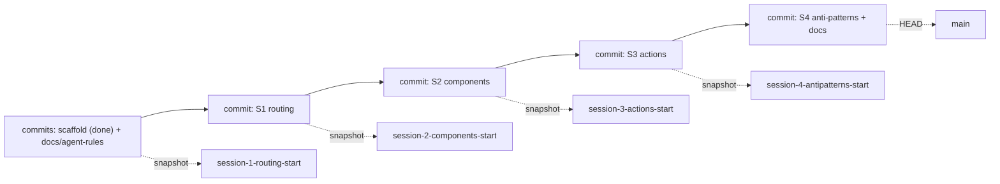

# Prepare nextjs-16-training-2026 training repo

Build the four-session Next.js 16 demo repo, following the existing build spec, and snapshot each session's starting state as a named git branch. The repo is already scaffolded and wired to the remote (see "Current state"), so the remaining work is: finish repo wiring (agent rules + first commit + first snapshot), then build S1–S4.

## Current state (already in place)

- Scaffold present and committed (`69d6cc1`): `next@16.2.7`, `react`/`react-dom@19.2.4`, Tailwind 4, **Biome** (`pnpm lint` = `biome check`, `pnpm format` = `biome format --write`), **pnpm** (`pnpm-lock.yaml`, `pnpm-workspace.yaml`).
- `next.config.ts` is the default empty config → **Cache Components OFF** (correct).
- `src/app/` is the bare scaffold only (`layout.tsx`, `page.tsx`, `globals.css`, `favicon.ico`) — no demos built yet.
- Remote already wired: `origin` → `git@github.com:adheepgeorge/nextjs-16-training-2026.git`.
- Docs already copied into `.cursor/` (currently **untracked**): `.cursor/plan.md`, `.cursor/nextjs-freshers-training-2026-docs/`.
- Only `main` exists; no `session-N-<topic>-start` branches yet.
- **Gap:** `AGENTS.md` and `CLAUDE.md` do not exist yet — they will be **authored fresh** for this repo (not copied from the sibling).

## Branch model (locked)

All development happens on `main`. The four `session-N-<topic>-start` branches are read-only snapshots created with `git branch <name>` (pointer at HEAD, no checkout/switch), each capturing the state _before_ that session is built:

- `session-1-routing-start` — clean scaffold + docs + agent rules (default config)
- `session-2-components-start` — after S1 built
- `session-3-actions-start` — after S2 built
- `session-4-antipatterns-start` — after S3 built
- `main` — ends 1+ commits ahead of `session-4-antipatterns-start` (S4 `/anti-patterns` demo + companion docs)



## Source of truth

The full demo/route spec is already written in [.cursor/plan.md](.cursor/plan.md) (sections 4 "Demos to build", 7 "Build order", 8 "Files touched"). This plan does not restate every route — it copies that build plan into the new repo and executes it there. Per [AGENTS.md](AGENTS.md), consult `node_modules/next/dist/docs/` before writing any Next.js 16 code (async `params`/`cookies`, Turbopack default, Cache Components left off).

## Phase 0 — Finish repo wiring (scaffold already done)

Scaffold, remote, and docs copy are complete (see "Current state"). Only the agent rules, first commit, and first snapshot remain.

1. ~~Scaffold via `create-next-app`~~ — DONE. Note the scaffold uses **Biome**, not ESLint, so all later "lint" steps use `pnpm lint` (= `biome check`).
2. ~~Verify Next 16.x / React 19.x~~ — DONE (`next@16.2.7`, `react@19.2.4`).
3. ~~Confirm Cache Components OFF + green build~~ — config is default (off); re-run `pnpm build` once more before the first commit to confirm still green.
4. ~~Wire remote~~ — DONE (`origin` set).
5. Author fresh agent rules tailored to this repo (do not copy the sibling's). Keep them short and repo-specific:
   - `AGENTS.md` — the core rules every agent reads. Wrap in the `<!-- BEGIN:nextjs-agent-rules -->` / `<!-- END -->` markers and cover: (a) this is Next.js **16** with breaking changes — read `node_modules/next/dist/docs/` before writing any Next code; async `params`/`searchParams`/`cookies`/`headers`; Turbopack is the default; (b) **Cache Components stays OFF** — do not add `cacheComponents` to `next.config.ts`; (c) tooling: **pnpm** + **Biome** (`pnpm lint` / `pnpm format`, never ESLint/Prettier); (d) this is a teaching repo — keep demos minimal and readable, no extraneous abstractions; (e) the locked branch model (work on `main`, `session-N-start` are `git branch` snapshots — never commit onto them).
   - `CLAUDE.md` — one line, `@AGENTS.md`, so Claude inherits the same rules without duplication.

6. Stage and commit the now-untracked companion materials (`.cursor/` + the new `AGENTS.md` + `CLAUDE.md`) as the "docs + agent rules" commit, then snapshot the clean pre-S1 state: `git branch session-1-routing-start`.

## Phase 1 — Session 1: Intro & Routing `(s1-routing)`

Build the routing demos and shared mock data, then snapshot.

- Replace `src/app/page.tsx` with a nav hub (cards + `<Link>` to each demo); tidy `layout.tsx` metadata; drop unused `public/` assets.
- Create `src/lib/data.ts` — mock fetchers (users, posts, products) with small artificial delays so S2 streaming is visible.
- Routes: `/about`, `/blog`, `/blog/[slug]` (**`await params`** + **`generateMetadata`**), `/layout-demo`, `/layout-demo/settings`. Add `loading.tsx`/`error.tsx`/`not-found.tsx` special files where they teach a point.
- Commit, then `git branch session-2-components-start`.

## Phase 2 — Session 2: Components & Data Fetching `(s2-components)`

- Core: `/users-server` (async server component), `/users-client` (client component fetching `/api/users`), `/counter` (`'use client'` leaf), `/dashboard` (streaming via `loading.tsx`).
- Route Handler `src/app/api/users/route.ts` returning the same mock users as JSON (HTTP source for `/users-client`).
- If-time demos: `/dashboard/granular` (explicit `<Suspense>`), `/parallel-fetch` (`Promise.all`).
- Commit, then `git branch session-3-actions-start`.

## Phase 3 — Session 3: Server Actions & Mutations `(s3-actions)`

- `/guestbook` — `<form action={serverAction}>` → append → `revalidatePath`.
- `/todos` — add/toggle via Server Actions + `useActionState` for pending/error UI.
- Commit, then `git branch session-4-antipatterns-start`.

## Phase 4 — Session 4 demo + companion docs (on `main`, ahead of snapshots)

- Build `/anti-patterns` (deliberately whole tree `'use client'`, contrast with `/users-server`). Commit.
- Write `INSTRUCTOR.md` (per-route talking points, not a typing script), `CHEATSHEET.md` (one-page takeaway: §2 decision tree + §1 v16 gotchas + S1→S2→S3 CRUD loop + links), update `README.md` (run steps, **React + ES6 prerequisites**, branch map, demo list). Commit.

## Phase 5 — QA + publish

- `pnpm build` green; `pnpm lint` (Biome) clean; every route loads; `/users-client` hits `/api/users`; streaming visible on `/dashboard`.
- Push everything (requires network / git write; remote must exist):

```bash
git push -u origin main
git push origin session-1-routing-start session-2-components-start session-3-actions-start session-4-antipatterns-start
```

## Notes / assumptions

- Folder + repo name: `nextjs-16-training-2026` (matches the remote).
- Scaffold already complete on Next 16.2.7 / React 19.2.4 — no re-scaffold needed.
- Linter/formatter is **Biome** (not ESLint): `pnpm lint` = `biome check`, `pnpm format` = `biome format --write`. Anywhere this plan said "ESLint", read "Biome".
- The new repo has its own copy of the plan + training docs (independent of `nextjs-training-2026-demo`); they are currently untracked and get committed in Phase 0 step 6, along with freshly authored `AGENTS.md`/`CLAUDE.md` (not copied from the sibling).
- Branches are created with `git branch` (no switching) so all work stays linear on `main`.
- Package manager: **pnpm** (`pnpm install`, `pnpm dev`, `pnpm build`); `pnpm-lock.yaml` + `pnpm-workspace.yaml` are committed instead of `package-lock.json`.
