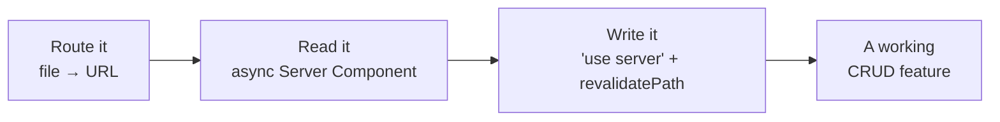

# Next.js 16 — One-Page Cheatsheet

Your takeaway from the course. The whole mental model fits on one page.

---

## The decision tree

```
Fetching data?      →  async Server Component (await the data right in the component)
Need interactivity? →  'use client' (keep it small, at the leaves)
Slow data?          →  wrap it in <Suspense> so the rest of the page streams
Mutating data?      →  'use server' action, then revalidatePath('/route')
```

That's a complete loop: **render on the server, fetch inline, stream the slow
parts, mutate via actions, refresh with `revalidatePath`.**



---

## Server vs Client — the one rule

| | Server Component (default) | Client Component (`'use client'`) |
|---|---|---|
| When | Fetching data, rendering HTML | State, effects, events (interactivity) |
| Data | `await` it inline from `data.ts` / a DB | `fetch()` an API route from the browser |
| Ships JS? | No data-fetching JS | Component + logic + data all shipped |
| Example | `/users-server`, `/guestbook` | `/counter`, the add-todo form |

> **Anti-pattern (S4):** marking a whole page `'use client'` and fetching with
> `useEffect` when nothing is interactive. Fix: delete `'use client'`, make it
> `async`, `await` the data. Push the client boundary down to the leaves.

---

## Server Actions (writes)

```tsx
// actions.ts
'use server';
export async function signGuestbook(formData: FormData) {
  const name = formData.get('name');
  // ...validate + mutate (DB / store)...
  revalidatePath('/guestbook'); // re-render the Server Component with fresh data
}

// page.tsx (Server Component)
<form action={signGuestbook}> ... </form>   // works without JS
```

- Need a **pending flag** or **error UI**? Use `useActionState(action, init)` in a
  small `'use client'` leaf (see `/todos`).
- Server Actions are reachable by direct POST — real apps check auth **inside** the action.

---

## v16 gotchas (breaking changes from v15)

- **`params` / `searchParams` are Promises** → `await params` in pages & `generateMetadata`.
- **`cookies()` / `headers()` / `draftMode()` are async-only** → `await cookies()`.
- **Turbopack is the default** → no `--turbopack` flag on `dev` / `build`.
- **Caching is a day-2 topic** → Cache Components (`'use cache'`, PPR) is off here; defaults are fine.

---

## When NOT to use Next.js

- Simple static/content site, little interactivity → plain HTML / Astro.
- Internal SPA-only tool, no SEO, no server render → Vite + React.
- No Node/serverless host available → reconsider (Next wants a JS server).
- SEO + interactivity + server data in one app → **Next.js** ✅.

---

## What you can now build

The S1 → S2 → S3 loop **is** a working CRUD feature: route it, read it on the
server, write it with an action and revalidate. Everything else (auth, caching,
fancy UI) is a layer on top.

**Keep learning:** [Next.js Learn](https://nextjs.org/learn) · [react.dev](https://react.dev/learn) · this repo's per-session branches.
