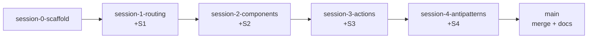

# Instructor Guide — Next.js 16 Freshers Training

The index for running this course. Each session has a full **teaching script**
in [`teaching-scripts/`](teaching-scripts/) (Say / Show / Ask cues, Mermaid
diagrams, v16 gotchas, time budgets). This file is the map: timing, branch
model, and how to drive the live demo.

> **Hands-on:** every session ends with a tiny build-it-yourself task in
> [`teaching-scripts/hands-on-exercises.md`](teaching-scripts/hands-on-exercises.md).
> Trainees scaffold their **own** fresh Next.js 16 repo and grow it across all
> four sessions. **No AI, no copy-paste in the room** — docs only (each exercise
> links the exact pages). Answer code is for trainer verification, not hand-out.

> **Stack:** Next.js 16.2.7 · React 19.2.4 · TypeScript · Tailwind CSS v4 · Biome · pnpm · Turbopack (default)
> **Caching:** **Cache Components OFF** (the v16 default) — caching is a day-2 topic, mentioned only as a ~3-min concept in Session 4.
> **Audience:** Freshers comfortable with React fundamentals (`useState`/`useEffect`, props) and ES6.

---

## Session index & timing

| # | Session | Min | Clock | Teaching script | Core idea |
|---|---------|-----|-------|-----------------|-----------|
| 1 | Intro & Routing | 45 | 9:30–10:15 | [session-1-routing.md](teaching-scripts/session-1-routing.md) | Files in `src/app/` *are* the router; special files add behavior |
| 2 | Components & Data Fetching | 45 | 10:30–11:15 | [session-2-components.md](teaching-scripts/session-2-components.md) | Server-by-default; `'use client'` at the leaves; `<Suspense>` streaming |
| 3 | Server Actions & Mutations | 30 | 11:15–11:45 | [session-3-actions.md](teaching-scripts/session-3-actions.md) | `<form action>` → `'use server'` → `revalidatePath` |
| 4 | Best Practices & Disadvantages | 30 | 11:45–12:15 | [session-4-best-practices.md](teaching-scripts/session-4-best-practices.md) | Diagnose `/anti-patterns`; caching = day-2; when *not* to use Next |

**Teaching arc:** route (S1) → read (S2) → write (S3) → judge it (S4).

**Per-session hands-on** (all in [`hands-on-exercises.md`](teaching-scripts/hands-on-exercises.md), ~8–12 min each):

| # | Tiny build | Drills |
|---|------------|--------|
| 0 | Scaffold a fresh Next.js 16 app | `create-next-app`, Turbopack default, leave caching off |
| 1 | `/about` + dynamic `/greet/[name]` + a `loading.tsx` | file → URL, `await params`, special files |
| 2 | `/users-server` async component + a `/counter` client leaf | server-by-default, `'use client'` at the leaf |
| 3 | A `<form action={serverAction}>` + `revalidatePath` | `'use server'`, mutate → revalidate, no client state |
| 4 | Build the whole-tree `'use client'` anti-pattern, then refactor it | server-first; push the client boundary down |

---

## Branch model

Dedicated per-session branches, **chained** — each cut from the previous
session's tip, carrying all prior sessions plus its own code **and** its own
teaching script. `main` is the full course (all four sessions merged + these
cross-session docs).

| Branch | Branched from | Contents |
|---|---|---|
| `session-0-scaffold` | `main` @ scaffold | Clean scaffold + docs + agent rules |
| `session-1-routing` | `session-0-scaffold` | + nav hub, `(s1-routing)/`, `src/lib/data.ts` |
| `session-2-components` | `session-1-routing` | + `(s2-components)/`, `/api/users` |
| `session-3-actions` | `session-2-components` | + `(s3-actions)/` |
| `session-4-antipatterns` | `session-3-actions` | + `/anti-patterns` |
| `main` | merge of `session-4-antipatterns` | Full course + `INSTRUCTOR.md`, `CHEATSHEET.md`, `README.md` |



### Two ways to use the repo

| Mode | Who | Checkout | What you get |
|---|---|---|---|
| **Watch demo** (default) | Instructor, observers | `main` | Full finished app + nav hub to every route |
| **Build along** | Attendee / live-coding instructor | The **previous** session's branch | Prior sessions only — today's session is yours to build, then diff against this session's branch |

**Watch-demo pre-flight:** `git switch main && pnpm install && pnpm dev`, then visit routes in teaching-script order.
**Build-along pre-flight (e.g. S2):** `git switch session-1-routing && pnpm install && pnpm dev` — S1 routes only; add S2, compare against `session-2-components`.

---

## Route map (all on `main`)

| Session | Routes |
|---|---|
| S1 — Routing | `/about` · `/blog` · `/blog/[slug]` · `/layout-demo` · `/layout-demo/settings` |
| S2 — Components | `/users-server` · `/users-client` · `/counter` · `/dashboard` · `/dashboard/granular` · `/parallel-fetch` · `GET /api/users` |
| S3 — Server Actions | `/guestbook` · `/todos` |
| S4 — Best Practices | `/anti-patterns` |

Mock data + artificial delays live in [`src/lib/data.ts`](src/lib/data.ts) so
streaming and loading states are visible.

---

## Running the demo

```bash
pnpm install
pnpm dev      # Turbopack by default — no --turbopack flag in v16
# http://localhost:3000  → the nav hub links to every route
```

- `pnpm build` — production build (Turbopack)
- `pnpm lint` — Biome check (not ESLint)
- `pnpm format` — Biome format --write

---

## v16 gotchas to teach correctly

These are **breaking changes** from v15 — most training data is wrong here.

- **`params` / `searchParams` are Promises** — `await` them (S1 `/blog/[slug]`, `generateMetadata`).
- **`cookies()` / `headers()` / `draftMode()` are async-only** — no sync versions.
- **Turbopack is the default** for `dev` and `build` — no `--turbopack` flag.
- **Cache Components stays OFF** — async data fetching "just works"; caching is a day-2 topic.
- **`revalidatePath` / `revalidateTag`** are the simple, model-agnostic refresh after a mutation (S3).

Hand out [`CHEATSHEET.md`](CHEATSHEET.md) as the closing artifact.
