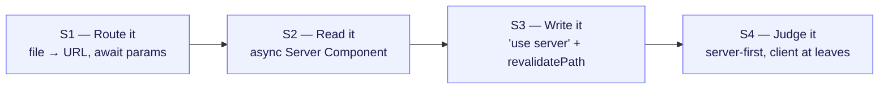

# Hands-On Exercises — one tiny build per session

> **Format:** each session ends with a small, self-contained task the trainee builds in **their own brand-new Next.js 16 repo** (not this repo's branches). Every exercise drills the **one core idea** of its session and is sized for ~8–12 minutes after the demo.
>
> **Why a fresh repo:** scaffolding once and growing it across all four sessions means each trainee owns the whole loop — route → read → write → judge — in code they typed themselves.

---

## Rules of engagement (read this to the room)

- **No AI in the room.** No Copilot, no ChatGPT, no Cursor autocomplete-the-file. The goal is a strong grasp of the fundamentals, not output on a screen.
- **No copy-paste — type it.** Don't paste from the slides, from Slack, or from a neighbour. The struggle of getting there *is* the learning.
- **Recall the pattern you just watched.** Every task maps to a demo you saw minutes ago. If you're stuck, re-open the demo and read it — then write your own version from understanding.
- **The done-check is the goal, not the code.** You're "done" when the behaviour described under *Done-check* is true. There's no single right way to type it.
- **Trainers:** answer code is for *your* verification only — describe the fix in words and point at the relevant demo; don't paste solutions into Slack or the projector.

**Say:** "By the end you'll have built one small app that routes, reads, writes, and that you can critique — all typed by you."

### Where to look things up (docs are allowed — AI is not)

Reading the docs **is** the skill. Each exercise lists the exact pages to refer to.

- **Online:** the official Next.js 16 docs at [nextjs.org/docs/app](https://nextjs.org/docs/app).
- **Offline (version-exact):** the *same* docs ship inside your freshly scaffolded repo at `node_modules/next/dist/docs/01-app/`. These match your installed v16 exactly — when online and offline disagree, trust the offline copy.
- **React-only APIs** (e.g. `useActionState`) live in the React docs at [react.dev](https://react.dev/reference/react).

---

## Session 0 — Scaffold (do once, ~5 min)

Before Session 1's exercise, everyone needs a clean Next.js 16 app. Walk this together.

- **Task:** create a fresh app with the official scaffolder, then run the dev server.
- **Hint:** use `create-next-app` (App Router, TypeScript). In **v16, Turbopack is the default** — there is **no `--turbopack` flag** to pass. `pnpm dev` is enough.
- **Done-check:** `pnpm dev` boots, the starter page loads at `http://localhost:3000`, and the dev banner mentions **Turbopack**.
- **Confirm versions:** `next` is `16.x`, `react` / `react-dom` are `19.x`.
- **Leave caching alone:** do **not** add `cacheComponents` to `next.config.ts`. We keep Cache Components **off** and **do not cover caching** in this course — the default config keeps async data fetching working with no build errors.

### Docs to refer

- **Installation** — [getting-started/installation](https://nextjs.org/docs/app/getting-started/installation) · offline: `01-app/01-getting-started/01-installation.md`
- **Project Structure** (where files go) — [getting-started/project-structure](https://nextjs.org/docs/app/getting-started/project-structure) · offline: `01-app/01-getting-started/02-project-structure.md`
- **`create-next-app` CLI** — [api-reference/cli/create-next-app](https://nextjs.org/docs/app/api-reference/cli/create-next-app) · offline: `01-app/03-api-reference/06-cli/create-next-app.md`

> Trainees keep this same repo for Sessions 1–4. Each exercise adds to it.

---

## Session 1 — Routing: "files are the router"

> **Core idea:** a file's path in `src/app/` *is* its URL. Dynamic segments use `[brackets]`, and `params` is a **Promise you must `await`** in v16. Special files (`loading`, `not-found`) add behaviour with zero config.
> **Time:** ~12 min · **Maps to demo:** `/about`, `/blog/[slug]`, `blog/loading.tsx`

### Task

In the repo you scaffolded:

1. Make a **plain page** that appears at `/about`.
2. Make a **dynamic route** at `/greet/[name]` that reads the name **from the URL** and renders a heading like "Hello, Ada" for `/greet/ada`.
3. Add a **loading skeleton** to one route that fetches slowly, so a fallback shows before the content.
4. Link to both new pages from the **home page** using `<Link>`.

### Hints (concept, not code)

- For (1): the URL `/about` tells you exactly which folder + file to create. No router config anywhere.
- For (2): the folder name carries the dynamic part. Inside the page, `params` is a **Promise** — you must `await` it before reading `name`. (Old tutorials that do `params.name` directly are wrong for v16 — this is *the* headline breaking change.)
- For (3): you don't wire up a spinner in React. Name a file by convention in the route folder and Next shows it while the async page resolves. To *see* it, give your data fetch an artificial delay (e.g. an `await` on a timer).
- For (4): why `<Link>` and not `<a>`? Client-side nav + automatic prefetch.

### Done-check

- `/about` renders your text.
- `/greet/ada` shows "Hello, ada"; changing the URL segment changes the greeting.
- Hard-refreshing the slow route flashes the skeleton, then swaps in real content.
- Clicking the home-page links navigates without a full page reload.

### Stretch (if fast)

- Add a `not-found.tsx` and call the `notFound()` helper for an unknown value.
- Give the dynamic page a per-page `<title>` via `generateMetadata` (remember: `await params` there too).

### Docs to refer

- **Layouts and Pages** — [getting-started/layouts-and-pages](https://nextjs.org/docs/app/getting-started/layouts-and-pages) · offline: `01-app/01-getting-started/03-layouts-and-pages.md`
- **Dynamic Routes** (the `[name]` segment) — [api-reference/file-conventions/dynamic-routes](https://nextjs.org/docs/app/api-reference/file-conventions/dynamic-routes) · offline: `01-app/03-api-reference/03-file-conventions/dynamic-routes.md`
- **`page.js`** (note `params` is a **Promise** in v16) — [api-reference/file-conventions/page](https://nextjs.org/docs/app/api-reference/file-conventions/page) · offline: `01-app/03-api-reference/03-file-conventions/page.md`
- **`loading.js`** (the streaming fallback) — [api-reference/file-conventions/loading](https://nextjs.org/docs/app/api-reference/file-conventions/loading) · offline: `01-app/03-api-reference/03-file-conventions/loading.md`
- **Linking and Navigating** — [getting-started/linking-and-navigating](https://nextjs.org/docs/app/getting-started/linking-and-navigating) · offline: `01-app/01-getting-started/04-linking-and-navigating.md`
- *Stretch:* `not-found.js` + `notFound()` — [file-conventions/not-found](https://nextjs.org/docs/app/api-reference/file-conventions/not-found) · `generateMetadata` — [functions/generate-metadata](https://nextjs.org/docs/app/api-reference/functions/generate-metadata)

---

## Session 2 — Components & Data: "server by default"

> **Core idea:** components render on the **server by default**. An `async` Server Component can `await` its data inline — no `useEffect`, no spinner, no fetching JS in the bundle. Reach for `'use client'` only for interactivity, and keep it at the **leaves**.
> **Time:** ~12 min · **Maps to demo:** `/users-server`, `/counter`

### Task

1. Create a tiny **mock data module** exporting an `async` function that returns a small list (e.g. users or products) after a short artificial delay.
2. Build a page at `/users-server` that is an **async Server Component**: `await` your data function and render the list. **No** `useState`, **no** `useEffect`.
3. Build a page at `/counter` that is a **Server Component** containing exactly one small **client leaf** — a button that increments a number. Only the button should be `'use client'`; the surrounding text stays server-rendered.

### Hints (concept, not code)

- For (2): the page's function signature is the tell — it's `async`, and you `await` inside it. The data ends up in the **initial HTML**, so the browser makes no API call to render it.
- For (3): the page file has **no** directive (server). It imports a separate component file whose **first line** is `'use client'` and which holds the `useState` + `onClick`. Draw the client boundary as **low in the tree** as possible.
- Ask yourself before adding `'use client'`: *does this piece need state, events, or effects?* If no → it stays a Server Component.

### Done-check

- On `/users-server`, **View Source** (not DevTools Elements) shows the list items already in the HTML, and the **Network tab shows no client-side fetch** for that data.
- On `/counter`, the button increments, but the explanatory text around it is present in View Source (proving it rendered on the server).

### Stretch (if fast)

- Build `/users-client` the *old* way: a `'use client'` page that fetches from a Route Handler (`app/api/.../route.ts`) in `useEffect` with a manual loading flag. Compare the spinner + extra round-trip against `/users-server`. (This is the exact contrast Session 4 will diagnose.)
- Wrap a slow section in `<Suspense>` instead of a whole-page `loading.tsx`.

### Docs to refer

- **Server and Client Components** (the headline mental model) — [getting-started/server-and-client-components](https://nextjs.org/docs/app/getting-started/server-and-client-components) · offline: `01-app/01-getting-started/05-server-and-client-components.md`
- **Fetching Data** (await in an async Server Component) — [getting-started/fetching-data](https://nextjs.org/docs/app/getting-started/fetching-data) · offline: `01-app/01-getting-started/06-fetching-data.md`
- **`'use client'` directive** (what the boundary does) — [api-reference/directives/use-client](https://nextjs.org/docs/app/api-reference/directives/use-client) · offline: `01-app/03-api-reference/01-directives/use-client.md`
- *Stretch:* **Route Handlers** — [getting-started/route-handlers](https://nextjs.org/docs/app/getting-started/route-handlers) · offline: `01-app/01-getting-started/15-route-handlers.md` · **Streaming / `<Suspense>`** — [guides/streaming](https://nextjs.org/docs/app/guides/streaming)

---

## Session 3 — Server Actions: "write it, then revalidate"

> **Core idea:** a `<form>` can call a `'use server'` function directly. After mutating, call `revalidatePath('/route')` and the server-rendered list refreshes itself — no client state, no manual re-fetch. `useActionState` is the opt-in for a pending flag + error UI.
> **Time:** ~12 min · **Maps to demo:** `/guestbook`, `/todos`

### Task

1. Add a **mutable in-memory store** to your data module (e.g. an array) plus a function that pushes a new item onto it.
2. Build a page at `/guestbook` (or `/todos`) that:
   - is a **Server Component** that reads and lists the store, and
   - has a `<form>` whose `action` is a **`'use server'` function** that reads the submitted `FormData`, adds an item, and calls `revalidatePath` so the list updates.
3. Confirm the new item appears **without you writing any re-fetch or client state**.

### Hints (concept, not code)

- The action lives in a file (or inline) marked `'use server'`. Its body **only ever runs on the server**, even though the browser triggers it.
- The form receives the standard browser `FormData` object — read fields off it by their input `name`.
- You wrote **no** `onSubmit`, **no** `fetch`, **no** `event.preventDefault()`. Passing the server function to the form's `action` prop is the whole wiring.
- The list refreshes because `revalidatePath('/your-route')` tells Next to re-run the page's Server Component, which re-reads the store.
- Validate **inside the action** (server-side) — a user can't bypass it from the browser.

### Done-check

- Submitting the form adds an item to the list with no page reload code you wrote.
- **Disable JavaScript** in DevTools and submit again — **it still works** (progressive enhancement: it's a real `<form>` posting to a server action).
- A bad input rejected by your server-side validation does **not** get added.

### Stretch (if fast)

- Add a **pending state + error message** with `useActionState` in a small `'use client'` form leaf — the button reads "Adding…" while in flight, and a returned error renders inline. Keep only that form on the client; the page and list stay server-rendered.
- Add a per-row toggle/delete as **another tiny `<form action={...}>`** — no `useState` for the checkbox.

### Docs to refer

- **Mutating Data** (Server Actions, `<form action={fn}>`) — [getting-started/mutating-data](https://nextjs.org/docs/app/getting-started/mutating-data) · offline: `01-app/01-getting-started/07-mutating-data.md`
- **`'use server'` directive** — [api-reference/directives/use-server](https://nextjs.org/docs/app/api-reference/directives/use-server) · offline: `01-app/03-api-reference/01-directives/use-server.md`
- **`revalidatePath`** (refresh the list after a mutation) — [api-reference/functions/revalidatePath](https://nextjs.org/docs/app/api-reference/functions/revalidatePath) · offline: `01-app/03-api-reference/04-functions/revalidatePath.md`
- **Forms guide** (progressive enhancement, FormData) — [guides/forms](https://nextjs.org/docs/app/guides/forms) · offline: `01-app/02-guides/forms.md`
- *Stretch:* **`useActionState`** (pending + error) — React docs: [react.dev/reference/react/useActionState](https://react.dev/reference/react/useActionState)

---

## Session 4 — Judgment: "spot it, then fix it"

> **Core idea:** the framework will happily let you do the wrong thing. The single decision that separates good Next.js from bad: *does this need state/events?* If no → Server Component. Push the `'use client'` boundary down to the **interactive leaf**.
> **Time:** ~12 min · **Maps to demo:** `/anti-patterns` → `/users-server`

### Task (this one is build-it-wrong, then fix-it)

1. **Build the anti-pattern on purpose.** Make a page at `/anti-patterns` that shows the *same* list as your `/users-server` page, but built the bad way: mark the **whole page** `'use client'`, hold the data in `useState`, and load it in a `useEffect` that fetches from a Route Handler. Add a loading skeleton for the `null` state.
2. **Observe the cost.** Load it and watch the **spinner flash on every refresh**. Open the Network tab and see the extra client fetch.
3. **Refactor it to the right shape.** Turn it back into an `async` Server Component that `await`s the data inline — delete `'use client'`, delete the effect and state. Compare the two.

### Hints (concept, not code)

- Before refactoring, ask the room's diagnostic question out loud: *"Is anything on this page interactive?"* If the answer is no, `'use client'` at the top is the bug.
- `'use client'` is a **boundary, not a free switch** — everything the file imports becomes client too, so a top-level directive drags the whole tree into the browser bundle.
- The fix is famously small: roughly **one deletion and one keyword** (drop the directive, make the function `async`, `await` the data).

### Done-check

- **Before:** `/anti-patterns` shows a spinner on refresh, and the Network tab shows a browser fetch for the data.
- **After:** the refactored page has the list **already in View Source**, makes **no client fetch**, and ships **less JS** (no effect/state code).
- Trainee can state the rule in one line: *do the work on the server; push the client boundary to the leaves.*

### Discussion (no code — talk it through)

- **When *not* to use Next.js:** a brochure/static site, a pure internal SPA with no SEO, or anywhere you can't run a Node server — simpler tools win. Knowing when not to reach for it is itself a best practice.

### Docs to refer

- **Server and Client Components** (re-read the "when to use each" section) — [getting-started/server-and-client-components](https://nextjs.org/docs/app/getting-started/server-and-client-components) · offline: `01-app/01-getting-started/05-server-and-client-components.md`
- **`'use client'` directive** (it's a *boundary*, not a free switch) — [api-reference/directives/use-client](https://nextjs.org/docs/app/api-reference/directives/use-client) · offline: `01-app/03-api-reference/01-directives/use-client.md`
- **Rendering Philosophy** (server-first as the default) — [guides/rendering-philosophy](https://nextjs.org/docs/app/guides/rendering-philosophy) · offline: `01-app/02-guides/rendering-philosophy.md`
- *Discussion:* **Single-Page Applications** (when a lighter tool fits) — [guides/single-page-applications](https://nextjs.org/docs/app/guides/single-page-applications) · offline: `01-app/02-guides/single-page-applications.md`

---

## Trainer wrap-up

By the end of four short builds, each trainee has — **in their own repo, typed by hand** — a small app that:

- **routes** (files → URLs, `await params`),
- **reads** on the server (async Server Component, no spinner),
- **writes** with a server action + `revalidatePath`, and
- they can **critique** the difference between server-first and the whole-tree-client anti-pattern.

That's the entire mental model of modern Next.js, earned through practice rather than copied.
