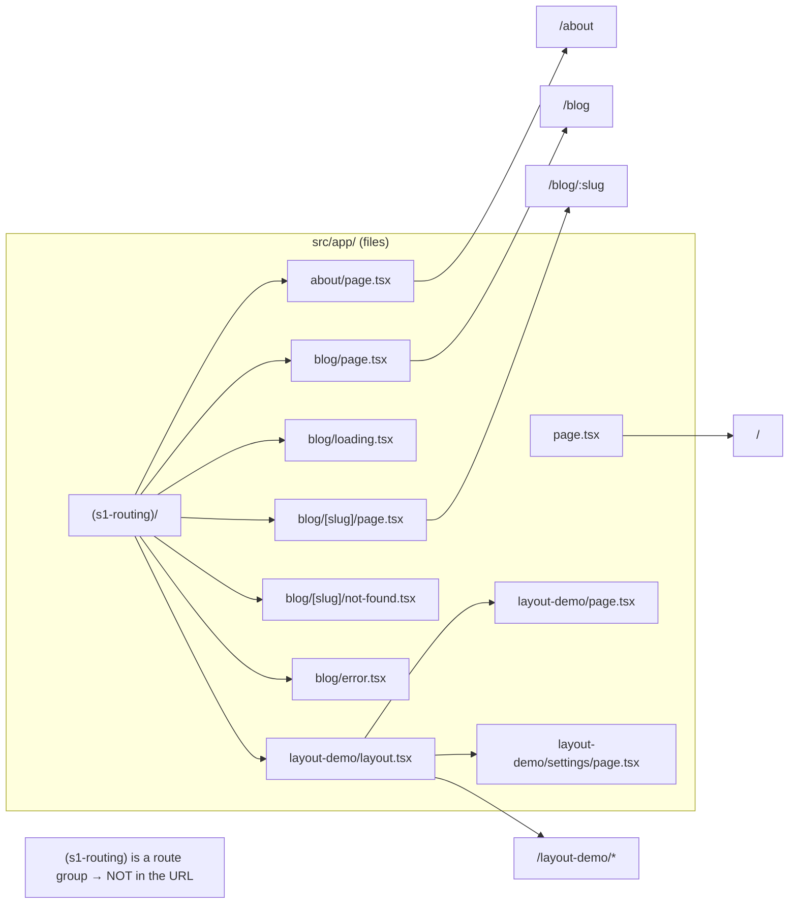
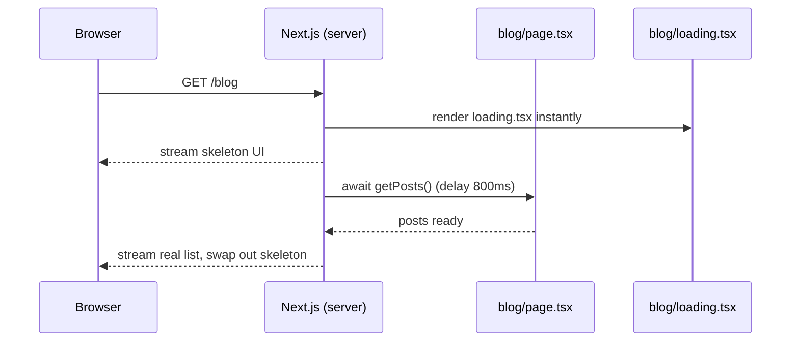
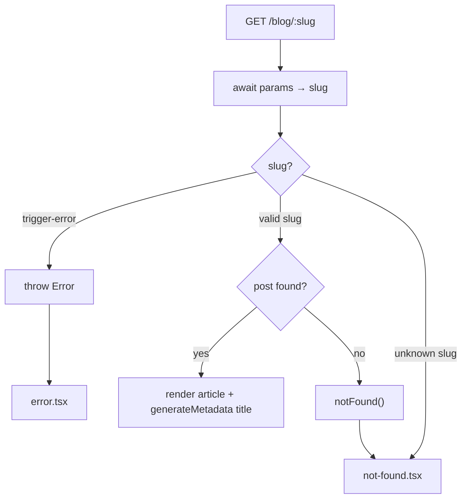
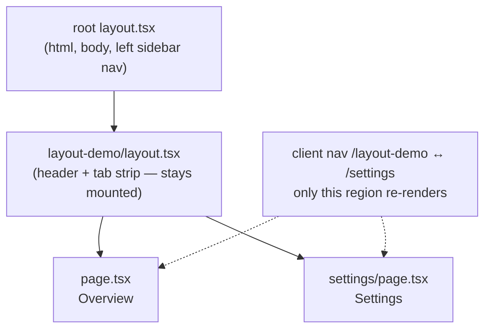

# Session 1 — Intro & Routing

> **Duration:** 45 min · **Clock:** 9:30–10:15
> **Build-along branch:** `session-0-scaffold` (start here, build toward `session-1-routing`)
> **Watch-demo branch:** `main`
> **Learning goal:** Folders + files in `src/app/` *are* the router. A file's path is its URL, and special files (`layout`, `loading`, `error`, `not-found`) add behavior with zero config.

---

## Pre-flight

**Watch demo (instructor showing finished code):**

```bash
git switch main
pnpm install      # first time only
pnpm dev          # Turbopack, no --turbopack flag in v16
```

**Build along (room types it live):**

```bash
git switch session-0-scaffold   # clean scaffold, before S1
pnpm install
pnpm dev
```

Not built yet on `session-0-scaffold`: nav hub, `src/lib/data.ts`, and everything under `src/app/(s1-routing)/`. You'll add them this session and can diff against `session-1-routing` at the end.

**URLs, in visiting order:**

1. `http://localhost:3000/` — nav hub
2. `/about` — plain page
3. `/blog` — list + `loading.tsx`
4. `/blog/welcome-to-nextjs-16` — dynamic segment + `generateMetadata`
5. `/blog/does-not-exist` — `not-found.tsx`
6. `/blog/trigger-error` — `error.tsx`
7. `/layout-demo` → `/layout-demo/settings` — nested layout

---

## Opening hook (~2 min)

> "In most frameworks you wire up a router: a config file that maps URLs to components. In Next.js, **there is no router config**. The folder structure *is* the router. If you can create a file in the right place, you've created a route. Let's prove it."

Ask the room: *"If I make a file at `src/app/about/page.tsx`, what URL do you think that becomes?"* — let them answer, then show `/about`.

### The whole session on one slide — files map to URLs

Show this before diving in, so the room has the map in their head:



**Say:** "Parentheses folder `(s1-routing)` disappears from the URL. Square brackets `[slug]` become the dynamic part. Everything else: folder path = URL path."

---

## Demo-by-demo walkthrough

### 1. The nav hub — `/` (~4 min)

**File:** `src/app/page.tsx`

- **Say:** "`page.tsx` at the root of `src/app/` = the `/` route. The page itself is just a Server Component returning JSX — no `useState`, no client JS of its own."
- **Show:** the `session1Demos` array → `<Link href=...>` cards. Hover a card, point at the Network tab: Next **prefetches** the linked route automatically.
- **Show:** the persistent **left sidebar** comes from the root `layout.tsx` (`src/app/sidebar-nav.tsx`). It *is* a small Client Component (`'use client'`) — it uses `usePathname()` to highlight the active link — so the only client JS on `/` is that nav, not the page.
- **Ask the room:** "Why use `<Link>` instead of a plain `<a>`?" → client-side nav + automatic prefetch, no full page reload.
- **v16 gotcha:** Turbopack is the default bundler now. Notice the dev banner says *Turbopack* — there is **no `--turbopack` flag** anymore.

### 2. `/about` — file maps to URL (~4 min)

**File:** `src/app/(s1-routing)/about/page.tsx`

- **Say:** "The folder `(s1-routing)` is wrapped in parentheses — that's a **route group**. It organizes files but is **invisible in the URL**. The route is `/about`, not `/s1-routing/about`."
- **Show:** the URL bar = `/about`. Then show the folder path in the editor. Contrast the two.
- **Ask the room:** "Where would I put a file to make `/about/team`?" → `(s1-routing)/about/team/page.tsx`.
- **Note:** no `'use client'` here → pure Server Component, renders HTML per request, ships zero component JS.

### 3. `/blog` — list + `loading.tsx` (~7 min)

**Files:** `src/app/(s1-routing)/blog/page.tsx`, `blog/loading.tsx`, `src/lib/data.ts`

- **Say:** "This is an **async Server Component**. Look — `export default async function`, and we `await getPosts()` right inside the component. No `useEffect`, no loading state in React."
- **Show:** `getPosts()` in `data.ts` has an artificial `await delay(800)`. Hard-refresh `/blog` → the **skeleton** appears first.
- **Say:** "That skeleton is `blog/loading.tsx`. You don't wire it up — name a file `loading.tsx` in a route folder and Next shows it automatically while the async page resolves."
- **Ask the room:** "What React feature do you think `loading.tsx` is built on?" → Suspense (sets up S2).
- **v16 gotcha:** data fetching 'just works' because **Cache Components is off** (the v16 default in this repo) — no "uncached data outside Suspense" build error to explain on day one.

**What happens on request — draw this:**



**Say:** "Browser never waits on a blank screen. Skeleton streams first, real content swaps in when the `await` resolves. You wrote zero loading-state code."

### 4. `/blog/[slug]` — dynamic segment, `await params`, `generateMetadata` (~8 min)

**File:** `src/app/(s1-routing)/blog/[slug]/page.tsx`

- **Say:** "Square brackets in a folder name = a **dynamic segment**. `[slug]` captures whatever's in that URL position."
- **Show:** click a post from `/blog` → `/blog/welcome-to-nextjs-16`. The `{slug}` renders on the page.
- **THE v16 headline:** point at the type — `params: Promise<{ slug: string }>` — and the line `const { slug } = await params;`.
  - **Say:** "This is the single biggest v16 breaking change. `params` is now a **Promise**. You **`await`** it. Old tutorials that do `params.slug` directly are wrong for v16."
- **Show `generateMetadata`:** switch browser tabs and read the tab title — it's the post title. That comes from `export async function generateMetadata`, which **also** `await params`.
  - **Ask the room:** "Why is per-page `<title>` from `generateMetadata` better than hardcoding one title?" → SEO, sharable links, each blog post / product page gets its own title.
- **Note:** the root `layout.tsx` sets a title `template: "%s · Next.js 16 Training"`, so the tab reads `Welcome to Next.js 16 · Next.js 16 Training`.

### 5. `/blog/does-not-exist` — `not-found.tsx` (~3 min)

**Files:** `blog/[slug]/page.tsx` (the `notFound()` call), `blog/[slug]/not-found.tsx`

- **Show:** visit `/blog/does-not-exist`. The page code calls `getPostBySlug` → `null` → `notFound()`.
- **Say:** "`notFound()` throws a special signal Next catches, then renders the nearest `not-found.tsx`. Again — convention over config."

**One page, three outcomes — the `[slug]` decision tree:**



**Say:** "Same file handles all three: render, `notFound()`, or `throw`. Each routes to its matching special file."

### 6. `/blog/trigger-error` — `error.tsx` (~4 min)

**File:** `blog/error.tsx`

- **Show:** visit `/blog/trigger-error`. The page deliberately `throw`s. Next renders `error.tsx`.
- **Say:** "`error.tsx` is a route-level error boundary. Note the **`'use client'`** at the top — error boundaries need to be Client Components because they take an interactive `reset()` callback."
- **Show:** click **Try again** → calls `reset()`, re-renders the segment.
- **Ask the room:** "Why must this *route file* be a client component?" → it has interactivity (`onClick`, `reset`). (The sidebar nav is also a client component, but for the same reason — it needs `usePathname()`; everything else in the route tree stays server-only.) Sets up the S2 server-vs-client boundary.

### 7. `/layout-demo` → Settings — nested layouts (~5 min)

**Files:** `layout-demo/layout.tsx`, `layout-demo/page.tsx`, `layout-demo/settings/page.tsx`

- **Say:** "A `layout.tsx` wraps every page in its folder **and all child folders**. Shared shell, defined once."
- **Show:** this route has **two** layouts nesting — the global app nav (left sidebar, from the root layout) *and* `layout-demo/layout.tsx`, which adds a **header + a horizontal tab strip** (`Overview | Settings`). Notice the inner layout is deliberately a *different shape* than the outer sidebar. Navigate `/layout-demo` → `/layout-demo/settings`: the header and tabs **stay mounted** (the active tab just moves) — only the `{children}` below swaps. No flicker.
- **Show:** the active-tab highlight comes from `layout-demo/tabs.tsx`, a small `'use client'` component using `usePathname()` — the same pattern as the global nav.
- **Show:** `settings/page.tsx` has **no import** of the layout — it inherits it automatically by position in the tree.
- **Ask the room:** "Where does the root `<html>`/`<body>` come from?" → `src/app/layout.tsx`, the root layout that wraps the whole app.

**Layouts nest — outer stays mounted, inner swaps:**



**Say:** "Navigating Overview ↔ Settings swaps only the inner `{children}`. The root layout (sidebar) and the layout-demo header + tabs never re-mount — that's why there's no flicker."

---

## Recap (~2 min)

Tie back to the mental model:

- **Folders = URLs.** `page.tsx` makes a route; route groups `(...)` organize without affecting the URL.
- **Special files add behavior, zero config:** `layout` (shared shell), `loading` (Suspense fallback), `error` (boundary), `not-found`.
- **v16 reality:** `params` is a **Promise** → `await` it (in both the page and `generateMetadata`). Turbopack is default.
- **Next up (S2):** that async Server Component idea + the `'use client'` boundary we glimpsed in `error.tsx`.

---

## Time budget

| Segment | Min | If running long |
|---|---|---|
| Opening hook | 2 | keep |
| `/` nav hub | 4 | trim prefetch tangent |
| `/about` | 4 | **cut** — mention route groups during nav hub instead |
| `/blog` + loading | 7 | keep (core) |
| `/blog/[slug]` params + metadata | 8 | keep (the v16 headline — never cut) |
| `not-found` | 3 | **cut** — just mention it exists |
| `error` | 4 | shorten to a single click |
| layout-demo | 5 | keep (core) |
| Recap | 2 | keep |

**Total:** ~39 min core + buffer. **Never cut:** `await params` on `/blog/[slug]`. **First to cut:** `/about` and `not-found`.
