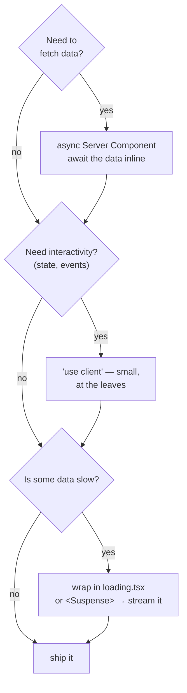
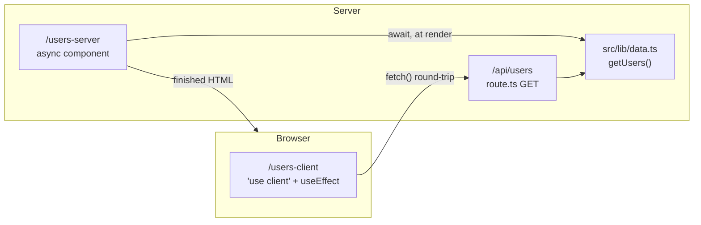
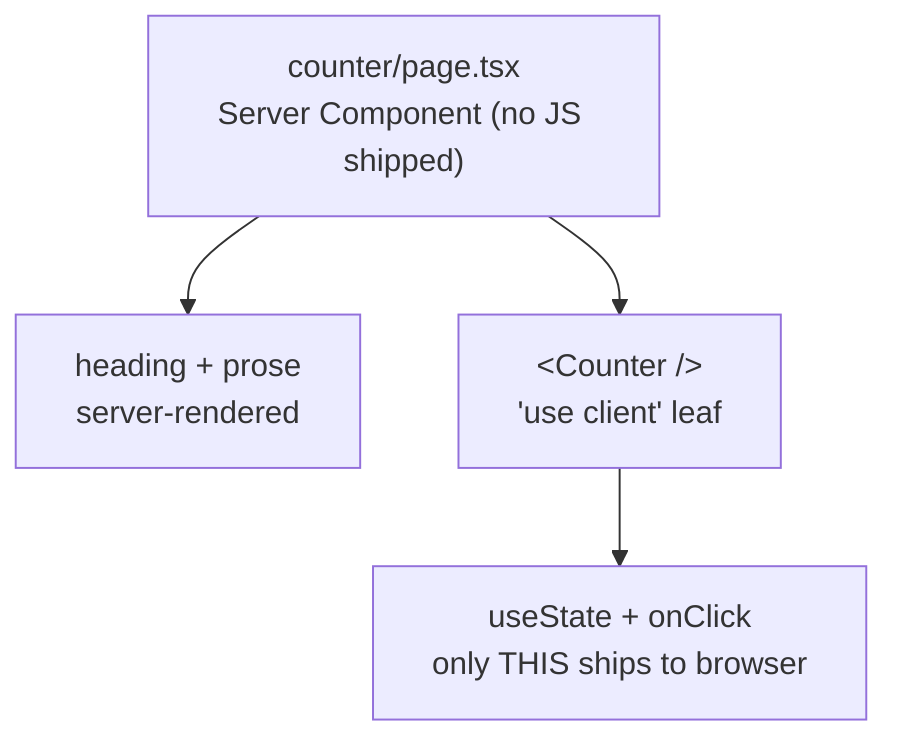
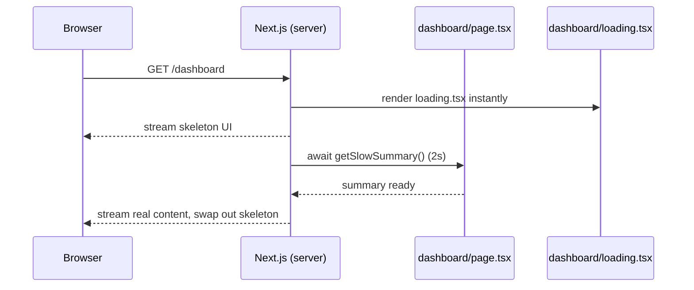

# Session 2 — Components & Data Fetching

> **Duration:** 45 min · **Clock:** 10:30–11:15
> **Build-along branch:** `session-1-routing` (start here, build toward `session-2-components`)
> **Watch-demo branch:** `main`
> **Learning goal:** Components render on the **server by default**. Fetch data right inside an `async` Server Component; reach for `'use client'` only for interactivity, and keep it at the **leaves**. Wrap slow data in a `loading.tsx` or `<Suspense>` so the page streams.

---

## Pre-flight

**Watch demo (instructor showing finished code):**

```bash
git switch main
pnpm install      # first time only
pnpm dev          # Turbopack, no --turbopack flag in v16
```

**Build along (room types it live):**

```bash
git switch session-1-routing   # S1 routes only, before S2
pnpm install
pnpm dev
```

Not built yet on `session-1-routing`: everything under `src/app/(s2-components)/` (`users-server`, `users-client`, `counter`, `dashboard`, `dashboard/granular`, `parallel-fetch`) **and** the Route Handler `src/app/api/users/route.ts`. You'll add them this session and can diff against `session-2-components` at the end.

**URLs, in visiting order:**

1. `http://localhost:3000/users-server` — async Server Component
2. `/users-client` — `'use client'` + `useEffect`, fetches `/api/users`
3. `/api/users` — the Route Handler itself (raw JSON)
4. `/counter` — the `'use client'` boundary at a leaf
5. `/dashboard` — streaming via `loading.tsx`
6. `/dashboard/granular` — explicit `<Suspense>` boundaries *(if time)*
7. `/parallel-fetch` — `Promise.all`, no waterfall *(if time)*

---

## Opening hook (~2 min)

> "Yesterday's tutorials told you to fetch data with `useEffect` and a loading spinner. In Next.js you mostly **don't**. A component can be `async` and `await` its data on the server — the browser receives finished HTML with zero fetching JavaScript. Today we'll build the *same* user list twice — once the server way, once the old client way — and feel the difference."

Ask the room: *"When you call an API in a React app today, where does that `fetch` run?"* — let them say "the browser", then show that `/users-server` never makes a browser request at all.

### The whole session on one slide — the decision loop

Show this before diving in, so the room has the map in their head:



**Say:** "Every route today is one path through this tree. Server-first is the default; `'use client'` and `<Suspense>` are the two things you *add* when you need them."

---

## Demo-by-demo walkthrough

### 1. `/users-server` — the async Server Component (~9 min)

**Files:** `src/app/(s2-components)/users-server/page.tsx`, `src/lib/data.ts`

- **Say:** "Look at the signature — `export default async function`. We `await getUsers()` right inside the component and map over the result. There is no `useState`, no `useEffect`, no loading flag."
- **Show:** `getUsers()` in `data.ts` is server-only (artificial `await delay(600)`). View source / Network tab on the page: the user names are **already in the HTML**, and no `/api` call fires from the browser.
- **Ask the room:** "Where did the `fetch`/DB call happen?" → on the server, during render. Credentials and query logic never reach the client.
- **v16 gotcha:** this 'just works' with no caching error because **Cache Components is off** (the v16 default in this repo). A route that reads runtime data simply renders per request.

### 2. `/users-client` + `/api/users` — the client way, and why you need a Route Handler (~10 min)

**Files:** `src/app/(s2-components)/users-client/page.tsx`, `src/app/api/users/route.ts`

- **Say:** "Same list, now the *old* way. First line of the file: `'use client'`. That one directive changes everything below it."
- **Show the wall:** try to `import { getUsers } from "@/lib/data"` in a client file — it's **server-only**. A Client Component can't reach the server fetchers directly.
- **Show the fix — a Route Handler:** open `api/users/route.ts`: `export async function GET()` returning `Response.json(users)`. Visit `/api/users` in the browser — raw JSON. **Say:** "`route.ts` is an HTTP endpoint. This is Next's `app/` equivalent of an API route."
- **Show the cost:** back on `/users-client`, the component runs `useEffect` → `fetch('/api/users')` → manual `useState` loading skeleton → setState. Refresh and watch the skeleton flash. **Say:** "We hand-wrote the loading state, the data-fetching code ships to the browser, and the data arrives a round-trip *after* the page."
- **Ask the room:** "Two pages, identical data. Which would you reach for by default?" → server. Client only when you genuinely need browser-side fetching.

**Server component reads `data.ts` directly; client must hop through `/api/users`:**



**Say:** "The server component pulls data straight from `data.ts` while rendering. The client component can't — it has to leave the browser, hit `/api/users`, and come back. That extra hop *is* the server/client divide."

### 3. `/counter` — the `'use client'` boundary at a leaf (~8 min)

**Files:** `src/app/(s2-components)/counter/page.tsx` (server), `counter/counter.tsx` (`'use client'`)

- **Say:** "Interactivity *does* need the browser. The trick is to keep that part small. This page is a Server Component — all the explanatory text renders on the server. Only the `<Counter>` button is a client leaf."
- **Show:** `page.tsx` has no directive (server). It imports `Counter` from `counter.tsx`, which starts with `'use client'` and uses `useState` + `onClick`.
- **Ask the room:** "Why split it into two files instead of marking the whole page `'use client'`?" → only the interactive leaf ships JS; the rest stays server-rendered. This is the exact anti-pattern Session 4 will diagnose.
- **v16 gotcha tie-in:** remember `error.tsx` from S1 was `'use client'` for the same reason — it needs an interactive `reset()`.

**The boundary — server page, one client leaf:**



**Say:** "Draw the line as low in the tree as you can. Everything above the `'use client'` leaf stays on the server."

### 4. `/dashboard` — streaming via `loading.tsx` (~8 min)

**Files:** `src/app/(s2-components)/dashboard/page.tsx`, `dashboard/loading.tsx`, `getSlowSummary()` in `data.ts`

- **Say:** "Back to a Server Component, but this one awaits a *slow* fetch — `getSlowSummary()`, a deliberate 2-second delay."
- **Show:** hard-refresh `/dashboard`. The skeleton from `loading.tsx` appears **instantly**, then the real summary streams in when the `await` resolves.
- **Say:** "Same convention as S1's `/blog`: name a file `loading.tsx` in the route folder and Next wraps your page in a `<Suspense>` boundary for you. `loading.tsx` *is* Suspense with a default boundary."
- **Ask the room:** "What did we write to make the skeleton appear? Any `isLoading` state?" → no — just the file. The framework does it.

**Request flow — skeleton first, content streams in:**



**Say:** "The user sees structure immediately instead of a blank screen. The slow `await` happens behind the skeleton, and the finished section streams in to replace it."

### 5. `/dashboard/granular` — explicit `<Suspense>` *(if time, ~4 min)*

**File:** `src/app/(s2-components)/dashboard/granular/page.tsx`

- **Say:** "`loading.tsx` streams the *whole* page as one unit. For finer control, drop `<Suspense>` boundaries around individual sections."
- **Show:** two async components — `<UsersCard>` (~600ms) and `<SummaryCard>` (~2s) — each wrapped in its own `<Suspense fallback={...}>`. The fast card appears first; the slow one fills in later. The page header shows immediately.
- **Ask the room:** "Which renders first, and why?" → the users card — each boundary resolves independently, so a slow section never blocks a fast one.

### 6. `/parallel-fetch` — `Promise.all`, no waterfall *(if time, ~3 min)*

**File:** `src/app/(s2-components)/parallel-fetch/page.tsx`

- **Show:** `const [users, products] = await Promise.all([getUsers(), getProducts()])`. The two fetches (600ms + 1200ms) run **together** — total ~1.2s, not ~1.8s.
- **Say:** "If you `await` one and *then* `await` the next, you've built a waterfall — each request waits for the last. Independent data should start in parallel with `Promise.all`."

---

## Recap (~2 min)

Tie back to the mental-model loop:

- **Server by default.** An `async` Server Component awaits its data inline — no `useEffect`, no spinner, no fetching JS in the bundle (`/users-server`).
- **`'use client'` is an opt-in, kept at the leaves.** It's the only way to get state/events, and it forces client components to fetch over HTTP via a **Route Handler** (`/users-client` → `/api/users`). Contrast `/counter`: server page, one tiny client leaf.
- **Stream slow data.** `loading.tsx` streams the whole route; `<Suspense>` streams a section; `Promise.all` avoids waterfalls.
- **Next up (S3):** we can *read* data well now — next we'll **write** it with Server Actions and `revalidatePath`, closing the CRUD loop.

---

## Time budget

| Segment | Min | If running long |
|---|---|---|
| Opening hook + decision tree | 2 | keep |
| `/users-server` | 9 | keep (core — the headline idea) |
| `/users-client` + `/api/users` | 10 | keep (the server/client contrast is the point) |
| `/counter` | 8 | trim the prose, keep the two-file split |
| `/dashboard` streaming | 8 | keep (core) |
| `/dashboard/granular` | 4 | **cut** — mention `<Suspense>` exists |
| `/parallel-fetch` | 3 | **cut** — mention waterfalls in recap |
| Recap | 2 | keep |

**Total:** ~37 min core + buffer. **Never cut:** `/users-server` vs `/users-client` — that contrast is the whole session. **First to cut:** `/dashboard/granular` and `/parallel-fetch` (the two "if time" demos).
