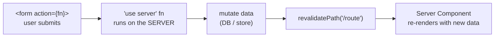
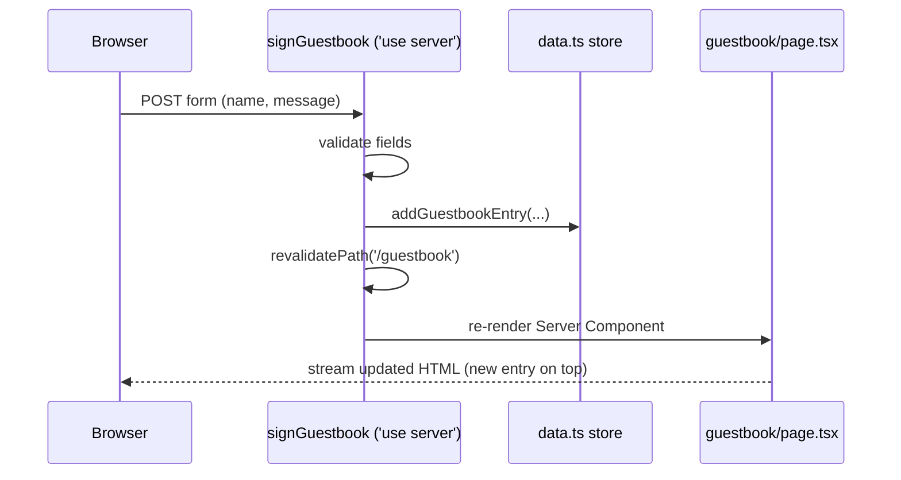
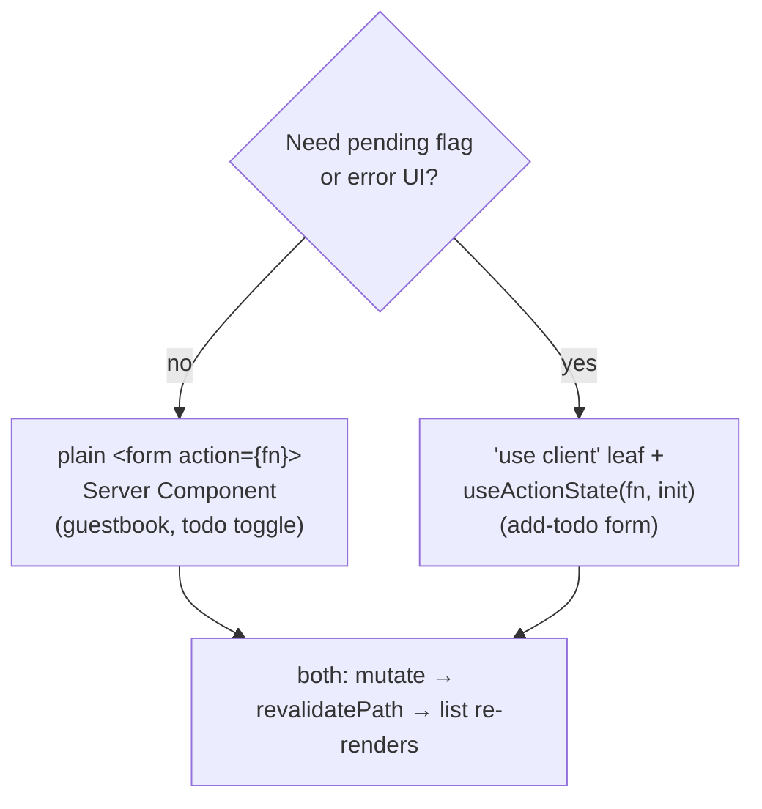
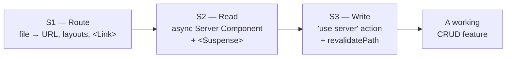

# Session 3 — Server Actions & Mutations

> **Duration:** 30 min · **Clock:** 11:15–11:45
> **Build-along branch:** `session-2-components` (start here, build toward `session-3-actions`)
> **Watch-demo branch:** `main`
> **Learning goal:** Write data the Next.js way. A `<form>` calls a `'use server'` function on the server; after mutating, call `revalidatePath('/route')` so the server-rendered list refreshes. Reach for `useActionState` only when you need a pending flag or validation errors. This **closes the CRUD loop**: route (S1) → read (S2) → write (S3).

---

## Pre-flight

**Watch demo (instructor showing finished code):**

```bash
git switch main
pnpm install      # first time only
pnpm dev          # Turbopack, no --turbopack flag in v16
```

**Build along (room types it live):**

```bash
git switch session-2-components   # S1 + S2 routes only, before S3
pnpm install
pnpm dev
```

Not built yet on `session-2-components`: everything under `src/app/(s3-actions)/` (`guestbook`, `todos`) plus the new mutable stores + mutators at the bottom of `src/lib/data.ts`. You'll add them this session and can diff against `session-3-actions` at the end.

**URLs, in visiting order:**

1. `http://localhost:3000/guestbook` — the simplest write: `<form action={serverAction}>` + `revalidatePath`
2. `/todos` — same pattern + `useActionState` for pending/error UI, plus per-row toggle forms

---

## Opening hook (~2 min)

> "In Session 2 we got really good at **reading** data — async Server Components, no `useEffect`, no spinner. But a real app also has to **write**. In the React you knew yesterday, that meant: `useState`, an `onSubmit` handler, `fetch('/api/...', { method: 'POST' })`, then manually re-fetch the list. Today we do all of that with **one async function** and **zero** client code for the simple case."

Ask the room: *"After you POST a change to the server, how do you get the list on screen to update?"* — let them say "re-fetch it / refresh state". Then show that `revalidatePath` does exactly that, server-side, for free.

### The write half of the loop — on one slide



**Say:** "This is the whole session. The form posts to a server function, the function mutates, then `revalidatePath` re-renders the page's Server Component with fresh data. Notice there's no client state in this picture at all."

---

## Demo-by-demo walkthrough

### 1. `/guestbook` — the simplest possible write (~12 min)

**Files:** `src/app/(s3-actions)/guestbook/page.tsx` (Server Component), `guestbook/actions.ts` (`'use server'`), mutators in `src/lib/data.ts`

- **Say:** "Open `actions.ts`. First line: `'use server'`. Every export in this file is now a **Server Action** — an async function the browser can call, but whose body only ever runs on the server."
- **Show the action:** `signGuestbook(formData)` reads `formData.get('name')` / `'message'`, validates, calls `addGuestbookEntry(...)`, then `revalidatePath('/guestbook')`. **Say:** "`FormData` is the plain browser object — the same one a normal HTML form sends. React hands it to our action automatically."
- **Show the wiring:** in `page.tsx`, the Server Component does `<form action={signGuestbook}>`. **Say:** "We pass the server function straight to the form's `action` prop. No `onSubmit`, no `fetch`, no `event.preventDefault()`."
- **Show it live:** sign the guestbook — the new entry appears at the top. **Say:** "We never wrote code to refresh this list. `revalidatePath('/guestbook')` told Next to re-run this Server Component, which re-reads the store."
- **Ask the room:** "Where did the validation run?" → on the server, inside the action. A user can't bypass it from the browser.
- **v16 gotcha / progressive enhancement:** turn off JavaScript in devtools and submit again — **it still works**. Because the Server Component renders a real `<form>` posting to a server action, the browser's native submit carries it. JS is an enhancement, not a requirement.

**The data path — form straight to the server, no client fetch:**



**Say:** "One round trip does both the mutation and the UI update. Compare this to `/users-client` in S2 — there we had to hop out to `/api/users` just to *read*. Here the write and the refresh are a single server function."

### 2. `/todos` — pending + validation with `useActionState` (~12 min)

**Files:** `src/app/(s3-actions)/todos/page.tsx` (Server Component), `todos/add-todo-form.tsx` (`'use client'`), `todos/actions.ts` (`'use server'`)

- **Say:** "The guestbook form had no feedback — submit and hope. Real forms want a **pending** state and **error** messages. That's the one job of React's `useActionState` hook."
- **Show the action shape:** `addTodoAction(prevState, formData)` returns state — `{ error: "..." }` on a bad input, `{}` on success (after `addTodo` + `revalidatePath`). **Say:** "An action used with `useActionState` takes the **previous state first**, then the `FormData`, and **returns the next state**."
- **Show the client leaf:** `add-todo-form.tsx` starts with `'use client'` and calls `const [state, formAction, pending] = useActionState(addTodoAction, {})`. The form uses `action={formAction}`; the button reads `pending` ("Adding…" + disabled); errors render from `state.error`. **Say:** "Only this tiny form is a client component — the page and the list stay server-rendered. Same leaf principle as `/counter` in S2."
- **Show it live:** submit an empty todo → red error from the server, list unchanged. Submit a real one → button flips to "Adding…", then the row appears.
- **Show the toggle:** each row is its own `<form action={toggleTodoAction}>` with a hidden `id` input. **Say:** "Toggling is just another tiny form posting a server action — no `useState` for the checkbox. The action flips `done` and `revalidatePath`s."
- **Ask the room:** "Why is the add form `'use client'` but the toggle forms aren't?" → only the add form needs the `pending`/`error` hook; the toggles are plain server-action forms, so they stay server-rendered.

**Two ways to call the same kind of action:**



**Say:** "Default to the plain server-action form. Add `useActionState` and a client leaf **only** for the form that needs live feedback. Either way the server half is identical: mutate, then `revalidatePath`."

---

## Recap (~2 min) — "you can now build a real app"

This is the emotional payoff of the course. Tie the three sessions into one loop:



**Say:** "With *just* these three ideas — route it, read it on the server, write it with an action and revalidate — you can build a real, working CRUD feature. Everything else (auth, caching, fancy UI) is a layer on top of this loop."

- **`'use server'`** marks a function that runs on the server and can be called from a form.
- **`<form action={fn}>`** wires it up — progressive enhancement, works without JS.
- **`revalidatePath('/route')`** refreshes the server-rendered data after a mutation — no manual re-fetch, works with Cache Components off.
- **`useActionState`** is the opt-in for `pending` + returned error state, kept in a small client leaf.

---

## Time budget

| Segment | Min | If running long |
|---|---|---|
| Opening hook + write-loop slide | 2 | keep |
| `/guestbook` (form action + revalidatePath) | 12 | keep — this is the core mental model |
| `/todos` (useActionState + toggle) | 12 | trim the toggle aside; keep the add-form pending/error |
| Recap — the S1→S2→S3 CRUD loop | 2 | **never cut** — it's the payoff |

**Total:** ~28 min + buffer. **Never cut:** `/guestbook` (the simplest write) and the closing CRUD-loop recap. **First to trim:** the `/todos` toggle-form aside — mention it exists, focus the time on `useActionState` pending + error.

---

## v16 gotchas cheat-list (call out as they come up)

- **`revalidatePath` / `revalidateTag`** are the simple, model-agnostic refresh — they work with **Cache Components off** (this repo's default). No `'use cache'` needed.
- **Server Actions are reachable by direct POST**, not just your form — real apps must check auth/authorization inside every action (we skip auth here, but say it out loud).
- **`cookies()` / `headers()` are async-only** in v16 — `await cookies()` inside an action if you need them.
- **In-memory store caveat:** our `data.ts` arrays reset when the dev server restarts. That's fine for a demo; a real action writes to a database at the same spot.
