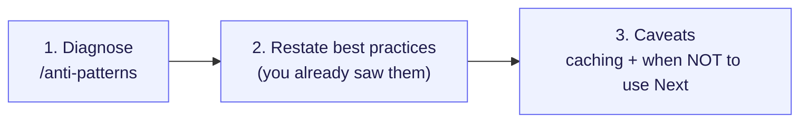
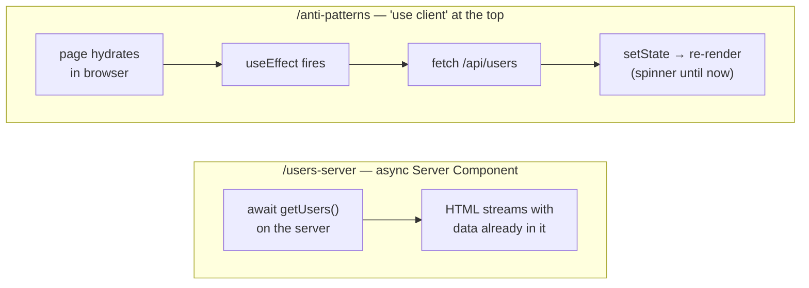
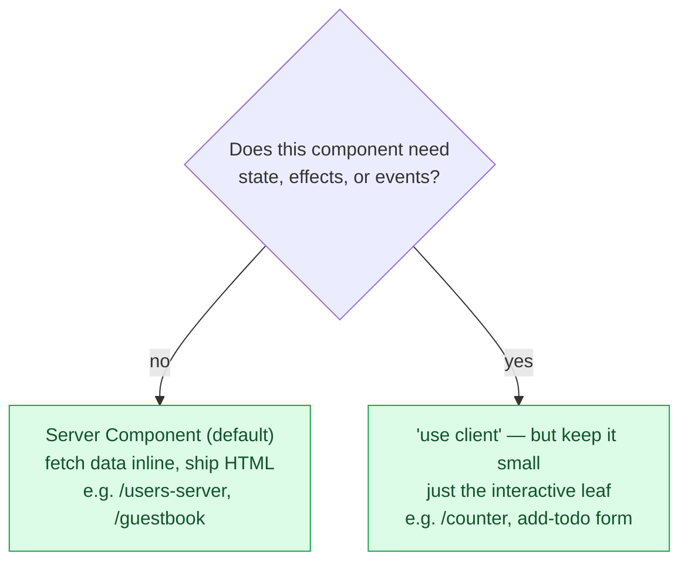
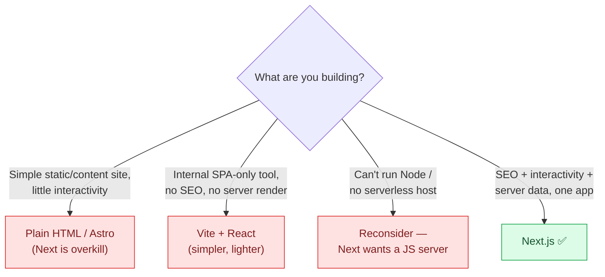
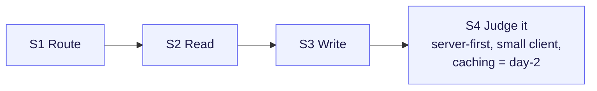

# Session 4 — Best Practices, Real-World & Disadvantages

> **Duration:** 30 min · **Clock:** 11:45–12:15
> **Build-along branch:** `session-3-actions` (start here, build toward `session-4-antipatterns`)
> **Watch-demo branch:** `main`
> **Learning goal:** Step back from new APIs and learn to *judge* Next.js code. Diagnose a deliberately-bad page, restate the best practices you already saw in Sessions 1–3, place caching as a day-2 concept, and know when **not** to reach for Next.js. This session is **discussion-led** — keep the room talking, not watching slides.

---

## Pre-flight

**Watch demo (instructor showing finished code):**

```bash
git switch main
pnpm install      # first time only
pnpm dev          # Turbopack, no --turbopack flag in v16
```

**Build along (room types it live):**

```bash
git switch session-3-actions   # S1–S3 routes only, before S4
pnpm install
pnpm dev
```

Not built yet on `session-3-actions`: the single demo at `src/app/anti-patterns/page.tsx`, plus its entries in the nav hub (`src/app/page.tsx`) and sidebar (`src/app/sidebar-nav.tsx`). You'll add them this session and can diff against `session-4-antipatterns` at the end.

**URLs, in visiting order:**

1. `http://localhost:3000/anti-patterns` — the "spot what's wrong" page (whole tree `'use client'`)
2. `/users-server` — the correct contrast (open in a second tab, side by side)

---

## Opening hook (~2 min)

> "The last three sessions taught you the *moves* — routing, server components, streaming, actions. This session is about **taste**: looking at a piece of Next.js code and knowing whether it's good. The framework will happily let you do the wrong thing. So let's start with a page that *works* — it shows the right data — but is built badly. Your job is to tell me why."

Frame the session as three short beats, not a lecture:



**Say:** "Three beats: diagnose a bad page, name the good habits behind the fix, then the honest caveats — caching is hard, and sometimes Next.js is the wrong tool. Talk to me throughout; this one's a conversation."

---

## Demo-by-demo walkthrough

### 1. `/anti-patterns` — "spot what's wrong" (~12 min)

**Files:** `src/app/anti-patterns/page.tsx` (deliberately a whole-tree Client Component)

- **Show this first — the running page, NOT the code.** Load `/anti-patterns`. **Ask the room:** *"This shows the same users as `/users-server`. Watch the page load — what do you notice?"* Let them spot the **flash of skeleton / spinner** on every refresh.
- **Now open the code.** Top line: `'use client'`. **Ask:** *"Is anything on this page interactive? Any buttons, any state the user changes?"* → No. So why is it a client component?
- **Walk the three flagged anti-patterns in the code comments:**
  1. **Whole tree `'use client'`** — nothing is interactive, yet the entire component (and any children) is pushed into the browser bundle.
  2. **`useEffect` + `fetch` to read data** — re-implementing by hand what an async Server Component does in one line; runs *after* hydration, so the user always sees a spinner.
  3. **Extra round trip to `/api/users`** — the browser hops out for data the server already had in `data.ts`.
- **Show the contrast.** Open `/users-server` in a second tab; flip between them. Same list, but the server version arrives **with the data already in the HTML** — no spinner, no client fetch, less JS.
- **v16 gotcha to call out:** "Cache Components is **off** in this repo (the v16 default), so a server component that reads runtime data just renders per request — no build error. The anti-pattern here isn't a caching mistake; it's putting the boundary in the wrong place."

**The same data, two boundaries:**



**Say:** "Both pages end at the same screen. The bad one makes the *browser* do the work — hydrate, effect, fetch, re-render — so there's always a spinner and extra JS. The good one does the work on the server and ships finished HTML. The whole best-practices talk is just: **keep work on the server, push the client boundary down to the leaves.**"

**Ask the room (the payoff question):** *"How would you fix this page?"* → delete `'use client'`, make it `async`, `await getUsers()` directly. One deletion and one keyword. That's `/users-server`.

### Where the client boundary *should* go



**Say:** "This is the single decision that separates good Next.js from bad. Default to server. Only the *leaf* that actually clicks, types, or holds state gets `'use client'` — like the counter in S2 or the add-todo form in S3. `/anti-patterns` failed by answering 'no' to this question and going client anyway."

---

### 2. Best practices — "you already saw this" (~6 min)

Don't introduce anything new. Tie each habit back to a demo they watched:

| Best practice | Where they already saw it |
|---|---|
| Server-first; client only at the leaves | `/users-server` vs `/anti-patterns`, `/counter` |
| Fetch data in async Server Components, colocated | `/users-server`, `/dashboard` |
| Wrap slow data in `<Suspense>` so the page streams | `/dashboard`, `/dashboard/granular` |
| Mutate with a `'use server'` action + `revalidatePath` | `/guestbook`, `/todos` |
| `await params` / `cookies()` — they're Promises in v16 | `/blog/[slug]` |

**Say:** "Notice we're not learning anything new here — every 'best practice' is just a demo from the last three sessions, named. That's the point: the defaults guide you toward good code."

---

### 3. Real-world & disadvantages (~6 min)

**Real-world use cases (2–3, quick):** e-commerce (product pages need SEO + speed), dashboards (auth'd, data-heavy, streaming), content/marketing sites (static-ish, fast). **Say:** "Next.js shines when you need server-rendered HTML *and* rich interactivity in one app."

**Caching — the ~3-minute concept** ⚠️ *idea only, no API drilling:*

> **Say:** "Next.js can cache parts of a page and even pre-render them at build time. v16 has a powerful model for this called **Cache Components** — `'use cache'`, partial pre-rendering. It's the single trickiest part of the framework, which is exactly why we left it **off** all course and call it a **day-2 topic**. Everything you built today works great on the defaults."

**When *NOT* to use Next.js** — present as a quick decision flowchart, not prose:



**Say:** "Next.js is a great default for product apps, but it's not free. If you're shipping a brochure site, a pure internal SPA with no SEO, or you have nowhere to run a Node server, simpler tools win. Knowing when *not* to use it is itself a best practice."

---

## Recap (~2 min)



**Say:** "You can now route, read, write — and *judge* whether Next.js code is good. The whole rule of thumb fits on one line: **do the work on the server, push the client boundary to the leaves, and treat caching as a later topic.** Hand out the cheatsheet — that's your one-page memory of this course."

- **Anti-pattern to avoid:** whole-tree `'use client'` + client-side `fetch` for data that isn't interactive.
- **The fix:** async Server Component, `await` the data inline (`/users-server`).
- **Caching:** real and powerful (Cache Components), but a **day-2** topic — defaults are fine for everything here.
- **Tool choice:** Next.js for SEO + interactivity + server data; simpler tools for static sites and pure SPAs.

---

## Time budget

| Segment | Min | If running long |
|---|---|---|
| Opening hook + three-beat framing | 2 | keep |
| `/anti-patterns` diagnose + `/users-server` contrast | 12 | keep — this is the whole session |
| Best practices "you already saw this" table | 6 | trim to 3 rows |
| Real-world + caching concept + when-not-to-use | 6 | cut real-world examples first, keep caching + decision flowchart |
| Recap + hand out cheatsheet | 2 | **never cut** |

**Total:** ~28 min + buffer. **Never cut:** the `/anti-patterns` → `/users-server` diagnosis (the active beat) and the closing cheatsheet hand-off. **First to trim:** the real-world examples roll-call.

---

## v16 gotchas cheat-list (call out as they come up)

- **Cache Components is OFF** here (the v16 default) — so async server components reading runtime data "just work" with no build error. Caching is opt-in and a day-2 topic.
- **`'use client'` is a boundary, not a free switch** — everything it imports becomes client too. That's why a top-level `'use client'` drags the whole tree into the browser.
- **Server Components can't use hooks/events** — if you reach for `useState`/`useEffect`/`onClick`, that file (a leaf) needs `'use client'`; the page above it shouldn't.
- **`await params` / `await cookies()`** remain Promises in v16 — a habit worth repeating even in the wrap-up.
